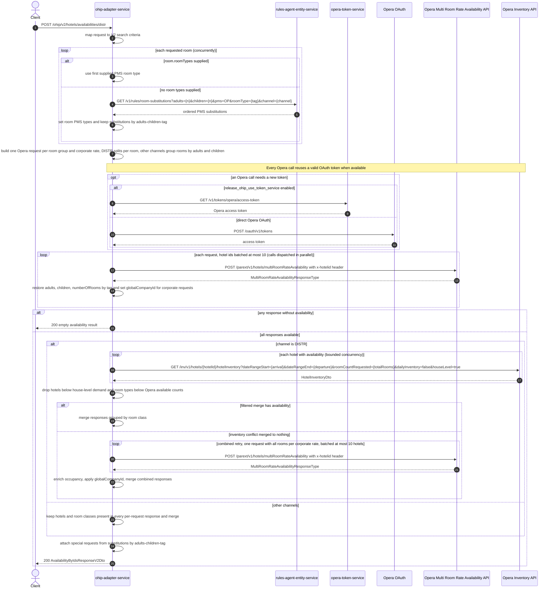

# OHIP Adapter Service: getHotelAvailabilityByIdsV2 Flow

Returns availability for a list of hotels via the Opera multi-room-rate availability API, combining rules-agent room substitutions, parallel per-room Opera searches, and (for the `DISTR` channel) an Opera hotel-inventory sufficiency check with a combined-request fallback.

```http
POST /ohip/v2/hotels/availabilities/distr
Host: ohip-adapter-service:9100
Content-Type: application/json
```

The servlet context path is `/ohip/`. The endpoint itself requires no inbound authentication. Every Opera outbound request carries the configured `x-app-key` header and a `x-hotelid` header, and uses the service OAuth client: when no reusable token exists, direct mode calls `POST /oauth/v1/tokens`; token-service mode calls `GET /v1/tokens/opera/access-token` instead.

## Flow

The controller maps the JSON body (`bookingChannel`, `hotelIds`, `arrivalDate`, `departureDate`, `rooms`, `rates`) into V2 search criteria; the single `rates.corporateRates` object becomes a one-element corporate-rate list.

For each requested room, concurrently, the service resolves PMS room types: a room that already names `roomTypes` uses its first entry directly; otherwise the room's `tag` is sent to `rules-agent-entity-service` as the room type (with adults, children, channel, and `pms=OP`) and the returned substitutions become the room's PMS room types. The substitutions are kept, keyed by adults-children-tag, to attach special requests to the response later.

The out port then fans the search out into one Opera request per room group and corporate rate: on the `DISTR` channel every room gets its own request; on other channels rooms are grouped by identical (adults, children). Each request's hotel list is split into batches of at most 10 hotel ids, and every batch is sent as `POST /parext/v1/hotels/multiRoomRateAvailability`. Responses are mapped back to the request rooms by `tag` to restore adults, children, and room count, and corporate requests stamp their `corporateId` on each room rate as `globalCompanyId`. If any parallel response comes back without availability, the endpoint returns an empty result.

For `DISTR`, the service additionally loads Opera house-level hotel inventory for every hotel that returned availability, drops hotels whose house availability cannot cover the total requested rooms, and keeps only room types whose Opera available count covers the response demand. If that filtering merges to no availability (room-type duplication across the per-room responses), it retries once with a single combined Opera request carrying all rooms and merges that instead. For other channels the parallel responses are merged directly: a hotel survives only when present in every per-request response, and a room class survives only when present in all of them.

Finally the service attaches special requests from the substitution map to each returned room type and maps the merged result to the response DTO.

## Mermaid Flow



## Features

- Multi-hotel, multi-room availability search through Opera's `multiRoomRateAvailability` API
- Room-type resolution per room: explicit PMS room types, or rules-agent substitutions looked up by the room's `tag`
- Corporate negotiated rates: one Opera request per corporate rate, `corporateId` echoed as `globalCompanyId` on each room rate
- Hotel-id batching (max 10 per Opera call) with parallel dispatch
- `DISTR` channel: per-room request splitting, Opera house-level inventory sufficiency filtering, and a combined-request retry when per-room responses conflict on inventory
- Non-`DISTR` channels: rooms grouped by identical occupancy; merged hotels and room classes must appear in every response
- Special requests attached to response room types from the substitution rules
- All-or-nothing semantics: any per-request response without availability empties the whole result
- No inbound authentication; Opera outbound calls authenticated via the service OAuth client with `x-app-key` and `x-hotelid` headers

## Feature Flags

| Flag | Effect when enabled |
| --- | --- |
| `release_ohip_use_token_service` | Obtains Opera tokens from `opera-token-service` instead of calling Opera OAuth directly; this applies to every Opera outbound call |
| `release_ohip_use_token_refresh_skew` | In direct OAuth mode, treats cached Opera tokens as expiring by the configured clock-skew interval before their actual expiry |

No other behavior of this endpoint is feature-flag gated.

## Request

| Field | Required | Notes |
| --- | --- | --- |
| `bookingChannel` | Yes | `channel` drives request splitting (`DISTR` per room) and merge rules; `subchannel`/`language` are carried but not used here |
| `hotelIds` | Yes | Opera hotel ids; batched at most 10 per Opera call |
| `arrivalDate` | Yes | `yyyy-MM-dd` |
| `departureDate` | Yes | `yyyy-MM-dd` |
| `rooms` | Yes | Each room: `tag` (required), optional `roomTypes`, `adults`, `children`, `numberOfRooms`. An empty list sends one unsplit Opera request |
| `rates` | Yes | `corporateRates` is a single object (V2); `ratePlanCodes` is forwarded to Opera |

## Branches

| Trigger | Behavior |
| --- | --- |
| Room supplies `roomTypes` | Skips the rules-agent call for that room and uses the first supplied PMS type |
| Corporate rates present | One Opera request per corporate rate per room group; `globalCompanyId` stamped on room rates |
| `DISTR` channel | Per-room splitting, hotel-inventory filtering, room-class grouping merge, and combined-request retry on inventory conflict |
| Any Opera response without availability | Endpoint returns an empty availability result without inventory checks |
| Hotel below house-level inventory demand (`DISTR`) | Hotel removed from all pending requests and from the result |
| More than 10 hotel ids per request | Split into multiple Opera calls; results merged as separate responses |
| Opera availability call error | `HotelAvailabilityException` with `OHIP_GET_MULTIROOM_RATE_AVAILABILITY_EXCEPTION` |
| Opera hotel-inventory call error | `HotelReservationException` with `OHIP_HOTEL_INVENTORY_EXCEPTION` |
