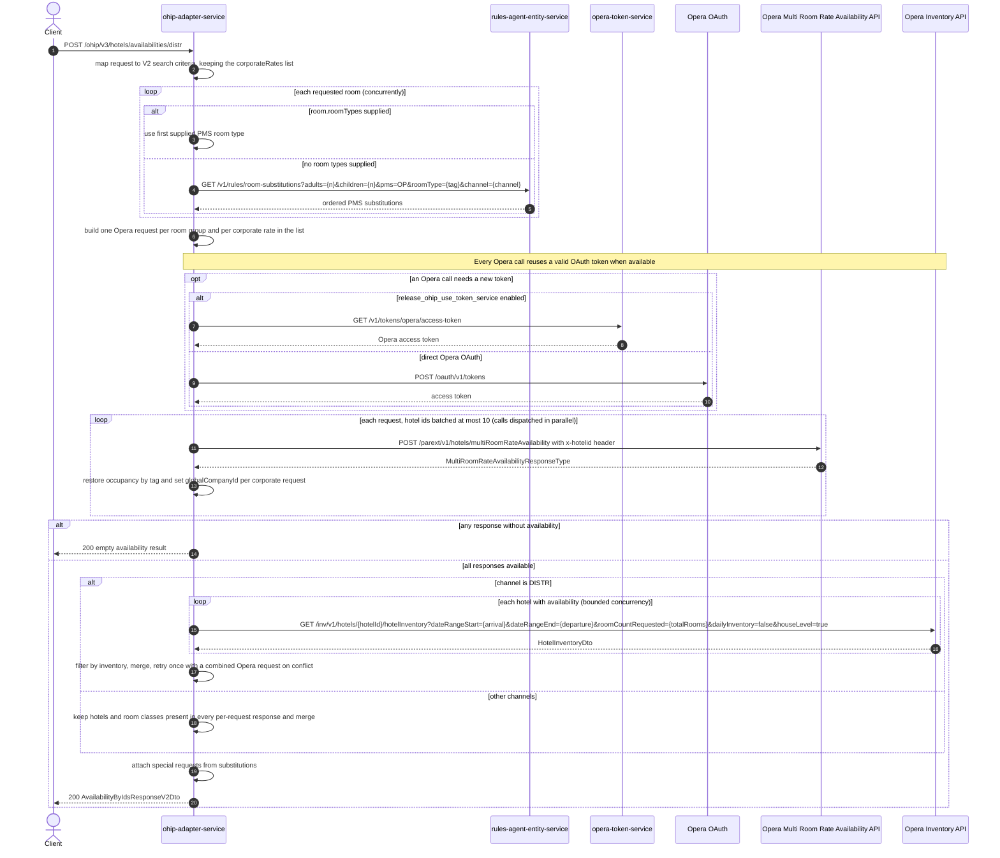

# OHIP Adapter Service: getHotelAvailabilityByIdsV3 Flow

Returns availability for a list of hotels via the Opera multi-room-rate availability API. Identical runtime chain to `getHotelAvailabilityByIdsV2` (see `GetHotelAvailabilityByIdsV2.md`); the only difference is the request shape: `rates.corporateRates` is a list of corporate rates instead of a single object, so one search can fan out over several corporate ids.

```http
POST /ohip/v3/hotels/availabilities/distr
Host: ohip-adapter-service:9100
Content-Type: application/json
```

The servlet context path is `/ohip/`. The endpoint itself requires no inbound authentication. Every Opera outbound request carries the configured `x-app-key` header and a `x-hotelid` header, and uses the service OAuth client: when no reusable token exists, direct mode calls `POST /oauth/v1/tokens`; token-service mode calls `GET /v1/tokens/opera/access-token` instead.

## Flow

The controller maps the JSON body into the same V2 search criteria domain model used by the V2 endpoint, keeping the full `corporateRates` list, and calls the same in-port method (`getHotelAvailabilityByIdsV2`).

From there the chain is exactly the V2 flow: per-room PMS room-type resolution (explicit `roomTypes`, or a rules-agent room-substitution lookup by the room's `tag`); one Opera request per room group and per corporate rate (`DISTR` splits per room, other channels group rooms by identical adults/children); hotel-id batching at most 10 per call to `POST /parext/v1/hotels/multiRoomRateAvailability`; occupancy restored by `tag` and `globalCompanyId` stamped from each request's `corporateId`; an empty result if any parallel response lacks availability; `DISTR`-only Opera house-level inventory filtering with a combined-request retry on inventory conflict; per-response merge rules by channel; and special requests attached from the substitution rules before mapping the response.

Because every corporate rate in the list produces its own Opera request per room group, a multi-corporate V3 request multiplies the Opera call fan-out accordingly, and merge rules still require every hotel (and, off `DISTR`, every room class) to appear in every per-request response.

## Mermaid Flow



## Features

- Same feature set as `getHotelAvailabilityByIdsV2` (see `GetHotelAvailabilityByIdsV2.md`)
- Multiple corporate rates per search: each corporate rate in `rates.corporateRates` produces its own Opera request per room group, each stamped with its own `globalCompanyId`
- Response DTO is the same V2 shape (`AvailabilityByIdsResponseV2Dto`)
- No inbound authentication; Opera outbound calls authenticated via the service OAuth client with `x-app-key` and `x-hotelid` headers

## Feature Flags

| Flag | Effect when enabled |
| --- | --- |
| `release_ohip_use_token_service` | Obtains Opera tokens from `opera-token-service` instead of calling Opera OAuth directly; this applies to every Opera outbound call |
| `release_ohip_use_token_refresh_skew` | In direct OAuth mode, treats cached Opera tokens as expiring by the configured clock-skew interval before their actual expiry |

No other behavior of this endpoint is feature-flag gated.

## Request

| Field | Required | Notes |
| --- | --- | --- |
| `bookingChannel` | Yes | `channel` drives request splitting (`DISTR` per room) and merge rules |
| `hotelIds` | Yes | Opera hotel ids; batched at most 10 per Opera call |
| `arrivalDate` | Yes | `yyyy-MM-dd` |
| `departureDate` | Yes | `yyyy-MM-dd` |
| `rooms` | Yes | Each room: `tag` (required), optional `roomTypes`, `adults`, `children`, `numberOfRooms` |
| `rates` | Yes | `corporateRates` is a **list** (V3); every entry fans out its own Opera request per room group. `ratePlanCodes` is forwarded to Opera |

## Branches

Same branch behavior as `getHotelAvailabilityByIdsV2` (see `GetHotelAvailabilityByIdsV2.md`), plus:

| Trigger | Behavior |
| --- | --- |
| Multiple `corporateRates` entries | Opera request count multiplies by the number of corporate rates; a hotel must appear in every response (per-request all-or-nothing merge still applies) |
