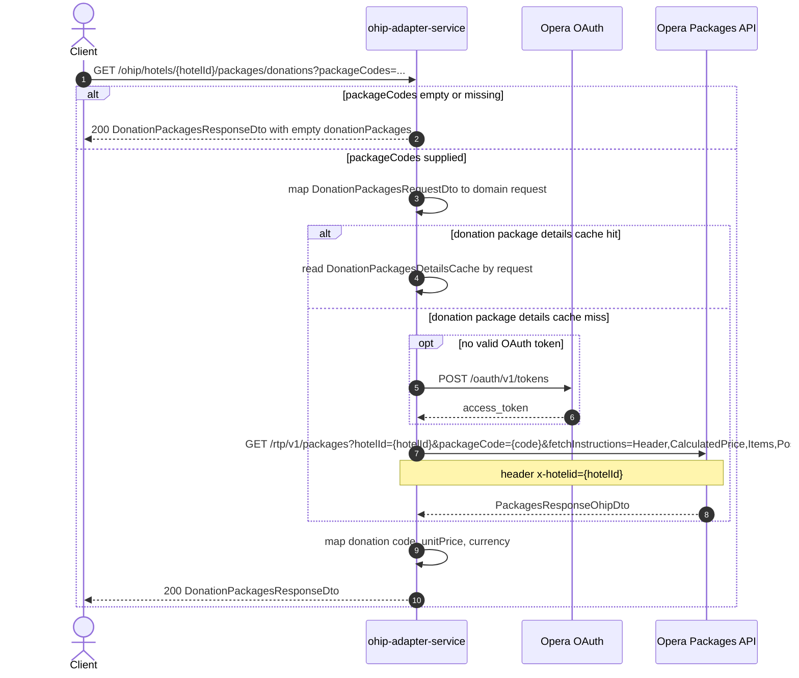

# OHIP Adapter Service: getHotelDonationsPackagesDetails Flow

Returns donation package code, unit price, and currency for a hotel by reading Opera package details.

```http
GET /ohip/hotels/{hotelId}/packages/donations?packageCodes={packageCode}
Host: ohip-adapter-service:9100
Accept: application/json
```

The servlet context path is `/ohip/`. Opera calls use the service OAuth client when no valid token is present.

## Flow

If `packageCodes` is missing or empty, the controller returns an empty `donationPackages` list without calling the packages port or Opera.

Otherwise the request is mapped to domain form and the packages out-port asks Opera for package details. Responses are cached in Redis when cache is enabled. The mapper keeps only donation code, unit price, and currency from the larger Opera payload.

## Mermaid Flow



## Features

- Lookup of donation packages by hotel and one or more package codes
- Early empty response when no package codes are provided
- Redis cache for Opera donation package details (`DonationPackagesDetailsCache`, 1-day manager; key from hotel id and package codes)
- Response reduced to `code`, `unitPrice`, and `currency`
- Does not call restaurant config, package groups, or rate plans APIs

## Feature Flags

None. This endpoint does not gate behavior on feature flags.

Global OAuth may still use `release_ohip_use_token_service` for token acquisition on Opera calls.

## Request

| Parameter | Required | Notes |
| --- | --- | --- |
| `hotelId` | Yes (path) | Opera hotel id |
| `packageCodes` | Advertised as required; empty list is accepted | Repeated query values such as `packageCodes=ZCHRY2&packageCodes=ZCHRY7` |

Public plural `packageCodes` is sent downstream as repeated singular `packageCode` query parameters.

## Branches

| Trigger | Behavior |
| --- | --- |
| Empty or missing `packageCodes` | Immediate empty `donationPackages` response; no Opera call |
| Cache hit | Skips Opera packages call |
| Cache miss | Opera `GET /rtp/v1/packages` with donation fetch instructions |
