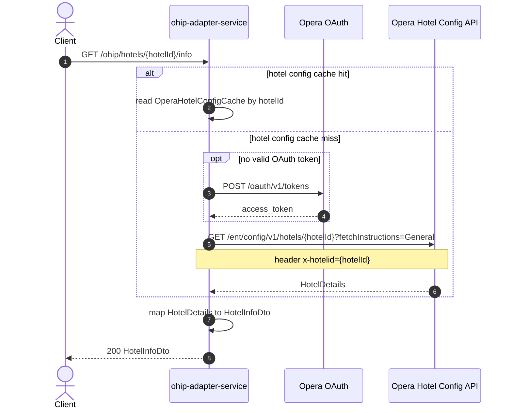

# OHIP Adapter Service: getHotelInfo Flow

Returns hotel configuration details such as timezone, country, currency, language, and check-in/out times from Opera hotel config.

```http
GET /ohip/hotels/{hotelId}/info
Host: ohip-adapter-service:9100
Accept: application/json
```

The servlet context path is `/ohip/`. Opera calls use the service OAuth client when no valid token is present.

## Flow

The controller passes `hotelId` to the hotel-info port. On a cache miss, ohip-adapter-service calls Opera enterprise hotel config with `fetchInstructions=General`, maps the `HotelDetails` payload into the public hotel-info DTO, and returns it. When Redis cache is enabled, subsequent calls for the same hotel id reuse the cached config.

## Mermaid Flow



## Features

- Hotel identity and operational config from Opera enterprise hotel config
- Redis cache by hotel id (`OperaHotelConfigCache`, 1-day manager)
- Public fields include three-letter id, timezone, country, currency, language, check-in time, and check-out time

## Feature Flags

None. This endpoint does not gate behavior on feature flags.

Global OAuth may still use `release_ohip_use_token_service` for token acquisition on Opera calls.

## Request

Path only:

| Parameter | Required | Notes |
| --- | --- | --- |
| `hotelId` | Yes (path) | Opera hotel id |

No query parameters or body.

## Branches

| Trigger | Behavior |
| --- | --- |
| Hotel config cache hit | Skips Opera hotel-config call |
| Hotel config cache miss | Calls Opera with `fetchInstructions=General` |
