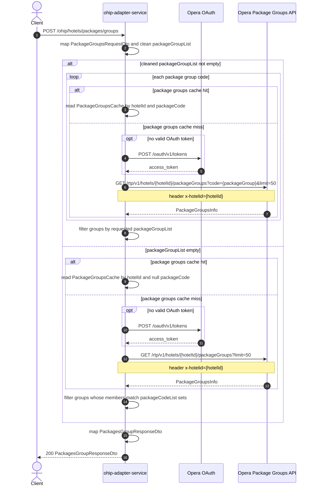

# OHIP Adapter Service: getHotelPackageGroups Flow

Returns hotel package groups and their member package codes from Opera, either for explicit group codes or by matching package-code sets.

```http
POST /ohip/hotels/packages/groups
Host: ohip-adapter-service:9100
Accept: application/json
Content-Type: application/json
```

The servlet context path is `/ohip/`. Opera calls use the service OAuth client when no valid token is present.

## Flow

The controller accepts a JSON body with `hotelId` and optional `packageGroupList` / `packageCodeList`. Null and blank package group codes are removed before downstream calls.

When at least one package group remains, Opera is called once per group code (`code={packageGroup}&limit=50`). When the cleaned list is empty, Opera is called once without a specific code and the response is filtered using `packageCodeList` member matching.

Each Opera package-groups response is cacheable. The public response lists package groups with descriptions and member package codes.

## Mermaid Flow



## Features

- Package group lookup by explicit group codes or by exact member package-code sets
- One Opera call per cleaned package group code, or one unscoped call when no groups are supplied
- Redis cache for package group responses (`PackageGroupsCache`, 1-day manager; key from hotel id and package code)
- Response includes package group code, description, and member package codes/descriptions
- Null/blank package group codes are ignored before calling Opera

## Feature Flags

None. This endpoint does not gate behavior on feature flags.

Global OAuth may still use `release_ohip_use_token_service` for token acquisition on Opera calls.

## Request

JSON body:

| Field | Required | Notes |
| --- | --- | --- |
| `hotelId` | Yes | Opera hotel id |
| `packageGroupList` | No | Package group codes to fetch directly |
| `packageCodeList` | No | Sets of package codes used to match groups when no package groups remain after cleaning |

Example by package groups:

```http
POST /ohip/hotels/packages/groups
Content-Type: application/json

{
  "hotelId": "HEAPTI",
  "packageGroupList": ["MDP", "DBR"]
}
```

Example by package-code sets:

```http
POST /ohip/hotels/packages/groups
Content-Type: application/json

{
  "hotelId": "HEAPTI",
  "packageCodeList": [
    { "packageCodes": ["MD2DIN", "MDBEVA", "MDBFST"] },
    { "packageCodes": ["DBBVPR", "DBDNPR"] }
  ]
}
```

## Branches

| Trigger | Behavior |
| --- | --- |
| Non-empty cleaned `packageGroupList` | One Opera package-groups call per code with `code` query param; filter by group codes |
| Empty cleaned `packageGroupList` | One Opera package-groups call without `code`; filter groups by exact member package-code sets |
| Empty `packageCodeList` on unscoped path | Groups with members can be included as "all packages requested" |
| Cache hit for hotelId + packageCode | Skips Opera package-groups call |
