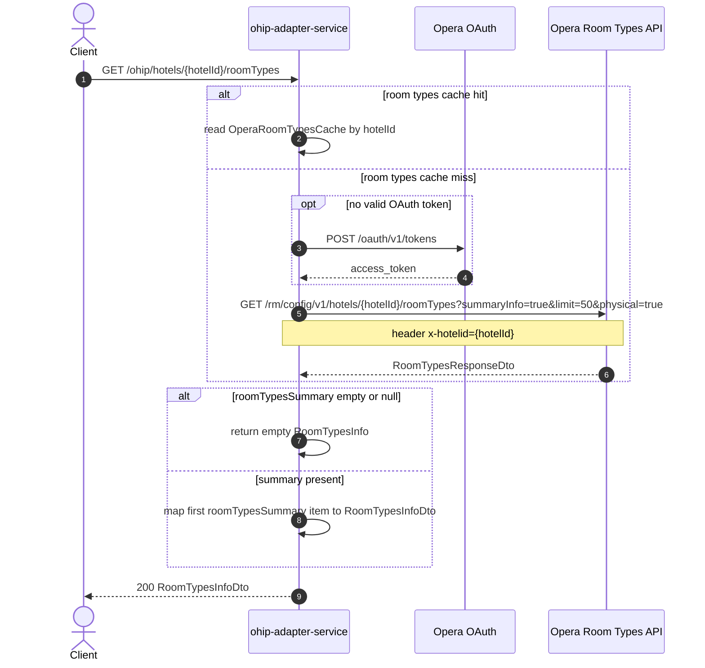

# OHIP Adapter Service: getRoomTypes Flow

Returns physical room-type summary information for a hotel from Opera room configuration.

```http
GET /ohip/hotels/{hotelId}/roomTypes
Host: ohip-adapter-service:9100
Accept: application/json
```

The servlet context path is `/ohip/`. Opera calls use the service OAuth client when no valid token is present.

## Flow

The controller asks the hotel-info port for room types by hotel id. On a cache miss, ohip-adapter-service calls Opera room types with summary info, limit 50, and physical rooms only. The out-port maps only the first `roomTypesSummary` entry; if the response is null or that list is empty, it returns an empty room-types payload.

## Mermaid Flow



## Features

- Physical room-type summary for one hotel
- Redis cache by hotel id (`OperaRoomTypesCache`, 7-day manager)
- Uses only the first Opera `roomTypesSummary` element
- Public room entries include room class, accessible flag, room type code, and number of rooms as a string

## Feature Flags

None. This endpoint does not gate behavior on feature flags.

Global OAuth may still use `release_ohip_use_token_service` for token acquisition on Opera calls.

## Request

Path only:

| Parameter | Required | Notes |
| --- | --- | --- |
| `hotelId` | Yes (path) | Opera hotel id |

No query parameters or body.

## Branches

| Trigger | Behavior |
| --- | --- |
| Room-types cache hit | Skips Opera room-types call |
| Empty/null `roomTypesSummary` | Returns empty room-types info |
| Summary present | Maps first summary item only |
