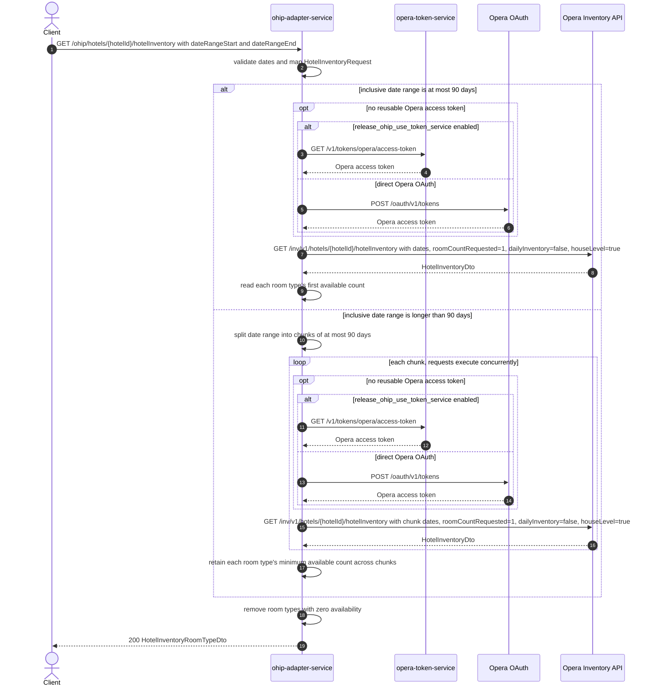

# OHIP Adapter Service: getHotelRoomsInventory Flow

Returns the available Opera room inventory counts for one hotel and date range, excluding room types whose available count is zero.

```http
GET /ohip/hotels/{hotelId}/hotelInventory?dateRangeStart={start}&dateRangeEnd={end}
Host: ohip-adapter-service:9100
Accept: application/json
```

The servlet context path is `/ohip/`. The Opera inventory request carries an OAuth bearer token, the configured `x-app-key`, and the requested hotel id in the `x-hotelid` header.

## Flow

The controller validates the two required ISO date query parameters, combines them with `hotelId`, and passes the resulting request through the availability domain service. For a range of at most 90 inclusive days, `ohip-adapter-service` makes one Opera Inventory API request. It asks for house-level, non-daily inventory with one room requested and does not restrict the request to particular room types.

For a range longer than 90 inclusive days, the service divides the range into chunks of no more than 90 days and requests those chunks concurrently. It returns the minimum available count observed for each room type across the chunk responses. For a single chunk, it uses each room type's first inventory count. In both cases it removes room types whose resulting count is zero before mapping the response.

Every Opera request reuses a valid OAuth token when one is available. Otherwise, authentication obtains a token either from `opera-token-service` or directly from Opera OAuth according to `release_ohip_use_token_service`.

## Mermaid Flow



## Features

- Hotel room-type inventory for a required inclusive date range
- Automatic concurrent chunking for ranges longer than 90 days
- Conservative multi-chunk aggregation using the minimum available count per room type
- Response shaping that omits room types with zero availability
- Opera requests with `x-app-key`, `x-hotelid`, and OAuth bearer authentication
- In-memory reuse of valid OAuth authorized clients, avoiding a token call while the selected token remains reusable
- No endpoint-specific inventory cache

## Feature Flags

| Flag | Effect when enabled |
| --- | --- |
| `release_ohip_use_token_service` | Obtains the bearer token from `opera-token-service` via `GET /v1/tokens/opera/access-token` instead of calling Opera OAuth directly |
| `release_ohip_use_token_refresh_skew` | In direct Opera OAuth mode, treats a cached token as expiring by the configured skew interval before its actual expiry |

## Request

| Parameter | Required | Notes |
| --- | --- | --- |
| `hotelId` | Yes | Path parameter used in both the Opera inventory path and the `x-hotelid` header |
| `dateRangeStart` | Yes | Query parameter validated as `yyyy-MM-dd`; becomes Opera `dateRangeStart` |
| `dateRangeEnd` | Yes | Query parameter validated as `yyyy-MM-dd`; becomes Opera `dateRangeEnd`; ranges are measured inclusively for chunking |

## Branches

- Missing, empty, or incorrectly formatted date parameters fail request validation before Opera is called.
- A range of at most 90 inclusive days results in one Opera inventory call. Longer ranges result in one concurrent call per chunk of at most 90 days.
- If Opera returns an error status, the client raises `OHIP_HOTEL_INVENTORY_EXCEPTION` as a `HotelReservationException`.
- The out-port has a defensive null-response branch that raises `DIGITAL_NO_HOTEL_ROOM_EXCEPTION`.
