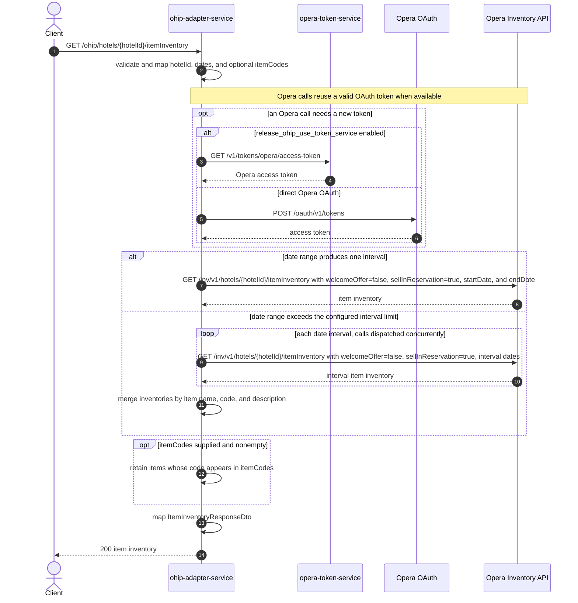

# OHIP Adapter Service: getItemInventory Flow

Returns Opera item inventory for a hotel and date range, optionally restricted to selected item codes.

```http
GET /ohip/hotels/{hotelId}/itemInventory?startDate={startDate}&endDate={endDate}&itemCodes={itemCode}
Host: ohip-adapter-service:9100
Accept: application/json
```

The servlet context path is `/ohip/`. The Opera request uses an OAuth bearer token, `x-app-key`, and `x-hotelid`. When no reusable token exists, direct mode calls `POST /oauth/v1/tokens`; token-service mode calls `GET /v1/tokens/opera/access-token` instead.

## Flow

The controller validates the required `startDate` and `endDate` query parameters, maps them with the `hotelId` and optional `itemCodes`, and passes the request to the availability service. The service asks its availability out-port for the complete item inventory before applying any item-code filtering.

For a date range within Opera's configured 90-day request limit, `ohip-adapter-service` makes one synchronous Opera Inventory API call. Longer ranges are split into supported intervals and requested concurrently. Their responses are merged by item name, code, and description, with each item's interval inventories combined into one list.

Opera always receives `welcomeOffer=false`, `sellInReservation=true`, the interval start and end dates, and the hotel id as `x-hotelid`; `itemCodes` is not forwarded. After all Opera data is mapped to the domain model, the service returns every item when `itemCodes` is absent or empty, or filters the merged result to items whose code exactly appears in `itemCodes`.

## Mermaid Flow



## Features

- Hotel item inventory for an inclusive date range
- Optional exact item-code filtering performed after Opera responds
- Automatic splitting of ranges that exceed Opera's configured 90-day request limit
- Concurrent Opera calls for split ranges and response merging by item identity
- OAuth token reuse across Opera requests
- Opera requests include `x-hotelid`, `x-app-key`, and bearer-token headers
- No item-inventory response cache

## Feature Flags

| Flag | Effect when enabled |
| --- | --- |
| `release_ohip_use_token_service` | Obtains Opera tokens from `opera-token-service` instead of calling Opera OAuth directly |
| `release_ohip_use_token_refresh_skew` | In direct OAuth mode, treats cached Opera tokens as expiring by the configured clock-skew interval before their actual expiry |

## Request

| Parameter | Required | Notes |
| --- | --- | --- |
| `hotelId` | Yes (path) | Sent to the Opera Inventory API in both the path and `x-hotelid` header |
| `startDate` | Yes | Query parameter in `yyyy-MM-dd` format |
| `endDate` | Yes | Query parameter in `yyyy-MM-dd` format |
| `itemCodes` | No | Array-valued query parameter; filtering is exact and local, and Opera still returns the complete item inventory |

## Branches

| Trigger | Behavior |
| --- | --- |
| Date range produces one interval | Calls Opera synchronously once and returns its item inventory without interval merging |
| Date range produces multiple intervals | Calls Opera concurrently for every interval, then combines inventories for matching item name, code, and description |
| `itemCodes` absent or empty | Returns all items received from Opera |
| `itemCodes` nonempty | Returns only items whose code is present in the supplied values |
| Opera Inventory API returns an error status | Raises the internal `OHIP_HOTEL_ITEMS_INVENTORY_EXCEPTION` (`902`), exposed as an HTTP 500 error response |
| Token service is selected and token retrieval fails | Stops before the Opera inventory call and exposes an HTTP 500 internal error response |
