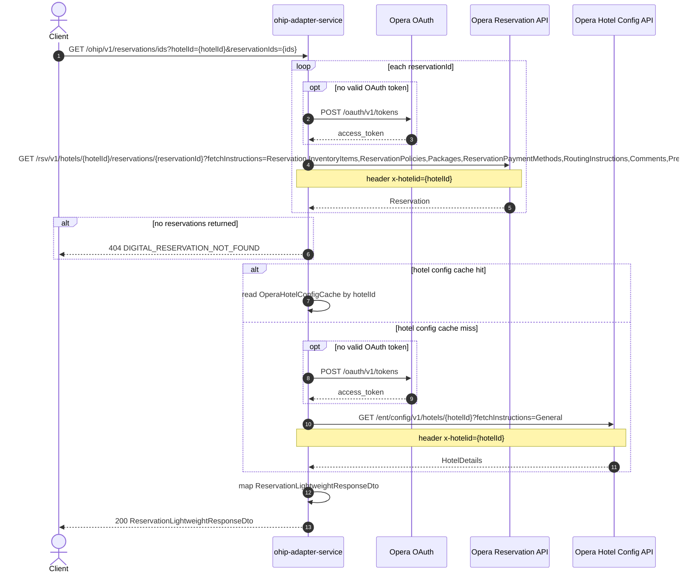

# OHIP Adapter Service: getLightweightReservationsByIds Flow

Returns lightweight reservation summaries for one or more reservation ids at a hotel, without basket rate, folio, profile, or card enrichment.

```http
GET /ohip/v1/reservations/ids?hotelId={hotelId}&reservationIds={reservationId[,reservationId...]}
Host: ohip-adapter-service:9100
Accept: application/json
```

The servlet context path is `/ohip/` and the reservation controller is mapped under `/v1`, so the public path is `/ohip/v1/reservations/ids`. Opera calls use the service OAuth client when no valid token is present.

This is the lightweight endpoint. For the full basket sibling at `/ohip/v1/reservations/basket`, with rate, folio, profile, and card enrichment, see [GetReservationsByIds.md](GetReservationsByIds.md).

## Flow

ohip-adapter-service loads each reservation from Opera with the same broad reservation fetch instructions used by other reservation reads. If none are returned, it throws reservation not found.

It then loads Opera hotel config (cached by hotel id) and maps reservations plus hotel config into a lightweight response containing reservation id, hotel id, check-in/out times, guest email, purpose of stay, and package list. It does not call rules-agent, rate-info amount enrichment, folios, profiles, or front-desk card APIs.

## Mermaid Flow



## Features

- Multi-reservation lightweight fetch by hotel id and reservation ids
- Opera reservation read with full fetch-instruction set
- Hotel config enrichment for check-in/out times (Redis-cached by hotel id)
- Response fields include reservation id, hotel id, email, purpose of stay, and packages
- No rules-agent, rate-info amount, folio/ACI, profile, or front-desk card enrichment

## Feature Flags

None. This endpoint does not gate behavior on feature flags.

Global OAuth may still use `release_ohip_use_token_service` for token acquisition on Opera calls.

## Request

| Query parameter | Required | Default | Purpose |
| --- | --- | --- | --- |
| `hotelId` | Yes | n/a | Opera hotel id for reservation and hotel-config lookups |
| `reservationIds` | Yes | n/a | Comma-separated reservation ids bound as a `Set<String>` |

Example:

```http
GET /ohip/v1/reservations/ids?reservationIds=6001001,6001002&hotelId=HEAPTI
Accept: application/json
```

## Branches

| Trigger | Behavior |
| --- | --- |
| No Opera reservations returned | `DIGITAL_RESERVATION_NOT_FOUND` |
| Hotel config cache hit | Skips Opera hotel-config call |
| Hotel config cache miss | Calls Opera with `fetchInstructions=General` |
