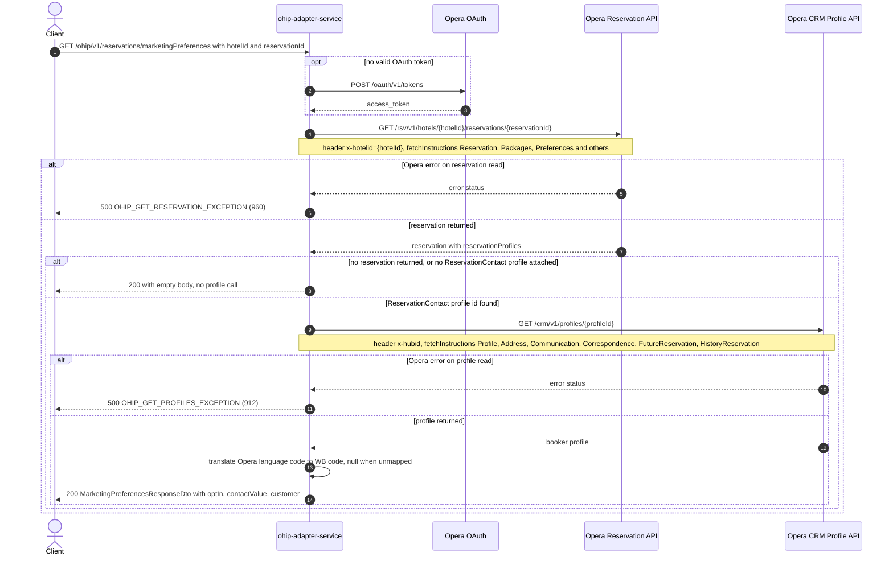

# OHIP Adapter Service: getMarketingPreferences Flow

Returns the marketing opt-in state and contact details of the profile attached to an Opera reservation as its reservation contact (the booker).

```http
GET /ohip/v1/reservations/marketingPreferences?hotelId={hotelId}&reservationId={reservationId}
Host: ohip-adapter-service:9100
Accept: application/json
```

The servlet context path is `/ohip/` and the reservation controller is mapped under `/v1`, so the public path is `/ohip/v1/reservations/marketingPreferences`. The endpoint itself requires no caller authentication; Opera calls use the service OAuth client.

## Flow

`HotelReservationController.getMarketingPreferences` passes `hotelId` and `reservationId` straight to `HotelReservationInPortImpl.getMarketingPreferences`, which does no validation or business logic of its own and delegates to `HotelReservationOutPortImpl.getMarketingPreferences`.

The out port first reads the reservation from Opera: `OhipReservationClient.getReservations(hotelId, Set.of(reservationId))` fans a single-element set through `getReservation`, so exactly one `GET /rsv/v1/hotels/{hotelId}/reservations/{reservationId}` is issued, with `x-hotelid` and the reservation `fetchInstructions` set (`Reservation`, `InventoryItems`, `ReservationPolicies`, `Packages`, `PaymentMethods`, `RoutingInstructions`, `Comments`, `Preferences`, `LinkedReservations`, `Alerts`). If the reservation list comes back empty, the port returns `null`.

From the first reservation it selects the *reservation contact* profile: `getProfileIdsByType(..., ResProfileTypeType.RESERVATIONCONTACT)` keeps only `reservationProfiles.reservationProfile[]` entries whose `reservationProfileType` is `ReservationContact` (Opera wire value) and takes the first id of each. A reservation whose attached profiles contain no `ReservationContact` entry yields an empty id set and the port returns `null` **without calling the profile API**.

With an id in hand, `getProfilesMap` calls `OhipReservationClient.sendGetProfilesByProfileIds`, one `GET /crm/v1/profiles/{profileId}` per id, carrying the `x-hubid` header and `fetchInstructions` `Profile`, `Address`, `Communication`, `Correspondence`, `FutureReservation`, `HistoryReservation`. The first returned profile is the booker profile. `setWbLanguageCode` then rewrites `profileDetails.customer.language` from the Opera language code to the Whitbread code using the configured `ohip.languages` map (`en` -> `E`, `de` -> `DE`); an Opera code that is not a value in that map is replaced with `null`.

`MarketingPreferencesResponseOhipMapper.toModel` finally builds the response: `optIn` from `profileDetails.privacyInfo.optInEmail`, `contactValue` from the first `profileDetails.emails.emailInfo[].email.emailAddress`, and `customer` from the first `personName` entry (`nameTitle`, `givenName`, `surname`), the first address' `country.code`, and the (already translated) `language`. A profile with no `profileDetails` maps to `null`.

Whenever the port returns `null` the controller still answers `200 OK`: the MapStruct DTO mapper maps `null` to `null`, so the caller receives a 200 with an empty body. Opera error responses on either leg are surfaced as `HotelReservationException` (an `AbstractInternalException`), producing a 500 with errCode `960` (`OHIP_GET_RESERVATION_EXCEPTION`) for the reservation leg and `912` (`OHIP_GET_PROFILES_EXCEPTION`) for the profile leg.

## Mermaid Flow



## Features

- Reads one Opera reservation and one Opera CRM profile, in that order, for a single reservation id
- Selects the booker profile strictly by Opera reservation profile type `ReservationContact`; `Guest` profiles on the same reservation are ignored
- Marketing opt-in comes from the profile's `privacyInfo.optInEmail`; the contact value is the profile's first email address
- Translates the Opera language code to the Whitbread language code via the configured `ohip.languages` map, nulling unmapped codes
- Absence is soft: an empty reservation read, a reservation without a `ReservationContact` profile, or a profile without `profileDetails` all yield `200 OK` with an empty body
- No caller authentication on the public endpoint

## Feature Flags

No endpoint-specific flag gates this flow. Only the shared Opera authentication flags apply, and both are evaluated outside the request context:

| Flag | Effect when enabled |
| --- | --- |
| `release_ohip_use_token_service` | Selects the token-service OAuth client registration for Opera calls (infrastructure flag) |
| `release_ohip_use_token_refresh_skew` | Applies the configured early-refresh clock skew to directly acquired Opera OAuth tokens |

## Request

| Parameter | In | Required | Purpose |
| --- | --- | --- | --- |
| `hotelId` | query | Yes | Opera hotel id, in the reservation URL and the `x-hotelid` header |
| `reservationId` | query | Yes | Opera reservation id whose reservation-contact profile is read |

Response body (`MarketingPreferencesResponseDto`): `optIn` (Boolean), `contactValue` (String, email address), `customer` (`title`, `firstName`, `lastName`, `country`, `language`).

## Branches

| Trigger | Behavior |
| --- | --- |
| Opera returns no reservation for the id | 200 with empty body, no `/crm/v1/profiles/{id}` call |
| Reservation carries no `ReservationContact` profile | 200 with empty body, no `/crm/v1/profiles/{id}` call |
| Profile lookup returns no profile, or a profile without `profileDetails` | 200 with empty body |
| Profile `privacyInfo` absent | 200 with `optIn` null, other fields populated |
| Opera language code not a value in `ohip.languages` | `customer.language` returned as null |
| Opera error on the reservation read | 500 `OHIP_GET_RESERVATION_EXCEPTION` (960) |
| Opera error on the profile read | 500 `OHIP_GET_PROFILES_EXCEPTION` (912) |
