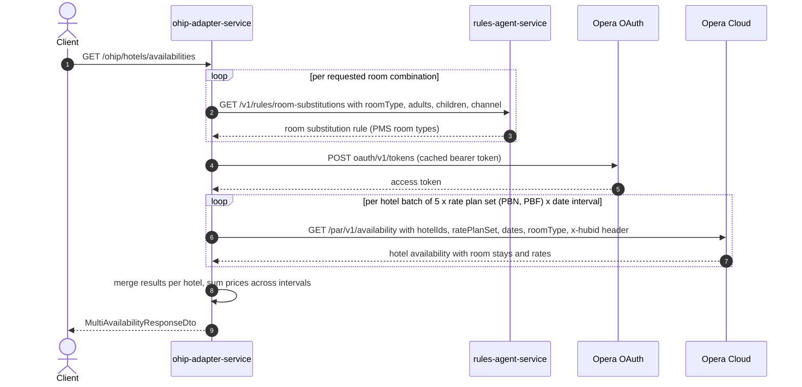

# OHIP Adapter Service: getMultiHotelAvailability Flow

Retrieves availability with room rates for a list of hotels by fanning out Opera
multi-hotel availability searches across the PBN and PBF rate plan sets.

```http
GET /ohip/hotels/availabilities
Host: ohip-adapter-service
```

No inbound authentication: the service excludes Spring Security auto-configuration, so
the endpoint accepts anonymous requests (callers are trusted upstream services).
Outbound calls to Opera are authenticated with an OAuth bearer token obtained from
`POST {OPERA_HOST}/oauth/v1/tokens` (enterprise credentials) and carry the
`x-hubid` header (`OPERA_HUB_ID`, default `DFLT_WHBOC001`).

## Flow

The controller (`HotelAvailabilityController.getMultiHotelAvailability`) maps the query
parameters to a `MultiHotelAvailabilityRequest` and calls
`HotelAvailabilityInPortImpl.getMultiHotelAvailability`. The in-port groups the requested
rooms into a room matrix (rooms with the same room type are merged, quantities summed)
and, for each matrix entry, resolves PMS room substitutions by calling the rules-agent
service once per requested `<roomType, adults, children>` combination.

`HotelAvailabilityOutPortImpl.getMultiHotelAvailabilities` then splits the search into
one Opera request per combination of: hotel batch (5 hotels each), rate plan set (`PBN`
then `PBF`), and date interval (stays longer than `maxRequestedDays` = 90 days are
split). Each split request is a `GET /par/v1/availability` call against Opera, executed
concurrently (up to `maxAvailabilityConcurrency` = 20). Results are merged per hotel and
room type; a hotel with no room rates is marked unavailable. Finally
`calculateFinalPrices` sums prices across date intervals in memory (no further calls)
and drops rates that did not return for every interval.

If any Opera split request fails, the whole request fails with error code
`OHIP_MULTIHOTELS_AVAILABILITY_EXCEPTION`.

## Mermaid Flow



## Features

- Multi-hotel availability search: one request returns availability for up to N hotels,
  batched 5 hotels per Opera call.
- Searches both `PBN` and `PBF` rate plan sets for every hotel batch.
- Room substitution: requested WB room types (DB, SB, FAM, DIS, TWIN) are translated to
  PMS room types via rules-agent before querying Opera.
- Long stays are split into intervals of at most 90 days; a rate must be present in
  every interval to survive, and interval prices are summed into the final total.
- A hotel whose room types come back with no rates is returned with `available: false`.
- No inbound auth; Opera calls use the enterprise OAuth token and `x-hubid` header.

## Feature Flags

No endpoint-specific feature flags gate this flow.

| Flag | Effect when enabled |
| --- | --- |
| `release_ohip_use_token_service` | Infrastructure only: Opera bearer tokens are fetched from opera-token-service instead of Opera OAuth. Permanently OFF in the integration environment; evaluated outside the request context. |
| `release_ohip_use_token_refresh_skew` | Infrastructure only: applies a clock-skew margin when refreshing the Opera token. Permanently OFF in the integration environment. |

## Request

Query parameters (`MultiAvailabilityRequestDto`):

| Parameter | Required | Effect |
| --- | --- | --- |
| `hotelIds` | yes | Hotels to search, batched 5 per Opera call. |
| `arrivalDate` | yes | Stay start (yyyy-MM-dd). |
| `departureDate` | yes | Stay end; ranges over 90 days are split into intervals. |
| `numberOfRooms` | yes | Rooms requested per room-type entry; summed into the room matrix quantity. |
| `roomTypes` | yes | WB room types, resolved to PMS types via rules-agent. |
| `adults` | yes | Adults per room entry, parallel to `roomTypes`. |
| `children` | no | Children per room entry. |
| `cotsRequired` | no | Cot request per room entry (carried in room matrix). |
| `channel` | yes | Booking channel, forwarded to rules-agent. |
| `companyId` | no | Accepted by the DTO but effectively unused: `splitRequest` does not copy it into the per-batch Opera requests, so the negotiated-rate query parameters (`reservationProfileType`, `attachedProfileId`) are never sent on this endpoint. |
