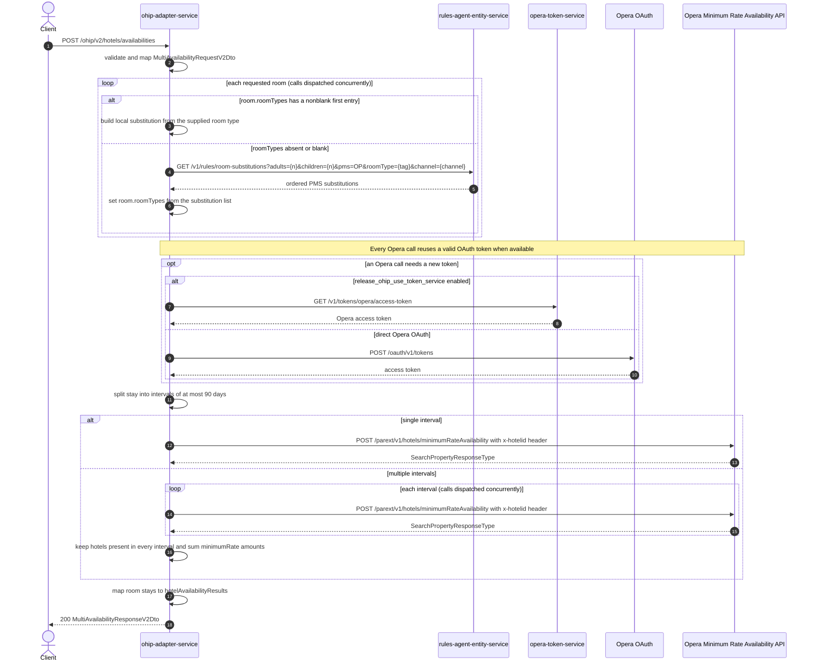

# OHIP Adapter Service: getMultiHotelAvailabilityV2 Flow

Returns a minimum-rate availability summary (available flag, minimum rate, currency) for a list of hotels by resolving room-type substitutions through rules-agent and calling the Opera minimum rate availability API.

```http
POST /ohip/v2/hotels/availabilities
Host: ohip-adapter-service:9100
Content-Type: application/json
Accept: application/json
```

The servlet context path is `/ohip/`. The endpoint itself requires no inbound authentication (Spring Security auto-configuration is excluded for the service). Every Opera outbound request uses the service OAuth client. When no reusable token exists, direct mode calls `POST /oauth/v1/tokens`; token-service mode calls `GET /v1/tokens/opera/access-token` instead.

## Flow

The controller validates the JSON body (`bookingChannel`, `hotelIds`, `arrivalDate`, `departureDate`, and `rooms` are mandatory) and maps it to a domain request. For each requested room, concurrently, the service resolves PMS room types: when the room already carries a nonblank `roomTypes` entry, a local substitution is built from it and no downstream call happens; otherwise it calls `rules-agent-entity-service` for room substitutions and writes the returned PMS room types back onto the room. The substitution map itself is discarded for this endpoint — its only lasting effect is populating empty `roomTypes`.

The out-port then maps the request to the Opera minimum-rate request shape (each room's `numberOfRooms` becomes `numberOfUnits`) and splits the stay into intervals of at most 90 days (`ohip.availability.maxRequestedDays`); every interval after the first starts one day earlier so nightly rates join up. A single interval is sent as one synchronous `POST /parext/v1/hotels/minimumRateAvailability` call to Opera with an `x-hotelid` header set to the first hotel id. Multiple intervals are sent concurrently and merged: only hotels present in every interval's response are kept, and their `minimumRate.amountAfterTax` values are summed across intervals.

Each returned Opera room stay maps to one `hotelAvailabilityResults` entry with `hotelId`, `available` (`true` only for Opera availability status `AVAILABLEFORSALE`), `minimumRate`, and `currency`. An Opera error status maps to a `HotelReservationException` with error code `OHIP_MULTIHOTEL_AVAILABILITY_EXCEPTION`.

## Mermaid Flow



## Features

- Multi-hotel minimum-rate availability summary by date range, rooms, and booking channel
- Room-type substitution through rules-agent only for rooms without a supplied room type; supplied room types are used as-is
- Automatic date-range splitting for stays over 90 days, with per-interval concurrent Opera calls and merged, summed minimum rates
- Pagination and shaping pass-through to Opera: `offset`, `limit`, `sortBy`, `minRate`, `accountId`, `includePublicRates`
- `available=true` only when Opera reports the hotel `AVAILABLEFORSALE`
- No inbound authentication; outbound Opera calls authenticated with the service OAuth client

## Feature Flags

No flags gate this endpoint's own logic. The only flags in the chain are the Opera token-acquisition flags that apply to every Opera outbound call:

| Flag | Effect when enabled |
| --- | --- |
| `release_ohip_use_token_service` | Obtains Opera tokens from `opera-token-service` instead of calling Opera OAuth directly; this applies to every Opera outbound call |
| `release_ohip_use_token_refresh_skew` | In direct OAuth mode, treats cached Opera tokens as expiring by the configured clock-skew interval before their actual expiry |

## Request

JSON body (`MultiAvailabilityRequestV2Dto`):

| Field | Required | Notes |
| --- | --- | --- |
| `bookingChannel` | Yes | Object; its `channel` drives the rules-agent substitution lookup |
| `hotelIds` | Yes | Opera hotel ids; the first one is sent as the Opera `x-hotelid` header |
| `arrivalDate` | Yes | `yyyy-MM-dd` |
| `departureDate` | Yes | `yyyy-MM-dd`; ranges over 90 days are split into multiple Opera calls |
| `rooms` | Yes | List of rooms; each has required `tag` plus optional `roomTypes`, `adults`, `children`, `numberOfRooms` (sent to Opera as `numberOfUnits`) |
| `accountId` | No | Passed through to Opera |
| `includePublicRates` | No | Passed through to Opera |
| `offset` / `limit` / `sortBy` | No | Passed through to Opera; echoed back in Opera's paging fields |
| `minRate` | No | Passed through to Opera |

## Branches

| Trigger | Behavior |
| --- | --- |
| Room supplies a nonblank first `roomTypes` entry | No rules-agent call for that room; the supplied type is used directly |
| Room has empty or blank `roomTypes` | Rules-agent substitution lookup runs and its PMS room types replace the room's `roomTypes` |
| Stay range over 90 days | Multiple concurrent Opera calls; only hotels returned in every interval survive, with minimum rates summed across intervals |
| Opera returns an error status | Mapped to `HotelReservationException` with code `OHIP_MULTIHOTEL_AVAILABILITY_EXCEPTION` |
