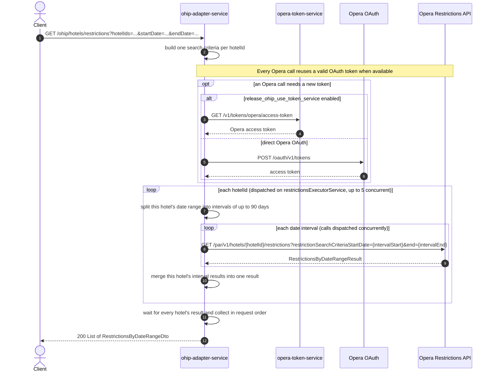

# OHIP Adapter Service: getMultiHotelRestrictionsByDateRange Flow

Returns stay restrictions for a date range across a list of hotels, by running the single-hotel restrictions flow once per hotel id in parallel and returning the results as a list.

```http
GET /ohip/hotels/restrictions?hotelIds=HTL1&hotelIds=HTL2&startDate=2022-03-01&endDate=2022-03-05
Host: ohip-adapter-service:9100
Accept: application/json
```

## Flow

The controller maps each `hotelIds` entry, together with the shared `startDate` and `endDate`, into one `RestrictionsByDateRangeSearchCriteria` per hotel. The domain port dispatches one restrictions lookup per hotel concurrently on a dedicated fixed-size thread pool (`restrictionsExecutorService`, default 5 threads, configurable via `config.service.ohip.restrictions.parallelThreads`), waits for every hotel's lookup to complete, and returns the results as a list in the same call order as `hotelIds`.

Each per-hotel lookup is the same flow as the single-hotel `GET /ohip/hotels/{hotelId}/restrictions` endpoint: the requested date range is split into intervals of at most 90 days, one Opera restrictions call per interval is made concurrently, and the interval results are merged into that hotel's result.

## Mermaid Flow



## Features

- Multi-hotel stay restrictions (such as minimum length of stay) over one shared date range
- Per-hotel concurrency bounded by a dedicated thread pool, independent of per-interval concurrency within a hotel
- Automatic 90-day interval splitting and recombination per hotel for ranges above the Opera limit
- Response list preserves the order of the requested `hotelIds`

## Feature Flags

None. This endpoint does not gate behavior on feature flags. (Opera OAuth token acquisition uses `release_ohip_use_token_service` and `release_ohip_use_token_refresh_skew`, shared infrastructure applied to every Opera outbound call in the service, not specific to this endpoint.)

## Request

| Parameter | Required | Notes |
| --- | --- | --- |
| `hotelIds` | Yes (query, repeated) | One or more Opera hotel ids |
| `startDate` | Yes | `yyyy-MM-dd`, applied to every hotel in the request |
| `endDate` | Yes | `yyyy-MM-dd`, applied to every hotel in the request |

## Branches

| Trigger | Behavior |
| --- | --- |
| More hotels than `restrictionsExecutorService` threads (default 5) | Excess per-hotel lookups queue on the pool until a thread frees up |
| A hotel's date range over 90 days | That hotel's interval calls are split, run concurrently, and merged before its result joins the response list |
| A hotel's first interval has no restriction data | A subsequent interval's result becomes that hotel's base result instead |
