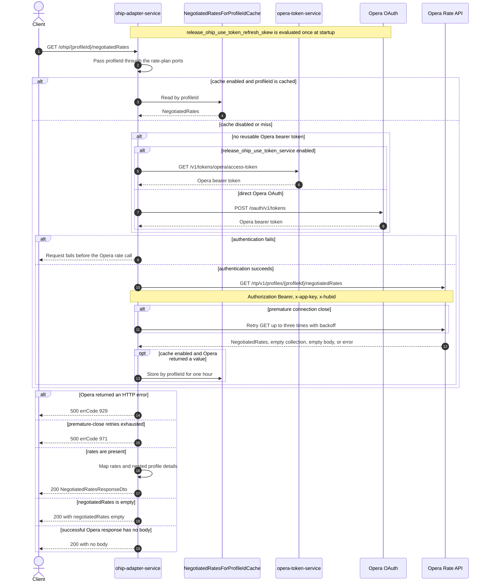

# OHIP Adapter Service: getNegotiatedRatesForProfileId Flow

Returns the Opera negotiated-rate assignments for one profile id.

```http
GET /ohip/{profileId}/negotiatedRates
Host: ohip-adapter-service:9100
Accept: application/json
```

The servlet context path is `/ohip/`; `RatePlansController` has no class-level path and maps
this method directly to `/{profileId}/negotiatedRates`. The controller has no endpoint-level
authentication guard. Outbound Opera requests carry a bearer token, `x-app-key`, and the
configured `x-hubid`.

## Flow

`RatePlansController.getNegotiatedRatesForProfileId` passes the path value unchanged through
`RatePlansInPortImpl` to `RatePlansOutPortImpl`. There is no validation, profile lookup,
endpoint-specific feature decision, fan-out, or secondary collaborator on this chain.

`OhipRatePlansClient.getNegotiatedRatesForProfileId` is conditionally cached for one hour in
`NegotiatedRatesForProfileIdCache`, keyed only by `profileId`. When caching is disabled or the
key is absent, it obtains or reuses an Opera bearer token and sends exactly one
`GET /rtp/v1/profiles/{profileId}/negotiatedRates` request with the configured `x-hubid`.
The shared Opera WebClient also adds `x-app-key` and the bearer token. The integration
environment sets `CACHE_TYPE=none`, so every integration request follows this Opera-call path.

The two MapStruct mappers preserve Opera's `negotiatedRates` collection and its rate, profile,
profile-id, profile-name, and rate-access fields in the public `NegotiatedRatesResponseDto`.
An Opera payload containing `"negotiatedRates": []` is a successful result and returns HTTP
200 with the same empty collection; it is not converted to 404. A successful Opera response
with no body instead produces a null mapped result and the controller returns HTTP 200 with no
response body.

Any Opera HTTP error status is translated to `RatePlansException`, so the public response is
HTTP 500 with errCode `929` (`OHIP_GET_NEGOTIATED_RATES_EXCEPTION`). The shared GET transport
retries only a premature connection close, up to three times with backoff; exhausting those
retries returns HTTP 500 with errCode `971`.

## Mermaid Flow



## Features

- One profile-id lookup with no preliminary profile or company call
- One Opera Rate API call on every integration request because application-data caching is off
- One-hour, profile-id-keyed caching when service caching is enabled outside integration
- Preservation of negotiated rate, hotel, profile, and rate-access details through both mappers
- Empty negotiated-rate collections remain successful empty collections
- Shared Opera OAuth selection and premature-close retry handling

## Feature Flags

No endpoint-specific business flag changes the request, mapping, or response. The shared Opera
authentication path evaluates these flags in `ohip-adapter-service`:

| Flag | Effect when enabled |
| --- | --- |
| `release_ohip_use_token_service` | Selects `opera-token-service` (`GET /v1/tokens/opera/access-token`) instead of direct Opera OAuth when a bearer token is required. |
| `release_ohip_use_token_refresh_skew` | Applies `config.service.ohip.tokenRefreshClockSkew` to refresh directly acquired Opera OAuth tokens early. It does not change the negotiated-rates request or public response. |

## Request

| Parameter | Location | Required | Effect |
| --- | --- | --- | --- |
| `profileId` | path | Yes | Used unchanged as the Opera profile-id path segment and as the one-hour cache key |

There are no query parameters or request body.

## Branches

| Trigger | Behavior |
| --- | --- |
| Integration environment (`CACHE_TYPE=none`) | Always obtains or reuses authorization and calls Opera once; no cache-hit branch is reachable |
| Cache enabled and `profileId` cached | Returns the cached Opera value without a new token-acquisition or negotiated-rates call |
| A valid authorized-client token is reusable | Skips both token-acquisition HTTP endpoints |
| No reusable token and `release_ohip_use_token_service` is disabled | Uses direct Opera OAuth; `ENABLE_CLIENT_CREDENTIALS` selects client credentials or the password grant |
| Opera returns `negotiatedRates: []` | Returns HTTP 200 with an empty negotiated-rates collection |
| Opera returns HTTP 2xx with no body | Returns HTTP 200 with no response body because both MapStruct mappers return null for null input |
| Opera returns any HTTP error status | Returns HTTP 500 with errCode `929`; the original Opera status is not preserved |
| The Opera GET closes prematurely | Retries up to three times with backoff; exhaustion returns HTTP 500 with errCode `971` |

The controller advertises HTTP 400 and 404 responses, but this runtime chain contains no
endpoint-specific branch that produces either status.
