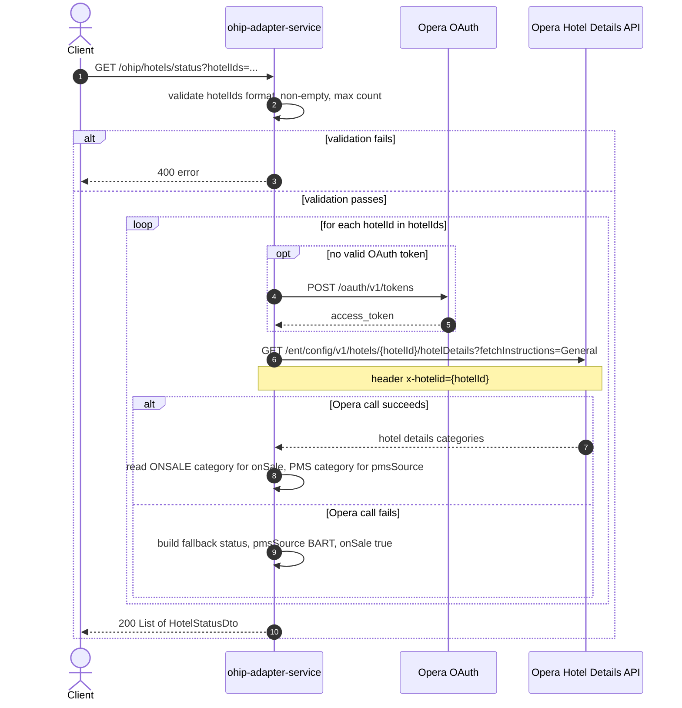

# OHIP Adapter Service: getOnSaleFlagFromOpera Flow

Returns the Opera-to-BART migration status (on-sale flag and PMS source) for one or more
hotels, by reading each hotel's Opera enterprise hotel-details record.

```http
GET /ohip/hotels/status?hotelIds={hotelId1},{hotelId2},...
Host: ohip-adapter-service:9100
Accept: application/json
```

The servlet context path is `/ohip/`. Opera calls use the service OAuth client when no
valid token is present.

## Flow

The controller validates the `hotelIds` request param (format, non-empty, count against
the configured limit) before doing anything else. For each hotel id, ohip-adapter-service
calls Opera enterprise hotel details with `fetchInstructions=General`. From the returned
detail categories it reads the `ONSALE` entry to determine the on-sale flag and the `PMS`
entry to determine the PMS source, defaulting either when Opera's response does not
contain that category. If the Opera call for a hotel id fails for any reason, that hotel
is instead reported as on sale with a fallback (BART) migration status rather than
failing the whole request, so a hotel never drops off sale because of an Opera outage. Results are mapped one-for-one from request hotel ids to
response entries, in no guaranteed order tied to the input set's iteration.

## Mermaid Flow



## Features

- Bulk lookup: accepts multiple `hotelIds` in one call, one Opera hotel-details call per
  hotel id (no batching on the Opera side)
- Reports migration state per hotel: `onSale` flag and `pmsSource` (`OPERA` or `BART`)
- Resilient per-hotel: an Opera failure for one hotel id does not fail the other hotel
  ids in the same request; that hotel is reported as PMS source `BART` and on sale

## Feature Flags

None. This endpoint does not gate behavior on feature flags.

Global OAuth may still use `release_ohip_use_token_service` for token acquisition on
Opera calls.

## Request

| Parameter | Required | Notes |
| --- | --- | --- |
| `hotelIds` | Yes (query) | Comma-separated set of hotel ids. Must match `[a-zA-Z0-9,]+`, must be non-empty, and each id must be 6 uppercase letters (`A-Z`). Count must be less than or equal to the configured `hotels.noOfAllowedHotels` (200). |

No body.

## Branches

| Trigger | Behavior |
| --- | --- |
| `hotelIds` contains a character outside `[a-zA-Z0-9,]+` | 400, `OhipBadRequestRetryException` ("Invalid HotelId format") before any Opera call |
| `hotelIds` empty | 400, `OhipBadRequestException` ("Missing Hotel Ids !") |
| `hotelIds` count exceeds `hotels.noOfAllowedHotels` (200) | 400, `OhipBadRequestException` ("Number of Hotel ids should be less or equal to 40") |
| A hotel id is not 6 uppercase letters | 400, `OhipBadRequestException` ("Invalid Hotel Id !") |
| Opera hotel-details response has no `ONSALE` category for a hotel id | Defaults that hotel's on-sale flag to `false` |
| Opera hotel-details response has no `PMS` category for a hotel id | Defaults that hotel's PMS source category, later normalized to `BART` unless it resolves to `OPERA` |
| Opera call throws (4xx, 5xx, or other error) for a hotel id | That hotel id is reported with PMS source `BART` and `onSale=true` instead of failing the request |
