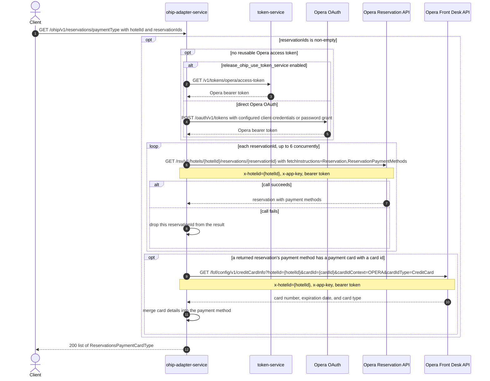

# OHIP Adapter Service: getPaymentTypeReservationsByReservationIds Flow

Returns the payment card/method for each requested reservation, fetching each reservation's payment methods from Opera and enriching any card-backed payment with full card details from Opera Front Desk.

```http
GET /ohip/v1/reservations/paymentType
Host: ohip-adapter-service:9100
Accept: application/json
```

The servlet context path is `/ohip/` and `HotelReservationController` is mapped under `/v1`, so the public path is `/ohip/v1/reservations/paymentType`. All Opera API calls carry a bearer token plus `x-app-key` and `x-hotelid` headers. A cached access token is reused until its refresh criteria require another direct Opera OAuth or token-service request.

## Flow

For each `reservationId` in the request, ohip-adapter-service fetches the reservation from the Opera Reservation API with fetch instructions limited to `Reservation` and `ReservationPaymentMethods`, running up to 6 of these lookups concurrently. A reservation whose Opera call fails is dropped from the result rather than failing the whole request. For each returned reservation, if any of its Opera payment methods carries a payment card with a card id, the service looks up that card's full details (number, expiration date, and card type) from Opera Front Desk and merges them into the payment method before mapping the response. Reservations without a card-bearing payment method are mapped using only the Opera payment-method data already returned. An empty or missing `reservationIds` list short-circuits to an empty response with no Opera calls.

## Mermaid Flow



## Features

- Batches per-reservation Opera lookups with a concurrency of 6.
- Tolerates per-reservation Opera failures: a failing reservation is logged and omitted, not surfaced as an overall error.
- Enriches only the first card-bearing payment method per reservation with full card details from Opera Front Desk; reservations without a card id skip the Front Desk call.
- Acquires and caches an Opera bearer token, using either token-service or the configured direct Opera OAuth grant.

## Feature Flags

None. This endpoint does not gate behavior on feature flags. (It shares the token-acquisition code path with other endpoints, whose `release_ohip_use_token_service` flag selects token-service vs. direct Opera OAuth, but that flag does not change this endpoint's own business logic.)

## Request

| Query parameter | Required | Purpose |
| --- | --- | --- |
| `hotelId` | Yes | Opera hotel id used in downstream paths and the `x-hotelid` header. |
| `reservationIds` | Yes | List of Opera reservation ids to look up; an empty list returns an empty list with no downstream calls. |

## Branches

| Trigger | Behavior |
| --- | --- |
| `reservationIds` is null or empty | Returns an empty list immediately; no Opera calls are made. |
| Opera reservation lookup fails for a given `reservationId` | That reservation is logged and dropped from the response; other reservations are unaffected. |
| A reservation's payment method has a payment card with a non-null card id | Front Desk `creditCardInfo` is called to enrich card number, expiration date, and card type (preferring `userDefinedCardType` when present). |
| A reservation's payment method has no card id, or no payment card at all | No Front Desk call is made for that reservation; the response uses the Opera payment-method data as-is. |
| Token-service mode is disabled and no direct Opera token is reusable | Uses the configured client-credentials grant when enabled, otherwise the password grant. |
| Opera Reservation or Front Desk calls fail outside the per-reservation lookup (e.g. Front Desk error) | Propagates the mapped internal/downstream exception. |
