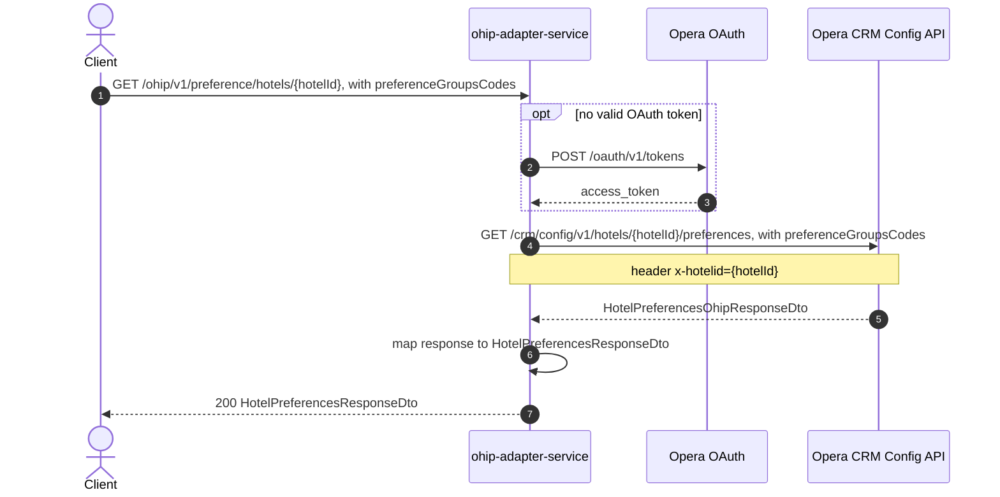

# OHIP Adapter Service: getPreferencesForGroup Flow

Returns the hotel-level preferences that belong to the requested preference group(s), sourced from Opera CRM config.

```http
GET /ohip/v1/preference/hotels/{hotelId}?preferenceGroupsCodes={groupCode}
Host: ohip-adapter-service:9100
Accept: application/json
```

The servlet context path is `/ohip/`. Opera calls use the service OAuth client when no valid token is present.

## Flow

The controller passes `hotelId` and `preferenceGroupsCodes` straight through to the preference in-port, which forwards them unchanged to the preference out-port. The out-port calls Opera CRM config for the hotel's preferences, filtered by the requested group code(s), and maps the Opera response into the public `HotelPreferencesResponseDto`. There is no caching, validation, or business-rule branching in this path - it is a direct pass-through to Opera.

## Mermaid Flow



## Features

- Hotel preferences lookup scoped to one or more preference group codes
- Direct pass-through to Opera CRM config, no caching or enrichment

## Feature Flags

None. This endpoint does not gate behavior on feature flags.

Global OAuth may still use `release_ohip_use_token_service` for token acquisition on Opera calls.

## Request

| Parameter | Required | Notes |
| --- | --- | --- |
| `hotelId` | Yes (path) | Opera hotel id, also sent as the `x-hotelid` header to Opera |
| `preferenceGroupsCodes` | Yes (query) | Preference group code(s) to filter Opera's response |

No request body.

## Branches

None beyond the shared OAuth token acquisition. Every call reaches Opera CRM config; there is no cache to hit or miss.
