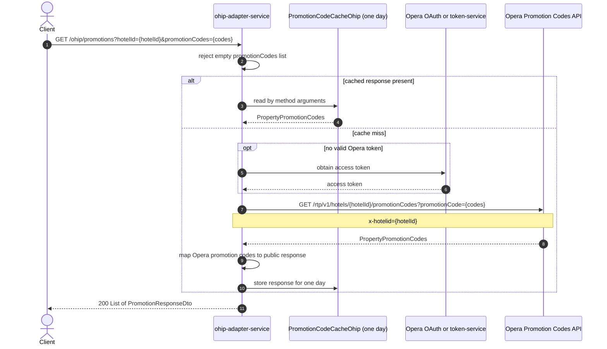

# OHIP Adapter Service: getPromotionCode Flow

Returns Opera promotion-code details for one or more promotion codes at a hotel.

```http
GET /ohip/promotions?hotelId={hotelId}&promotionCodes={code}
Host: ohip-adapter-service:9100
Accept: application/json
```

The servlet context path is `/ohip/`. Opera calls use the configured OAuth mode
when a valid token is not already available.

## Flow

The controller requires `hotelId` and a non-empty list of `promotionCodes`. The
rate-plan in-port rejects an empty `promotionCodes` list before any downstream
call is made. Valid requests pass both values to the Opera rate-plan client.

The client checks the one-day `PromotionCodeCacheOhip`. On a cache miss, it calls
Opera `GET /rtp/v1/hotels/{hotelId}/promotionCodes`, sends each requested code as
a `promotionCode` query value, and sends the hotel id in the `x-hotelid` header.
The Opera response's `propertyPromotionCodes` list is mapped into the public
`PromotionResponseDto` list and returned with HTTP 200.

## Mermaid Flow



## Features

- Hotel-specific Opera promotion-code lookup for one or more codes
- Rejects requests with an empty `promotionCodes` list before calling Opera
- One-day caching of the Opera response
- Mapping from Opera promotion codes to the public response model
- Configurable Opera token acquisition

## Feature Flags

| Flag | Effect when enabled |
| --- | --- |
| `release_ohip_use_token_service` | Obtains Opera access tokens through token-service instead of direct Opera OAuth; this is a global Opera-client mode rather than endpoint-specific business behavior |

## Request

| Query parameter | Required | Purpose |
| --- | --- | --- |
| `hotelId` | Yes | Sent to Opera as the `x-hotelid` header and as a path segment on the Opera call |
| `promotionCodes` | Yes | List of promotion codes forwarded to Opera as `promotionCode` query values; an empty list is rejected before Opera is called |

Example:

```http
GET /ohip/promotions?hotelId=HEAPTI&promotionCodes=SUMMER24
Accept: application/json
```

## Branches

| Trigger | Behavior |
| --- | --- |
| `promotionCodes` empty | Returns `DIGITAL_NO_PROMO_CODE_EXCEPTION` without calling Opera |
| Cached response present | Skips token acquisition and the Opera call |
| Cache miss | Calls Opera and caches the mapped response for one day |
| Token-service flag enabled | Uses token-service instead of direct Opera OAuth |
| Opera returns an error | Raises `OHIP_GET_PROMOTION_CODE_DETAILS_EXCEPTION` |
