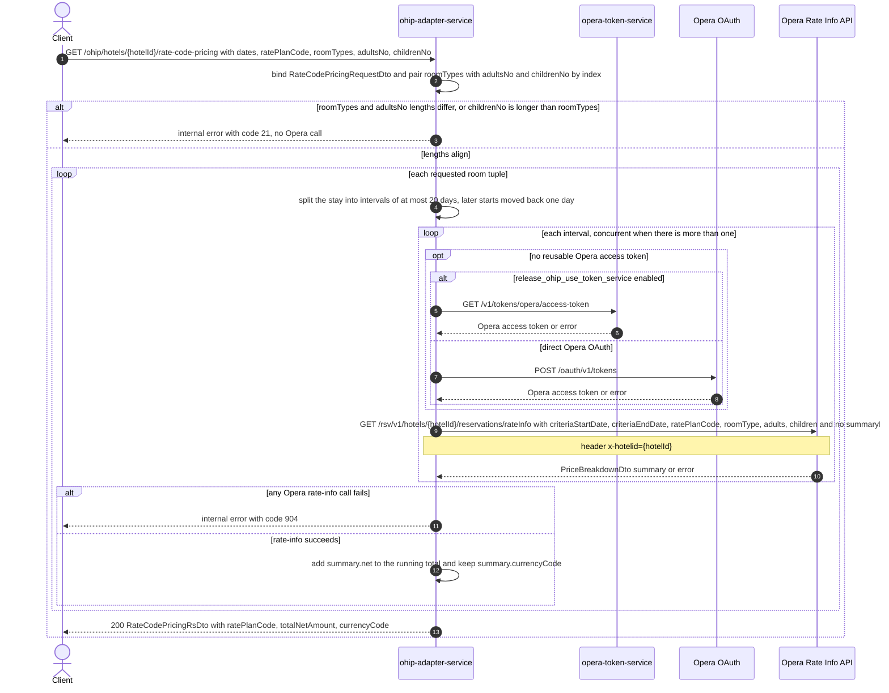

# OHIP Adapter Service: getRateCodePricing Flow

Returns the total net cost and currency for one rate plan over a stay, summed across every
requested room type and occupancy tuple.

```http
GET /ohip/hotels/{hotelId}/rate-code-pricing?arrivalDate={arrivalDate}&departureDate={departureDate}&ratePlanCode={ratePlanCode}&roomTypes={roomTypes}&adultsNo={adultsNo}&childrenNo={childrenNo}
Host: ohip-adapter-service:9100
Accept: application/json
```

The servlet context path is `/ohip/` and `HotelAvailabilityController` has no class-level
`@RequestMapping`, so the public path is `/ohip/hotels/{hotelId}/rate-code-pricing`. Every Opera
request uses the service OAuth client: when no reusable token exists, direct mode calls Opera
OAuth while token-service mode calls `opera-token-service` instead.

## Flow

The controller binds the query parameters to `RateCodePricingRequestDto` and
`RateCodeCriteriaDomainMapper` turns it into a `RateCodeCriteria`, pairing each `roomTypes`
entry with the `adultsNo` and `childrenNo` value at the same list index (an index past the end
of `childrenNo`, or a null entry, yields `0`). Mismatched `roomTypes`/`adultsNo` lengths, or a
`childrenNo` longer than `roomTypes`, raise `RateCodePricingException` before any downstream
call. The mapper reads `roomTypes`, `adultsNo` and `childrenNo` sizes without a null check, so
an entirely omitted list ends the request with a NullPointerException before any Opera call
(HTTP 500 carrying `errCode` 400) rather than defaulting.

`HotelAvailabilityInPortImpl.getRateCodePricing` delegates straight to
`HotelAvailabilityOutPortImpl`, which loops over the room-info criteria. For each tuple,
`ApiLimitsService.getRateInfoResponse(RateCodeCriteria, RateCodeRoomInfoCriteria)` splits the
stay into intervals of at most `maxRequestedDaysRateInfo - 1` (20) days, moving every interval
after the first back one day, then calls Opera through
`OhipAvailabilityClient.getRateCodePricing`. A single interval is called synchronously; several
intervals are dispatched concurrently on the API-limits executor and their summaries merged
(details concatenated, `net` and `gross` summed, currency and suppressed-rate taken from the
first interval).

Each Opera call is `GET /rsv/v1/hotels/{hotelId}/reservations/rateInfo` carrying exactly six
query parameters - `criteriaStartDate`, `criteriaEndDate`, `ratePlanCode`, `roomType`,
`adults` and `children` - plus the `x-hotelid` header. Observed on the wire:
`GET /rsv/v1/hotels/HEAPTI/reservations/rateInfo?criteriaStartDate=2026-09-26&criteriaEndDate=2026-09-28&ratePlanCode=SEMIFLEX&roomType=DBL&adults=2&children=0`.
`children` is always sent, defaulting to `0`. Note that this endpoint sends **no `summaryInfo`
parameter** - unlike the sibling `price-breakdown` endpoint (`getPriceBreakdownPerNight`),
which sends `summaryInfo=true`, and unlike the reservation-scoped reads on the same Opera URL,
which send `id`, `type=Reservation` and no criteria parameters. The criteria-shaped call is
therefore identified by the six parameters above and carries no reservation identifier.

The out-port accumulates `summary.net` from every tuple's response into `totalNetAmount`, keeps
the last response's `summary.currencyCode`, and echoes the requested `ratePlanCode`. Any Opera
HTTP error becomes `HotelReservationException(OHIP_RATECODE_INFO_EXCEPTION)`, internal error
code `904`, mapped to an internal-server error response. No profile, reservation, availability
or inventory call is made, and no cache sits in front of the Opera call.

## Mermaid Flow



## Features

- One rate plan priced across many room-type and occupancy tuples in a single request, aligned
  by the indexes of `roomTypes`, `adultsNo` and `childrenNo`
- One Opera rate-info call per requested room tuple for an ordinary date range; a stay longer
  than the configured window costs one call per split interval per tuple
- Automatic splitting at `maxRequestedDaysRateInfo - 1` (20) days with concurrent Opera calls
  and merged summaries; later interval starts are moved back one day to keep boundary coverage
- Response is an aggregate only: `ratePlanCode`, `totalNetAmount` (sum of `summary.net` over
  every tuple and interval), and `currencyCode` from the last tuple's summary. No per-night or
  per-room breakdown is returned
- Occupancy defaulting: an index past the end of `childrenNo`, or a null entry, contributes `0`
  children; a wholly omitted list is not defaulted and fails before any Opera call
- No endpoint data cache; only a reusable OAuth access token can avoid an extra authentication
  call

## Feature Flags

| Flag | Effect when enabled |
| --- | --- |
| `release_ohip_use_token_service` | Obtains the Opera access token from `GET /v1/tokens/opera/access-token` instead of calling Opera OAuth directly |
| `release_ohip_use_token_refresh_skew` | In direct OAuth mode, treats a cached Opera token as expiring by the configured clock-skew interval before its actual expiry |

No business flag is evaluated on this path. `HotelAvailabilityInPortImpl` and
`HotelAvailabilityOutPortImpl` do evaluate `flexRateStrikethroughBB` and
`availabilityFromDifferentRoomClasses`, but only inside `getHotelAvailability` and
`removeInconsistentRoomClassesRates`, neither of which this endpoint reaches. The two flags
listed above are transport-level token flags in `WebClientConfig`.

## Request

| Parameter | Required by implementation | Purpose |
| --- | --- | --- |
| `hotelId` | Yes, path | Opera hotel id used in the rate-info path and the `x-hotelid` header |
| `arrivalDate` | Yes | Stay start, parsed as `yyyy-MM-dd`, sent as `criteriaStartDate` |
| `departureDate` | Yes | Stay end, parsed as `yyyy-MM-dd`, sent as `criteriaEndDate` |
| `ratePlanCode` | Yes | Opera rate-plan code sent on every tuple's call and echoed in the response |
| `roomTypes` | Yes | Repeated or comma-separated room types; one Opera call per entry |
| `adultsNo` | Yes | Adult counts aligned by index with `roomTypes`; sent as `adults` |
| `childrenNo` | Yes, may be blank | Child counts aligned by index with `roomTypes`; sent as `children`, `0` for indexes the list does not cover. Omitting the parameter entirely fails in the mapper |

`RateCodePricingRequestDto` carries no bean-validation annotations despite the controller's
`@Valid`; the only structural check is the length check in `RateCodeCriteriaDomainMapper`.

## Branches

| Trigger | Behavior |
| --- | --- |
| Empty (present but blank) `roomTypes`, `adultsNo` and `childrenNo` | Makes no Opera call and returns 200 with `totalNetAmount` of `0` and no `currencyCode` |
| `roomTypes`, `adultsNo` or `childrenNo` omitted entirely | NullPointerException inside `RateCodeCriteriaDomainMapper` before any Opera call: HTTP 500 with `errCode` 400 |
| `roomTypes` and `adultsNo` of different length, or `childrenNo` longer than `roomTypes` | `RateCodePricingException` with `DIGITAL_RATE_CODE_PRICING_EXCEPTION`, internal error code `21`, before any Opera call |
| Stay of at most 20 days | One synchronous Opera rate-info call per tuple |
| Stay longer than 20 days | Concurrent Opera calls per split interval per tuple, summaries merged before the totals are accumulated |
| Opera rate-info returns any HTTP error | `HotelReservationException` with `OHIP_RATECODE_INFO_EXCEPTION`, internal error code `904` |
| Opera rate-info returns a body without `summary` | Fails inside the out-port while reading `summary.currencyCode`/`summary.net` |
| A reusable OAuth token exists | Skips token acquisition and sends the Opera rate-info request directly |
| Token-service mode needs a token and token retrieval fails | Stops before the Opera call with an internal token-service error |
