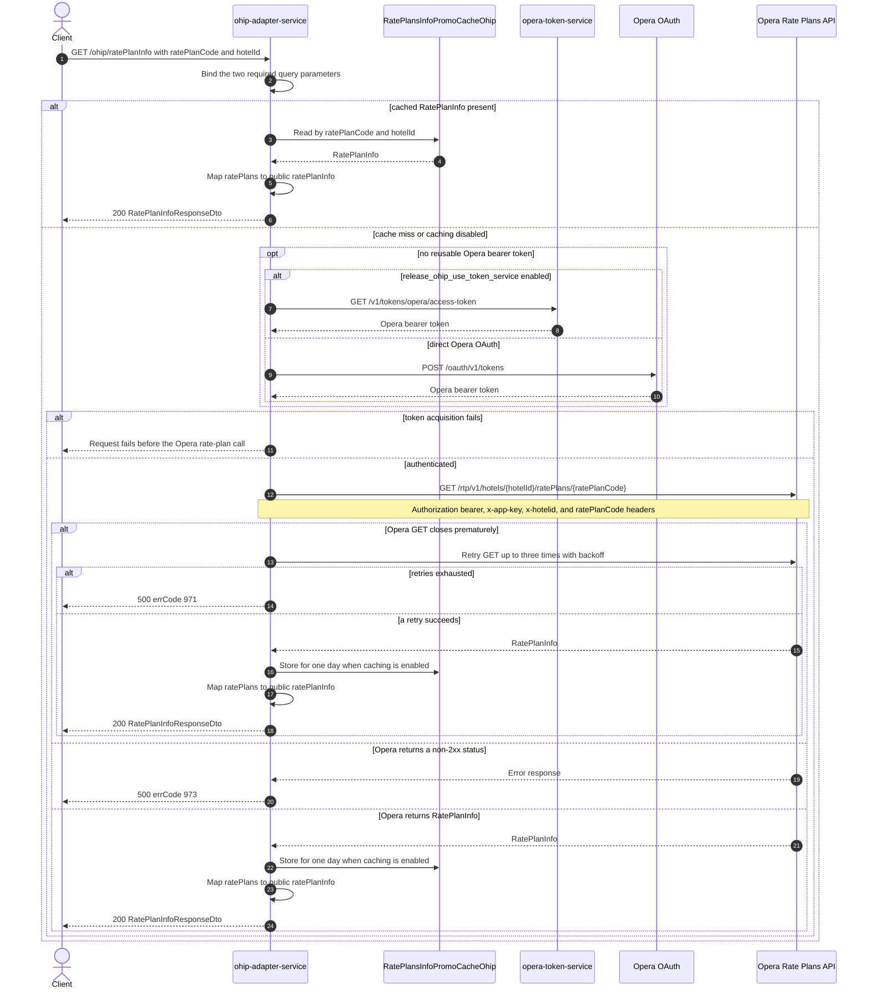

# OHIP Adapter Service: getRatePlanInfo Flow

Returns Opera rate-plan detail for one rate-plan code at one hotel.

```http
GET /ohip/ratePlanInfo?ratePlanCode={ratePlanCode}&hotelId={hotelId}
Host: ohip-adapter-service:9100
Accept: application/json
```

The servlet context path is `/ohip/`. The controller has no endpoint-level authentication
guard. Outbound Opera requests carry a bearer token, `x-app-key`, `x-hotelid`, and a
`ratePlanCode` header.

## Flow

`RatePlansController.getRatePlanInfo` requires the `ratePlanCode` and `hotelId` query
parameters and passes them unchanged through `RatePlansInPortImpl` and
`RatePlansOutPortImpl`. There is no domain validation, secondary collaborator, fan-out, or
endpoint-specific feature-flag decision.

`OhipRatePlansClient.getRatePlanInfo` is one-day cached by the combined rate-plan code and
hotel id when caching is enabled. On a cache miss, it uses the shared authenticated Opera
WebClient to call
`GET /rtp/v1/hotels/{hotelId}/ratePlans/{ratePlanCode}`. The request sends `hotelId` as
`x-hotelid`, sends the rate-plan code again as the `ratePlanCode` header, and also carries the
shared `Authorization: Bearer ...` and `x-app-key` headers.

The Opera `RatePlanInfo.ratePlans` list is mapped to the public
`RatePlanInfoResponseDto.ratePlanInfo` list. A successful controller return is HTTP 200. Every
Opera non-2xx status is mapped to `OHIP_GET_RATEPLANINFO_DETAILS_EXCEPTION`, HTTP 500 with
errCode `973`; an Opera 404 is not preserved as a public 404. A premature close of the Opera
GET is retried up to three times with backoff, and exhaustion maps to HTTP 500 with errCode
`971`.

## Mermaid Flow



## Features

- Hotel-specific lookup of one Opera rate-plan code
- One-day caching by the combined rate-plan code and hotel id when caching is enabled
- Direct mapping of Opera's `ratePlans` list to the public `ratePlanInfo` list
- Shared Opera bearer-token acquisition and selective retry for premature GET connection closes
- No endpoint-level authentication guard, domain rule, fan-out, or collaborator other than
  Opera authentication and the Opera Rate Plans API

## Feature Flags

No endpoint-specific business flag is evaluated. The shared Opera transport evaluates these
authentication flags:

| Flag | Effect when enabled |
| --- | --- |
| `release_ohip_use_token_service` | Selects `opera-token-service` (`GET /v1/tokens/opera/access-token`) instead of direct Opera OAuth when a bearer token is required. |
| `release_ohip_use_token_refresh_skew` | Applies the configured early-refresh clock skew to tokens acquired directly from Opera OAuth. It does not change the rate-plan GET or response. |

## Request

| Query parameter | Required | Effect |
| --- | --- | --- |
| `ratePlanCode` | Yes | Opera path value and outgoing `ratePlanCode` header |
| `hotelId` | Yes | Opera path value and outgoing `x-hotelid` header |

## Branches

| Trigger | Behavior |
| --- | --- |
| A cached value exists | Returns the cached Opera `RatePlanInfo` without token acquisition or an Opera data call |
| Caching is disabled or the cache misses | Authenticates as needed and makes exactly one Opera rate-plan GET |
| A valid Opera token is already reusable | Skips token acquisition and sends the Opera rate-plan GET directly |
| No reusable token and `release_ohip_use_token_service` is disabled | Obtains a token directly from Opera OAuth |
| Token acquisition fails | Fails before sending the Opera rate-plan GET |
| Opera returns any non-2xx status | Returns HTTP 500 with errCode `973`; there is no separate not-found branch |
| The Opera GET closes prematurely | Retries up to three times with backoff; exhaustion returns HTTP 500 with errCode `971` |
| Opera returns a successful empty body | Both MapStruct mappings receive `null`; the controller has no explicit absence or not-found handling |
