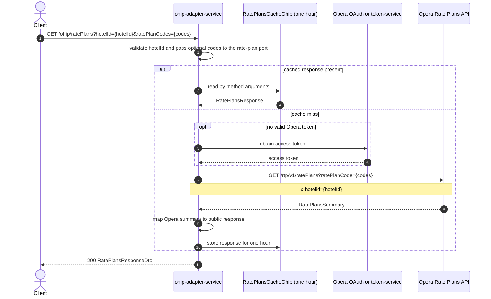

# OHIP Adapter Service: getRatePlans Flow

Returns Opera rate-plan summaries for a hotel, optionally filtered to requested
rate-plan codes.

```http
GET /ohip/ratePlans?hotelId={hotelId}[&ratePlanCodes={code}]
Host: ohip-adapter-service:9100
Accept: application/json
```

The servlet context path is `/ohip/`. Opera calls use the configured OAuth mode
when a valid token is not already available.

## Flow

The controller requires `hotelId` and accepts an optional list of
`ratePlanCodes`. It passes both values through the rate-plan in-port to the Opera
rate-plan client.

The client checks the one-hour `RatePlansCacheOhip`. On a cache miss, it calls
Opera `GET /rtp/v1/ratePlans`, sends each requested code as a `ratePlanCode` query
value, and sends the hotel id in the `x-hotelid` header. The Opera summary is
mapped into the public `RatePlansResponseDto` and returned with HTTP 200.

## Mermaid Flow



## Features

- Hotel-specific Opera rate-plan lookup
- Optional filtering by one or more rate-plan codes
- One-hour caching of the Opera response
- Mapping from Opera rate-plan summaries to the public response model
- Configurable Opera token acquisition

## Feature Flags

| Flag | Effect when enabled |
| --- | --- |
| `release_ohip_use_token_service` | Obtains Opera access tokens through token-service instead of direct Opera OAuth; this is a global Opera-client mode rather than endpoint-specific business behavior |

## Request

| Query parameter | Required | Purpose |
| --- | --- | --- |
| `hotelId` | Yes | Sent to Opera as the `x-hotelid` header |
| `ratePlanCodes` | No | List of rate-plan codes forwarded to Opera as `ratePlanCode` query values; omission requests the available hotel rate plans |

Example:

```http
GET /ohip/ratePlans?hotelId=HEAPTI&ratePlanCodes=SEMIFLEX&ratePlanCodes=ADVANCE
Accept: application/json
```

## Branches

| Trigger | Behavior |
| --- | --- |
| `ratePlanCodes` omitted | Calls Opera without a rate-plan-code filter |
| Cached response present | Skips token acquisition and the Opera call |
| Cache miss | Calls Opera and caches the mapped response for one hour |
| Token-service flag enabled | Uses token-service instead of direct Opera OAuth |
| Opera returns an error | Raises `OHIP_GET_RATEPLAN_DETAILS_EXCEPTION` |
