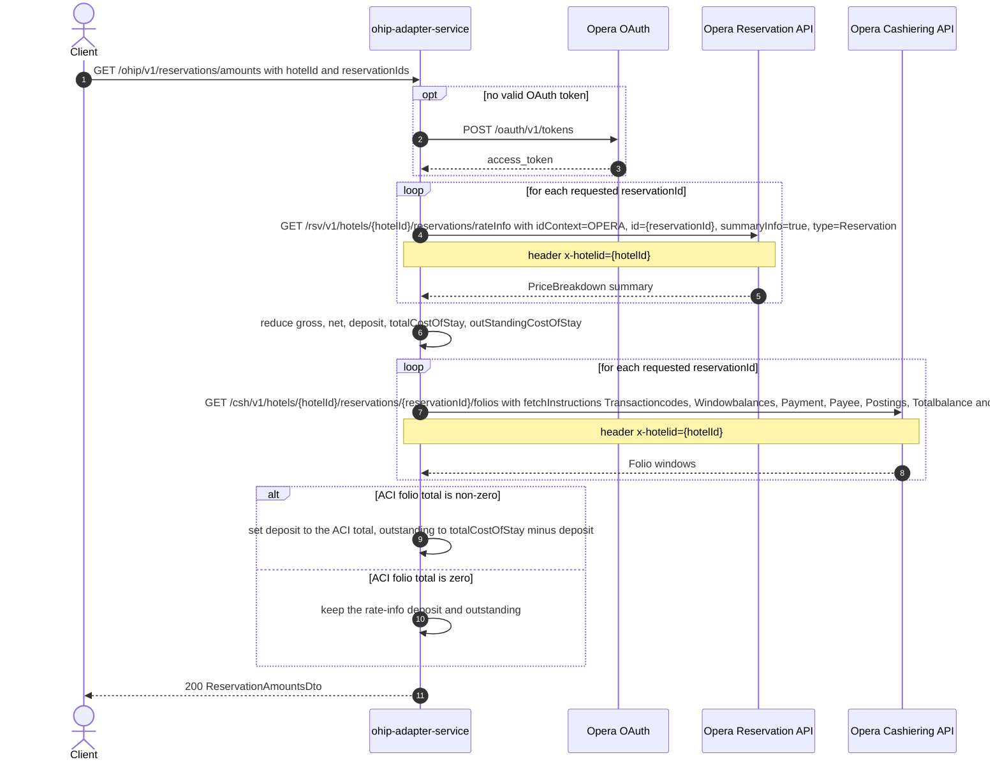

# OHIP Adapter Service: getReservationAmounts Flow

Returns one aggregated money summary (currency, gross, net, deposit, total cost of stay, outstanding cost of stay) for a set of Opera reservations at one hotel, with the deposit corrected by whatever has actually been posted on each reservation's cashiering folio.

```http
GET /ohip/v1/reservations/amounts?hotelId={hotelId}&reservationIds={id1},{id2}
Host: ohip-adapter-service:9100
Accept: application/json
```

The servlet context path is `/ohip/` and `HotelReservationController` is mapped under `/v1`, so the public path is `/ohip/v1/reservations/amounts`. `reservationIds` binds to a `Set<String>`, so duplicate ids collapse and iteration order follows the parsed set. No endpoint-level authentication guard is applied; Opera calls use the service OAuth client when no valid token is present.

## Flow

`HotelReservationController.getReservationAmounts` maps nothing on the way in and delegates to `HotelReservationInPortImpl.getReservationAmounts`, which is a pure delegation to `HotelReservationOutPortImpl.getReservationAmounts(hotelId, reservationIds)`.

The out-port runs two Opera legs, in order.

First the private `getReservationAmounts(hotelId, reservationIds, null)` overload reads the reservation-scoped rate-info summary for every requested reservation id (`Flux.flatMap`, so the calls fan out) and reduces the summaries into one `ReservationAmounts`: `currencyCode` is taken from the last summary reduced, while `gross`, `net`, `totalCostOfStay` and `outStandingCostOfStay` are summed and `deposit` is summed after negation (Opera reports deposits as negative amounts). The `rateInfoMap` argument is `null` on this path, so no per-reservation breakdown is retained.

Then, for every reservation id, it reads the Opera cashiering folios and sums the `payment.amount` of every folio window whose `emptyFolio` is `false`, taking the absolute value; this is the "ACI" deposit total. If that total is non-zero, it overwrites the reduced `deposit` and recomputes `outStandingCostOfStay` as `totalCostOfStay - depositFromAci`; a zero ACI total leaves the rate-info figures untouched.

`ReservationAmountsMapper` copies the model straight onto `ReservationAmountsDto` and the controller answers `200`. `discount` is never populated on this path and is always `null`.

No reservation read, profile read, CDH, AEM, Worldline or rules-agent call happens on this path, and neither Opera leg is cached.

## Mermaid Flow



## Features

- Multi-reservation aggregation: one response for the whole `reservationIds` set, not per reservation
- Opera reservation rate-info summary read per reservation id, with `idContext=OPERA`, `summaryInfo=true`, `type=Reservation` (no `criteriaStartDate`, no `roomType`, no `detailDate`)
- Opera cashiering folios read per reservation id, with the six `fetchInstructions` values and `includeFolioHistory=false`
- Deposit reconciliation: money actually posted on non-empty folio windows wins over the rate-info deposit, and the outstanding stay cost is recomputed from it
- `currencyCode` comes from the reservation summaries; `discount` is always `null` on this path
- No reservation, profile, CDH, AEM, Worldline or rules-agent call; no caching on either Opera leg

## Feature Flags

None. This endpoint does not gate behavior on feature flags. `HotelReservationInPortImpl.getReservationAmounts` is a pure delegation, and `HotelReservationOutPortImpl.getReservationAmounts` (both overloads), `extractAmountFromFolioWindows`, `OhipReservationClient.getReservationAmounts` and `OhipReservationClient.getFoliosAciAmount` contain no `unleashWrapper.isEnabled(...)` call.

Global OAuth may still use `release_ohip_use_token_service` for token acquisition on Opera calls; that flag is evaluated outside the request context and cannot be pinned.

## Request

| Query parameter | Required | Default | Purpose |
| --- | --- | --- | --- |
| `hotelId` | Yes | n/a | Opera hotel id used in both Opera paths and in the `x-hotelid` header |
| `reservationIds` | Yes | n/a | Set of Opera reservation ids; one rate-info read and one folios read per id, all reduced into one response |

Example:

```http
GET /ohip/v1/reservations/amounts?hotelId=HEAPTI&reservationIds=6001001
Accept: application/json
```

## Branches

| Trigger | Behavior |
| --- | --- |
| Every folio window reports `emptyFolio = true` (nothing posted) | ACI total is zero, so the rate-info `deposit` and `outStandingCostOfStay` are returned unchanged |
| A folio window reports `emptyFolio = false` with a payment | ACI total replaces `deposit`; `outStandingCostOfStay` becomes `totalCostOfStay - deposit` |
| Several reservation ids requested | Amounts are summed across reservations and the ACI totals across their folios; `currencyCode` is whichever summary reduced last |
| Opera rate-info read fails | `OHIP_GET_RESERVATION_AMOUNTS_EXCEPTION` (errCode 946), mapped as an internal server error; the folios leg never runs |
| Opera folios read fails | `OHIP_GET_FOLIOS_ACI_AMOUNT_EXCEPTION` (errCode 945), mapped as an internal server error |
| Opera folios answer has no `reservationFolioInformation`, or an empty folio-window list | The client filters the response away and returns `null`, and the caller immediately calls `.abs()` on the resulting `null` total, so the request fails with an internal server error instead of treating the reservation as nothing-paid |
| A folio window omits `emptyFolio`, or a non-empty window omits `payment` | Dereferenced without a null check while summing, so the request fails with an internal server error |
