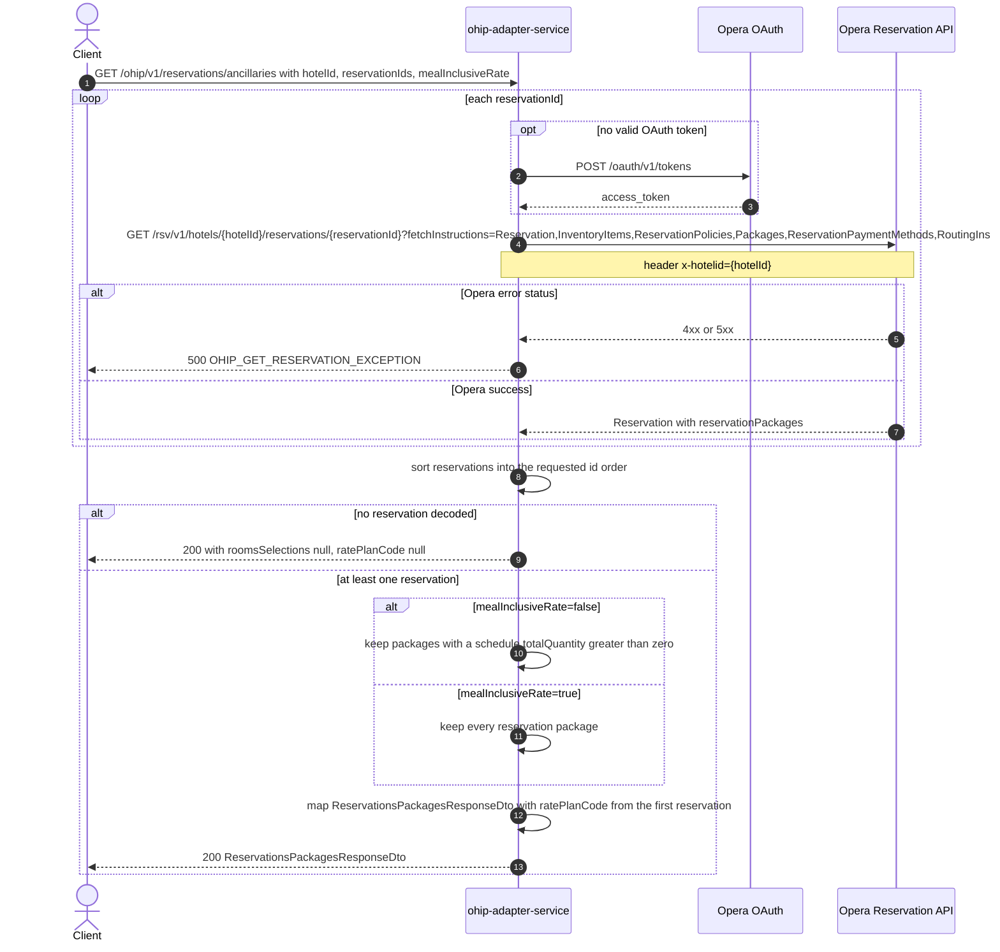

# OHIP Adapter Service: getReservationsPackagesByIds Flow

Returns the packages (ancillaries) currently attached to one or more Opera reservations at a hotel, grouped per reservation, plus the rate plan code of the first reservation read.

```http
GET /ohip/v1/reservations/ancillaries?hotelId={hotelId}&reservationIds={reservationId[,reservationId...]}&mealInclusiveRate={true|false}
Host: ohip-adapter-service:9100
Accept: application/json
```

The servlet context path is `/ohip/` and `HotelReservationController` is mapped under `/v1`, so the public path is `/ohip/v1/reservations/ancillaries`. The controller method is `getReservationsPackagesByIds`. Opera calls use the service OAuth client when no valid token is present.

## Flow

ohip-adapter-service reads every requested reservation from Opera, one HTTP call per reservation id, with the broad reservation fetch-instruction set shared by the other reservation reads (`Reservation, InventoryItems, ReservationPolicies, Packages, ReservationPaymentMethods, RoutingInstructions, Comments, Preferences, LinkedReservations, Alerts`). The reads run through `OhipReservationClient.getReservation`, are collected into a list, and are then re-sorted into the order of the incoming `reservationIds` set.

No other collaborator is touched: no profile read, no rate-info or amounts read, no folios, no rules-agent, no CDH, no hotel config.

The reservation list is mapped straight into the response. Each reservation contributes one `roomsSelections` entry built from its `reservationPackages`: package code as `id`, `consumptionDetails.totalQuantity` as `noSelections`, the schedule's `consumptionDate` values as `scheduledList`, plus `packageGroup` and the package-level `ratePlanCode`. The top-level `ratePlanCode` is taken from the *first* reservation's `roomStay.roomRates[0].ratePlanCode`.

`mealInclusiveRate` selects between two in-port methods that differ only in that filter: with `mealInclusiveRate=false` (the default) a package is dropped unless at least one schedule entry has `totalQuantity > 0`; with `mealInclusiveRate=true` every package on the reservation is mapped unfiltered. Both branches issue exactly the same Opera calls.

If Opera returns nothing decodable for the requested ids the collected list is empty and the endpoint answers `200` with `roomsSelections: null` and `ratePlanCode: null` — this path has no reservation-not-found branch. If an Opera reservation read returns an error status, the client raises `OHIP_GET_RESERVATION_EXCEPTION` (`ErrorCode` 960, internal-server class) and the caller sees a 500.

## Mermaid Flow



## Features

- Multi-reservation package read by hotel id and reservation id set, one Opera call per id
- Response order follows the order of the requested `reservationIds`
- Per-reservation `roomsSelections` with package id, selection count, consumption dates, package group and package rate plan code
- Top-level `ratePlanCode` taken from the first reservation's first room rate
- `mealInclusiveRate` toggles the zero-quantity package filter only; it changes no downstream call
- A reservation with no packages yields a `roomsSelections` entry whose `packagesSelection` is null
- No profile, rate-info, amounts, folio, hotel-config, rules-agent, or CDH enrichment

## Feature Flags

None. This endpoint does not gate behavior on feature flags.

Global Opera OAuth still consults `release_ohip_use_token_service` (`FeatureFlag.getUseTokenService()`) inside the `ohipWebClient` filter when choosing the client registration; it is evaluated outside the request context and changes no behavior of this endpoint.

## Request

| Query parameter | Required | Default | Purpose |
| --- | --- | --- | --- |
| `hotelId` | Yes | n/a | Opera hotel id used in the reservation path and the `x-hotelid` header |
| `reservationIds` | Yes | n/a | Comma-separated reservation ids bound as a `Set<String>`; one Opera read per id |
| `mealInclusiveRate` | No | `false` | `true` maps every reservation package; `false` drops packages whose schedule quantities are all zero or absent |

Example:

```http
GET /ohip/v1/reservations/ancillaries?hotelId=HEAPTI&reservationIds=6001001
Accept: application/json
```

## Branches

| Trigger | Behavior |
| --- | --- |
| `mealInclusiveRate=true` | Zero-quantity package filter is skipped; same Opera calls |
| Reservation carries no packages | `roomsSelections` entry with `packagesSelection: null` |
| Opera returns an empty body for every id | `200` with `roomsSelections: null` and `ratePlanCode: null` (no 404 branch here) |
| Opera returns an error status for a read | `OHIP_GET_RESERVATION_EXCEPTION` (`ErrorCode` 960) surfaced as HTTP 500 |
