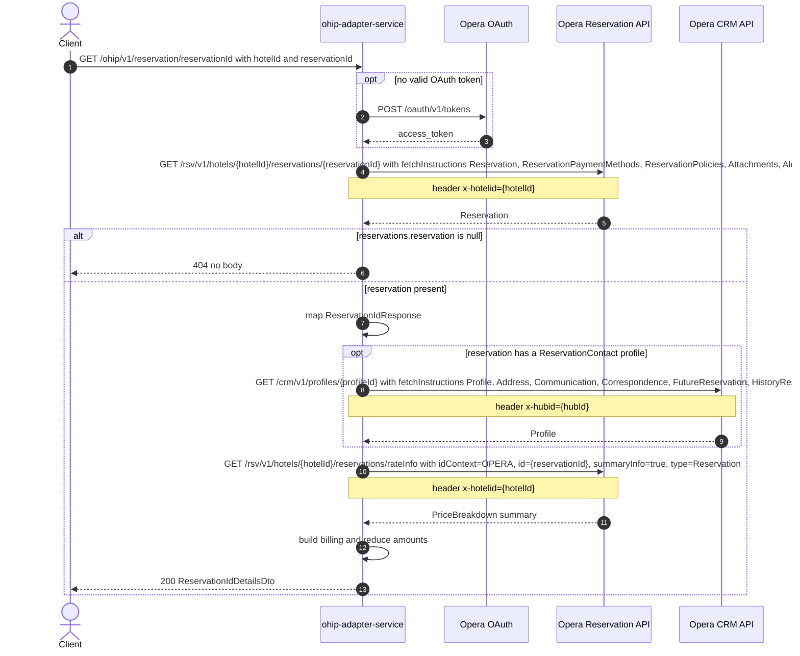

# OHIP Adapter Service: getReservationsByReservationId Flow

Returns the full detail of a single Opera reservation together with its billing block and the money summary (amount paid, balance outstanding, total cost) derived from Opera's reservation rate-info summary.

```http
GET /ohip/v1/reservation/reservationId?hotelId={hotelId}&reservationId={reservationId}
Host: ohip-adapter-service:9100
Accept: application/json
```

The servlet context path is `/ohip/` and `HotelReservationController` is mapped under `/v1`, so the public path is `/ohip/v1/reservation/reservationId` (singular `reservation`, and the literal segment `reservationId` — the value itself is a query parameter). No endpoint-level authentication guard is applied; Opera calls use the service OAuth client when no valid token is present.

## Flow

`HotelReservationController.getReservationsByReservationId` delegates to `HotelReservationInPortImpl`, which does no work of its own and calls `HotelReservationOutPortImpl.getReservationsByReservationId`.

The out-port reads the reservation from Opera with the reservation-by-id endpoint, asking for the reservation, its payment methods, policies, attachments, and alerts. If Opera returns a body whose `reservations.reservation` list is `null`, the out-port returns `null` and the controller answers `404` with no body.

Otherwise the out-port maps the Opera reservation into the reservation detail model, then does two enrichment steps over the returned reservation list. First it collects the profile ids of reservation profiles typed `ReservationContact` and, if any exist, reads each of those profiles from Opera CRM; that map supplies the booker profile used to build the `billing` block. Second it reads the reservation's amount summary from Opera's reservation rate-info endpoint and reduces it into deposit, outstanding, and total-cost figures, which become `amountPaid`, `newTotal`, `previousTotal`, `balanceOutstanding`, and `totalCost` on the response. When the reservation carries no `ReservationContact` profile, no CRM call is made and `billing` is `null`; the amounts call still happens.

The response's `currencyCode` is not populated on this path (the builder omits it), unlike the sibling basket read that shares the same response model.

## Mermaid Flow



## Features

- Single-reservation full read by hotel id and reservation id
- Opera reservation read with fetch instructions `Reservation`, `ReservationPaymentMethods`, `ReservationPolicies`, `Attachments`, `Alerts`
- Billing block built from the reservation's `ReservationContact` profile, read from Opera CRM by profile id; company name is taken from the reservation's `Company` reservation profile, not from a separate call
- Money summary (`amountPaid`, `balanceOutstanding`, `newTotal`, `previousTotal`, `totalCost`) reduced from Opera's reservation rate-info summary; the Opera deposit is negated
- No folio/ACI call on this path: the public `getReservationAmounts` overload that also reads `/csh/.../folios` is not the one used here
- No CDH, AEM, Worldline, rules-agent, or front-desk credit-card call
- 404 with an empty body when Opera reports no reservation

## Feature Flags

None. This endpoint does not gate behavior on feature flags. `HotelReservationInPortImpl.getReservationsByReservationId` is a pure delegation and `HotelReservationOutPortImpl.getReservationsByReservationId` and its helpers (`getProfilesGroupedByProfileIds`, the private `getReservationAmounts`) contain no `unleashWrapper.isEnabled(...)` call.

Global OAuth may still use `release_ohip_use_token_service` for token acquisition on Opera calls; that flag is evaluated outside the request context and cannot be pinned.

## Request

| Query parameter | Required | Default | Purpose |
| --- | --- | --- | --- |
| `hotelId` | Yes | n/a | Opera hotel id used in the reservation read, the rate-info read, and the `x-hotelid` header |
| `reservationId` | Yes | n/a | Opera reservation id read; also the `id` of the rate-info amounts lookup |

Example:

```http
GET /ohip/v1/reservation/reservationId?hotelId=HEAPTI&reservationId=6001001
Accept: application/json
```

## Branches

| Trigger | Behavior |
| --- | --- |
| Opera returns `reservations.reservation = null` | Out-port returns `null`, controller answers `404` with no body; neither the CRM profile nor the rate-info call happens |
| Reservation has no `ReservationContact` reservation profile | No Opera CRM call; `billing` is `null`; the rate-info amounts call still happens |
| Reservation has a `ReservationContact` profile | One Opera CRM profile read per distinct contact profile id, before the amounts call |
| Opera reservation read fails | `OHIP_GET_RESERVATION_BY_RESID_EXCEPTION` (errCode 948), mapped as an internal server error |
| Opera CRM profile read fails | `OHIP_GET_PROFILES_EXCEPTION` (errCode 912), mapped as an internal server error |
| Opera rate-info amounts read fails | `OHIP_GET_RESERVATION_AMOUNTS_EXCEPTION` (errCode 946), mapped as an internal server error |
| Opera returns `reservations.reservation = []` (empty, non-null) | Enrichment is skipped, but the billing/company helpers index element `0` of the empty list unguarded, so the request fails with an internal server error rather than a `404` |
