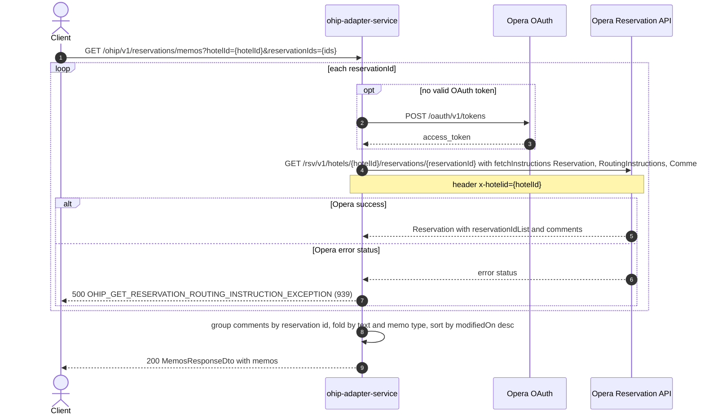

# OHIP Adapter Service: getMemos Flow

Returns the memos (Opera reservation comments) held against one or more reservations at a
hotel, de-duplicated across those reservations and sorted newest-modified first.

```http
GET /ohip/v1/reservations/memos?hotelId={hotelId}&reservationIds={reservationId[,reservationId...]}
Host: ohip-adapter-service:9100
Accept: application/json
```

The servlet context path is `/ohip/` and the reservation controller is mapped under `/v1`,
so the public path is `/ohip/v1/reservations/memos`. The service performs no inbound
authentication (Spring Security auto-configuration is excluded); Opera calls use the
service OAuth client when no valid token is present.

## Flow

`HotelReservationController.getMemos` binds `hotelId` and `reservationIds` (a
`Set<String>`) and calls the in-port. `HotelReservationInPortImpl.getMemos` is a pure
delegate - it logs and forwards to the out-port with no validation, business rule, or
feature-flag check.

`HotelReservationOutPortImpl.getMemos` fans the reservation ids out over a `Flux` and, for
each id, calls `OhipReservationClient.getReservationWithRoutingInstructions(hotelId,
reservationId)`: one blocking `GET` against the Opera reservation API at
`/rsv/v1/hotels/{hotelId}/reservations/{reservationId}` with the query parameter
`fetchInstructions` repeated three times - `Reservation`, `RoutingInstructions`,
`Comments` - and the header `x-hotelid`. This is the only downstream leg on the path; the
`RoutingInstructions` instruction is carried along by the shared client method but nothing
in the memos mapping reads routing instructions. The call is not cached and has no retry
spec.

`MemosOhipMapper.toModel` then folds the collected reservations into the response. For
each reservation it reads `reservations.reservation[0].comments`; when that list is
non-empty it keys the comments by the `Reservation`-typed entry of
`reservations.reservation[0].reservationIdList`. Each comment becomes a `Memo` keyed on
the pair (`comment.text.value`, memo type), where the memo type derives from
`comment.commentTitle` via `MemoUtils.getMemoType`: `AGENT NOTES` -> `AGENT`,
`BUSINESS NOTES` or the special-notes title -> `SYSTEM`, anything else -> `OPERA`. A memo
already seen under the same text and type absorbs the new comment - the comment's id is
appended under that reservation id in the memo's `ids` list, the memo's `createdOn`/
`createdBy` move to the earliest `comment.createDateTime`/`creatorId`, and its
`modifiedOn`/`modifiedBy` move to the latest `comment.lastModifyDateTime`/`lastModifierId`.
Dates are formatted with the literal pattern `yyyy-MM-dd HH:mm:SS`
(`MemosOhipMapper.COMMENT_DATE_PATTERN`) — **deliberately transcribed with uppercase `SS`,
which is not a doc typo**: in commons-lang `DateFormatUtils`, `SS` means two-digit
milliseconds, so the service drops seconds from memo dates and emits milliseconds in their
place (see `bug/memo-date-format-drops-seconds.md`). The resulting memos are sorted by
`modifiedOn` descending and returned as `200 OK` with a `MemosResponseDto` (`{"memos": [...]}`).

Any Opera error status on the reservation read is wrapped in a `HotelReservationException`
with `OHIP_GET_RESERVATION_ROUTING_INSTRUCTION_EXCEPTION` (errCode 939) and surfaces as a
500.

## Mermaid Flow



## Features

- Batch read: `reservationIds` is a set, one Opera reservation read per id, results merged
  into a single memo list.
- Memo data comes from `reservations.reservation[0].comments` on the get-reservation
  response - it is not a separate Opera resource. `comment.text.value` is the memo
  description, `comment.commentTitle` classifies it, and the comment audit fields
  (`comment.createDateTime`, `comment.creatorId`, `comment.lastModifyDateTime`,
  `comment.lastModifierId`) become `createdOn`/`createdBy`/`modifiedOn`/`modifiedBy`.
  The comment's own `id` (`CommentInfoType.id`) becomes an entry in the memo's `ids`.
- De-duplication: identical (text, memo type) pairs across reservations collapse into one
  memo whose `ids` list carries one entry per reservation id, each holding that
  reservation's comment ids.
- Memo type classification: `AGENT` for agent notes, `SYSTEM` for business/special notes,
  `OPERA` for every other comment title.
- Ordering: memos are sorted by `modifiedOn` descending.
- A reservation with no comments contributes nothing; a request whose reservations all have
  no comments returns `200` with an empty `memos` list.
- No inbound authentication on the public endpoint; outbound Opera calls carry a bearer
  token obtained from Opera OAuth when none is cached.
- No caching on the reservation read: every request hits Opera once per reservation id.

## Feature Flags

None. This endpoint does not gate behavior on feature flags - the controller, the in-port
(`HotelReservationInPortImpl.getMemos`), the out-port
(`HotelReservationOutPortImpl.getMemos`), the client method, and the mapper contain no
`unleashWrapper` checks. Only the global Opera token-acquisition flags
(`release_ohip_use_token_service`, `release_ohip_use_token_refresh_skew`) touch the path,
and they are infrastructure flags evaluated outside the request context.

## Request

| Query parameter | Required | Purpose |
| --- | --- | --- |
| `hotelId` | Yes | Opera hotel id used in the downstream path and the `x-hotelid` header. |
| `reservationIds` | Yes | Comma-separated reservation ids bound as a `Set<String>`; one Opera read per id. |

No request body. The response is `200 OK` with `{"memos": [{ "ids": [{"reservationId", "memoIds"}], "description", "createdOn", "createdBy", "modifiedOn", "modifiedBy", "memoType" }]}`.

## Branches

- **Reservation with no comments:** the mapper skips the reservation entirely (null or empty
  `comments`), so the reservation contributes no memos; with no commented reservation in the
  set the response is `200` with an empty `memos` array.
- **Reservation whose `reservationIdList` has no `Reservation`-typed entry:** its comments
  are dropped silently - the mapper only records comments it can key to a reservation id.
- **Empty Opera 200 body:** the client decodes nothing, `Mono.just(null)` throws inside the
  flux, and the request fails with a 500 rather than a 404 - there is no
  reservation-not-found branch on this endpoint.
- **Opera error status on any reservation read:** the whole request fails with
  `HotelReservationException` / `OHIP_GET_RESERVATION_ROUTING_INSTRUCTION_EXCEPTION`
  (errCode 939, HTTP 500); reads for other ids in the set are not awaited.
- **Comment without audit fields:** the mapper formats `comment.createDateTime` and
  `comment.lastModifyDateTime` with no null guard, so a comment missing either date raises an
  NPE (500). Real Opera always sends them.
