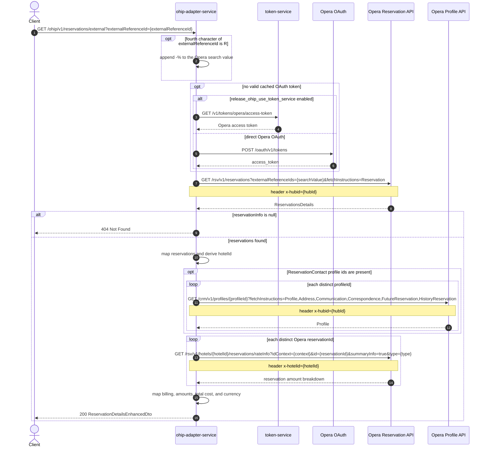

# OHIP Adapter Service: getReservationsByExternalId Flow

Finds Opera reservations by one external reference and returns reservation details enriched with booker billing and reservation amounts.

```http
GET /ohip/v1/reservations/external?externalReferenceId={externalReferenceId}
Host: ohip-adapter-service:9100
Accept: application/json
```

The servlet context path is `/ohip/` and the reservation controller is mapped under `/v1`, so the public path is `/ohip/v1/reservations/external`. Opera calls use the service OAuth client and include the configured Opera application key.

## Flow

ohip-adapter-service optionally converts the supplied external reference to an Opera wildcard search value, then searches the Opera Reservation API with `fetchInstructions=Reservation`. A reference whose fourth character is `R` has `-%` appended before the search; other references are passed unchanged.

When Opera returns no `reservationInfo`, the endpoint responds with 404. Otherwise, OHIP maps the returned reservations and derives the hotel id from the first reservation. It collects attached `ReservationContact` profile ids and loads each corresponding profile from the Opera Profile API. It also collects Opera reservation ids and loads the summary rate information for each reservation. These results provide billing details, amount paid, outstanding balance, total cost, and currency in the enhanced response.

Every Opera request passes through the OAuth client. With the token-service flag enabled, a missing or expired cached token is loaded from token-service. Otherwise, OHIP obtains a token directly from Opera using the configured client-credentials or password flow.

## Mermaid Flow



## Features

- Single external-reference search across Opera reservations
- Automatic `-%` wildcard suffix for references whose fourth character is `R`
- Reservation-contact billing enrichment from Opera profiles
- Summary amount enrichment for every returned Opera reservation id
- Enhanced response containing reservation details, billing, paid and outstanding amounts, total cost, and currency
- 404 response when Opera returns no `reservationInfo`

## Feature Flags

| Flag | Effect when enabled |
| --- | --- |
| `release_ohip_use_token_service` | Acquires Opera access tokens from token-service instead of authenticating directly with Opera |
| `release_ohip_use_token_refresh_skew` | In direct Opera OAuth mode, refreshes cached tokens by the configured clock-skew interval before expiry |

## Request

| Query parameter | Required | Purpose |
| --- | --- | --- |
| `externalReferenceId` | Yes | External booking reference used to find matching Opera reservations |

Example:

```http
GET /ohip/v1/reservations/external?externalReferenceId=BART7421
Accept: application/json
```

## Branches

| Trigger | Behavior |
| --- | --- |
| Fourth character of `externalReferenceId` is `R` | Appends `-%` to the value sent to Opera |
| Opera `reservationInfo` is null | Returns 404 without profile or amount enrichment |
| `ReservationContact` profile ids are present | Loads each distinct profile from Opera CRM for billing enrichment |
| Opera reservation ids are present | Loads summary rate information for each distinct id |
| Opera search, profile, or amount request fails | Returns an internal service error using the corresponding OHIP error code |
