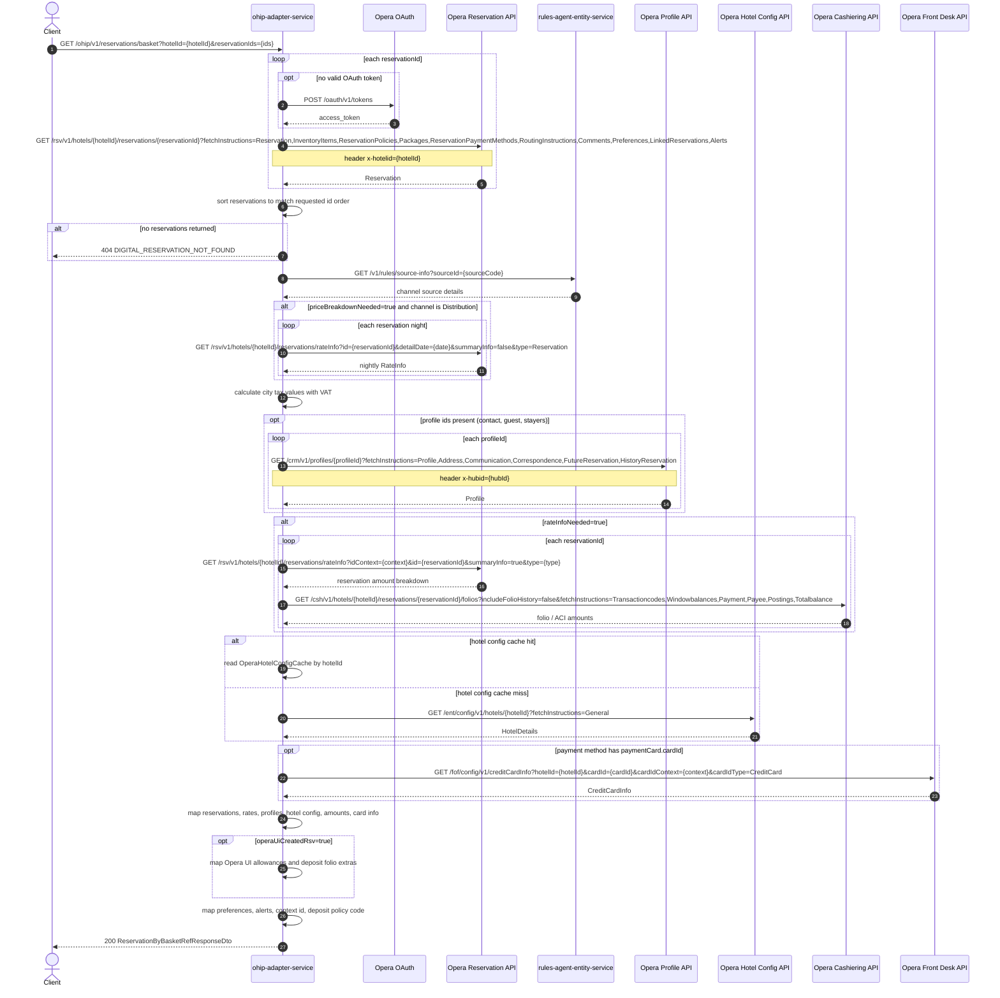

# OHIP Adapter Service: getReservationsByIds Flow

Returns full basket-style reservation details for one or more reservation ids at a hotel, with optional rate, profile, folio, and card enrichment.

```http
GET /ohip/v1/reservations/basket?hotelId={hotelId}&reservationIds={reservationId[,reservationId...]}
Host: ohip-adapter-service:9100
Accept: application/json
```

The servlet context path is `/ohip/` and the reservation controller is mapped under `/v1`, so the public path is `/ohip/v1/reservations/basket`. Opera calls use the service OAuth client when no valid token is present.

This is the full basket endpoint. For the lightweight sibling at `/ohip/v1/reservations/ids`, which returns summaries without rate, folio, profile, or card enrichment, see [GetLightweightReservationsByIds.md](GetLightweightReservationsByIds.md).

## Flow

ohip-adapter-service loads each reservation from Opera with a broad fetch-instruction set, then reorders results to match the requested id set. If none are found, it throws reservation not found.

It resolves the booking channel from rules-agent using the first reservation source code. When `priceBreakdownNeeded=true` and the channel is Distribution, it fetches nightly rate-info for each reservation night. Profile ids from reservation contact, guest, and stayer attachments are loaded from Opera CRM when present.

When `rateInfoNeeded=true` (default), it loads reservation amount rate-info and folio/ACI amounts per reservation. Hotel config is always loaded (cached by hotel id). If a payment method has a payment card id, front-desk credit card info is loaded and applied.

The in-port then validates deposit policy uniqueness across the basket (with a third-party booking exception when `mobile_accepts_ota_booking` is enabled) and sets the basket policy code. Optional `operaUiCreatedRsv` adds Opera-UI-specific allowances and deposit-folio mapping.

## Mermaid Flow



## Features

- Multi-reservation basket fetch by hotel id and reservation ids
- Broad Opera reservation fetch instructions (policies, packages, payments, preferences, alerts, linked reservations)
- Channel resolution through rules-agent source-info
- Optional distribution-channel nightly price breakdown
- Optional reservation amount + folio/ACI enrichment (`rateInfoNeeded`, default true)
- Profile enrichment for reservation contacts, guests, and stayers
- Hotel config enrichment (cached)
- Optional front-desk credit card metadata when a card id is present
- Deposit policy uniqueness checks across the basket, with third-party booking exception under `mobile_accepts_ota_booking`
- Optional Opera UI reservation extras via `operaUiCreatedRsv`

## Feature Flags

| Flag | Effect when enabled |
| --- | --- |
| `mobile_accepts_ota_booking` | Changes third-party booking detection used when deposit policy codes differ across basket reservations |
| `release_ohip_use_token_service` | Global OAuth mode for Opera token acquisition |

## Request

| Query parameter | Required | Default | Purpose |
| --- | --- | --- | --- |
| `hotelId` | Yes | n/a | Opera hotel id for all reservation lookups |
| `reservationIds` | Yes | n/a | Comma-separated reservation ids bound as a `Set<String>` |
| `priceBreakdownNeeded` | No | `false` | Enables nightly rate-info enrichment when channel is Distribution |
| `rateInfoNeeded` | No | `true` | Enables reservation amount and folio/ACI enrichment |
| `operaUiCreatedRsv` | No | `false` | Enables extra mapping for Opera UI-created reservations |

Example:

```http
GET /ohip/v1/reservations/basket?reservationIds=6001001,6001002&hotelId=HEAPTI&rateInfoNeeded=true
Accept: application/json
```

## Branches

| Trigger | Behavior |
| --- | --- |
| No Opera reservations returned | `DIGITAL_RESERVATION_NOT_FOUND` |
| `priceBreakdownNeeded=true` and Distribution channel | Nightly rate-info calls per stay date |
| Profile ids present | CRM profile fetches per id |
| `rateInfoNeeded=true` | Rate-info amounts + cashiering folios per reservation |
| Payment card id present | Front-desk credit card info lookup |
| `operaUiCreatedRsv=true` | Extra allowances / deposit folio mapping |
| Non-unique deposit policy codes | Error unless treated as third-party booking under `mobile_accepts_ota_booking` |
| Hotel config cache hit | Skips Opera hotel-config call |
