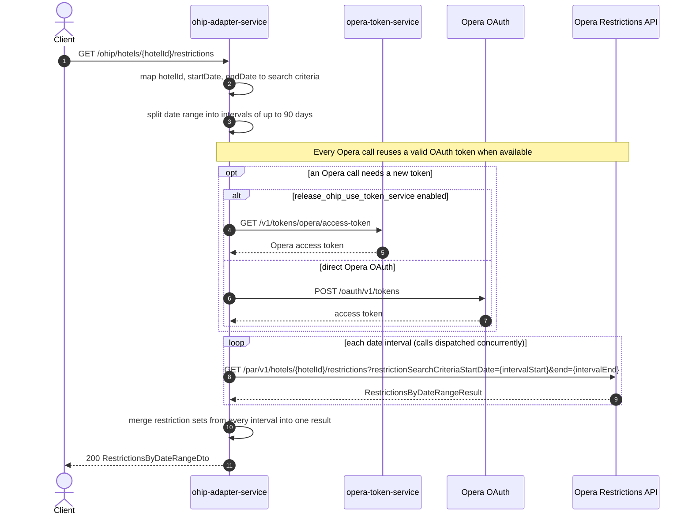

# OHIP Adapter Service: getRestrictionsByDateRange Flow

Returns one hotel's stay restrictions (such as minimum-length-of-stay) for a date range, by calling Opera Cloud's restrictions API once per Opera-supported date chunk and merging the results.

```http
GET /ohip/hotels/{hotelId}/restrictions?startDate=2022-03-01&endDate=2022-03-05
Host: ohip-adapter-service:9100
Accept: application/json
```

## Flow

The controller maps `hotelId`, `startDate`, and `endDate` into a `RestrictionsByDateRangeSearchCriteria` and calls the domain port directly; there is no request validation or business-rule branching beyond date-range splitting.

The requested range is split into intervals of at most 90 days each. One request per interval is dispatched concurrently to Opera's restrictions endpoint using the default `CompletableFuture` pool (not the dedicated multi-hotel executor). Each interval's response is joined and the results are reduced into a single result: restriction sets from every interval after the first are appended onto the first interval's restriction set list. If the first interval's response has no restriction data, a later interval's result is used as the base instead.

## Mermaid Flow



## Features

- Single-hotel stay restrictions (such as minimum length of stay) over a date range
- Automatic 90-day interval splitting and recombination for ranges above the Opera limit
- Concurrent Opera calls when the range spans more than one interval

## Feature Flags

None. This endpoint does not gate behavior on feature flags. (Opera OAuth token acquisition uses `release_ohip_use_token_service` and `release_ohip_use_token_refresh_skew`, shared infrastructure applied to every Opera outbound call in the service, not specific to this endpoint.)

## Request

| Parameter | Required | Notes |
| --- | --- | --- |
| `hotelId` | Yes (path) | Opera hotel id |
| `startDate` | Yes | `yyyy-MM-dd` |
| `endDate` | Yes | `yyyy-MM-dd` |

## Branches

| Trigger | Behavior |
| --- | --- |
| Date range over 90 days | Split into multiple intervals, called concurrently and merged into one restriction-set list |
| First interval has no restriction data | A subsequent interval's result becomes the base result instead |
