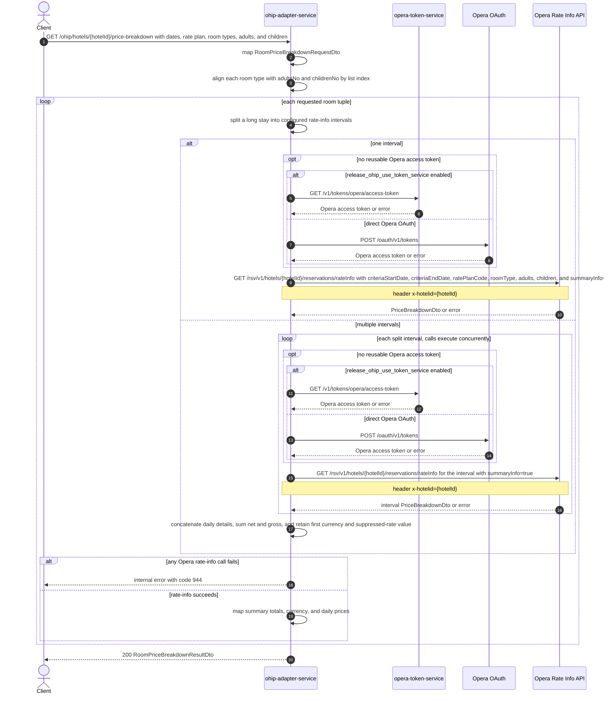

# OHIP Adapter Service: getRoomPriceBreakdown Flow

Returns an Opera rate-info price breakdown for each requested room type and occupancy tuple.

```http
GET /ohip/hotels/{hotelId}/price-breakdown?arrivalDate={arrivalDate}&departureDate={departureDate}&ratePlanCode={ratePlanCode}&roomTypes={roomType}&adultsNo={adults}&childrenNo={children}
Host: ohip-adapter-service:9100
Accept: application/json
```

The servlet context path is `/ohip/`, and the controller has no class-level path, so the public path is `/ohip/hotels/{hotelId}/price-breakdown`. Every Opera request uses the service OAuth client. When no reusable token exists, direct mode calls Opera OAuth while token-service mode calls `opera-token-service` instead.

## Flow

The controller binds the query parameters to `RoomPriceBreakdownRequestDto`, maps it to the domain request, and passes it to `HotelAvailabilityInPort`. The domain logic creates one room search criterion for each `roomTypes` entry by taking the adult and child counts at the same list index.

The availability out-port processes those room criteria in order. For each tuple, it maps the hotel, dates, rate-plan code, room type, and occupancy to an Opera request. `ApiLimitsService` sends one rate-info request for a date range within the configured rate-info window. Longer stays are split into supported intervals and dispatched concurrently; subsequent interval starts are moved back one day to preserve boundary coverage, and the summaries are recombined.

Each Opera call is `GET /rsv/v1/hotels/{hotelId}/reservations/rateInfo` with `summaryInfo=true` and the `x-hotelid` header. The returned summary is mapped to totals, currency, and daily prices. The endpoint returns the resulting breakdowns in the same order as the requested room tuples.

## Mermaid Flow



## Features

- Multiple room price breakdowns in one request, aligned by the indexes of `roomTypes`, `adultsNo`, and `childrenNo`
- One Opera rate-info call per requested room tuple for an ordinary date range
- Automatic splitting and concurrent Opera calls when a stay exceeds the configured 21-day rate-info window
- Summary recombination for split stays: daily details are concatenated, net and gross totals are summed, and currency and suppressed-rate state come from the first interval
- Opera summary mapping to `totalNetAmount`, `totalGrossAmount`, `totalTaxAmount`, `currencyCode`, and daily net/gross prices; `totalTaxAmount` is calculated as summary net minus summary gross
- No endpoint data cache; only reusable OAuth access tokens can avoid an additional authentication call

## Feature Flags

| Flag | Effect when enabled |
| --- | --- |
| `release_ohip_use_token_service` | Obtains the Opera access token from `GET /v1/tokens/opera/access-token` instead of calling Opera OAuth directly |
| `release_ohip_use_token_refresh_skew` | In direct OAuth mode, treats a cached Opera token as expiring by the configured clock-skew interval before its actual expiry |

## Request

| Parameter | Required by implementation | Purpose |
| --- | --- | --- |
| `hotelId` | Yes, path | Opera hotel id used in the rate-info path and `x-hotelid` header |
| `arrivalDate` | Yes | Stay start date parsed as `yyyy-MM-dd` and sent as `criteriaStartDate` |
| `departureDate` | Yes | Stay end date parsed as `yyyy-MM-dd` and sent as `criteriaEndDate` |
| `ratePlanCode` | Yes | Opera rate-plan code used for every requested room tuple |
| `roomTypes` | Yes | Repeated or comma-separated room types; one price breakdown is produced per entry |
| `adultsNo` | Yes | Adult counts aligned by index with `roomTypes` |
| `childrenNo` | Yes | Child counts aligned by index with `roomTypes` |

The DTO fields have no bean-validation annotations despite the controller's `@Valid`. The implementation therefore assumes non-null, correctly formatted dates and equally sized room, adult, and child lists.

## Branches

| Trigger | Behavior |
| --- | --- |
| Empty `roomTypes` list | Makes no Opera rate-info calls and returns an empty `priceBreakdown` list |
| Missing or misaligned room/adult/child lists | Fails during list iteration or index access before a complete response; there is no explicit parameter-mismatch validation for this endpoint |
| Invalid date text | Fails while parsing or splitting the date range before Opera is called |
| Stay exceeds the configured rate-info window | Splits the stay, moves later interval starts back one day, calls Opera concurrently for the intervals, and merges their summaries |
| Opera rate-info returns any HTTP error | Raises `HotelAvailabilityException` with `OHIP_PRICE_BREAKDOWN_PERNIGHT_EXCEPTION`, internal error code `944` |
| A reusable OAuth token exists | Skips token acquisition and sends the Opera rate-info request directly |
| Token-service mode needs a token and token retrieval fails | Stops before the Opera call with an internal token-service error |
