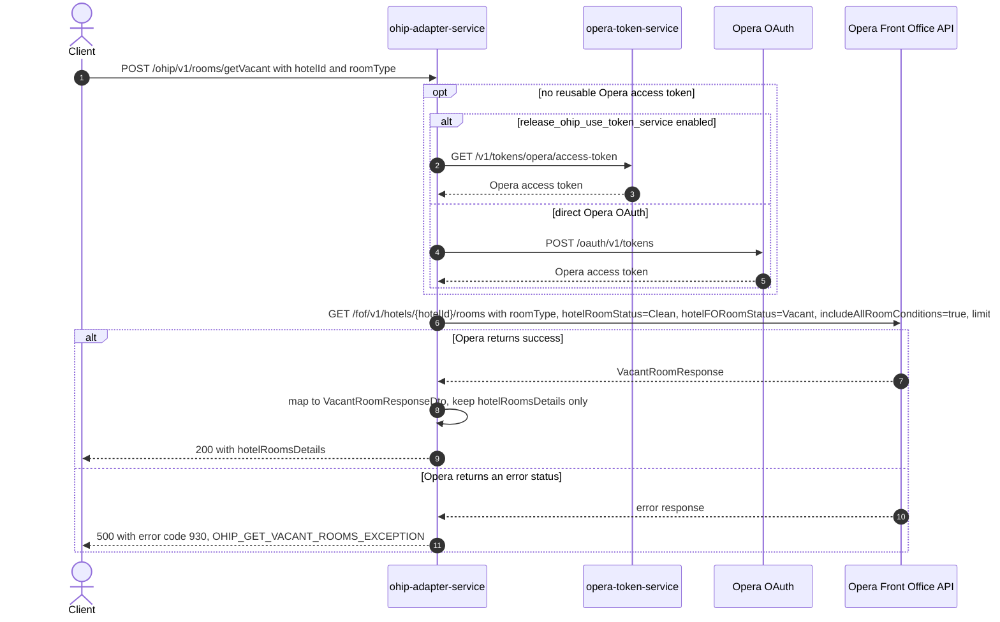

# OHIP Adapter Service: getVacantRooms Flow

Returns the clean, vacant Opera rooms of one room type in one hotel, for kiosk room
allocation.

```http
POST /ohip/v1/rooms/getVacant?hotelId={hotelId}&roomType={roomType}
Host: ohip-adapter-service:9100
Accept: application/json
```

The servlet context path is `/ohip/`. The endpoint itself requires no inbound
authentication; the outbound Opera request carries an OAuth bearer token, the configured
`x-app-key`, and the requested hotel id in the `x-hotelid` header.

## Flow

The controller takes the two required query parameters `hotelId` and `roomType` and
passes them straight through the room-allocation domain port; there is no business logic
in between. The out-port implementation makes one Opera Front Office API request,
`GET /fof/v1/hotels/{hotelId}/rooms`, filtered to the requested room type with
`hotelRoomStatus=Clean`, `hotelFORoomStatus=Vacant`, `includeAllRoomConditions=true`,
and `limit=60`. The Opera response is mapped to a response DTO that exposes only
`hotelRoomsDetails` (the hotel id and the room list); Opera's paging fields
(`totalPages`, `offset`, `limit`, `hasMore`, `totalResults`, `links`) are dropped by the
mapper.

Every Opera request reuses a valid OAuth token when one is available. Otherwise,
authentication obtains a token either from `opera-token-service` or directly from Opera
OAuth according to `release_ohip_use_token_service`.

Any Opera error status is mapped to a `RoomAllocationException`
(`OHIP_GET_VACANT_ROOMS_EXCEPTION`, code 930), which the shared business exception
handler returns as HTTP 500.

## Mermaid Flow



## Features

- Looks up vacant rooms for exactly one hotel and one room type per call; the room
  status filters (`Clean`, `Vacant`) and the page size of 60 are hard-coded, not
  caller-controlled.
- No inbound authentication or authorization on the endpoint.
- Response exposes only `hotelRoomsDetails` (hotel id plus the room list with each
  room's id, type, status, and condition data); Opera paging metadata is not returned.
- Despite the POST method, the endpoint has no request body; both inputs are query
  parameters.

## Feature Flags

| Flag | Effect when enabled |
| --- | --- |
| `release_ohip_use_token_service` | Opera access tokens are fetched from `opera-token-service` instead of directly from Opera OAuth. Infrastructure-level flag on the shared `ohipWebClient`, evaluated outside the request context. |
| `release_ohip_use_token_refresh_skew` | Applies the configured early-refresh clock skew to directly acquired Opera OAuth tokens. |

No other flag gates this endpoint's behavior.

## Request

| Parameter | In | Required | Effect |
| --- | --- | --- | --- |
| `hotelId` | query | yes | Hotel whose rooms are listed; also sent to Opera as the `{hotelId}` path segment and the `x-hotelid` header. |
| `roomType` | query | yes | Opera room type code the room list is filtered to (`roomType` query parameter on the Opera call). |
