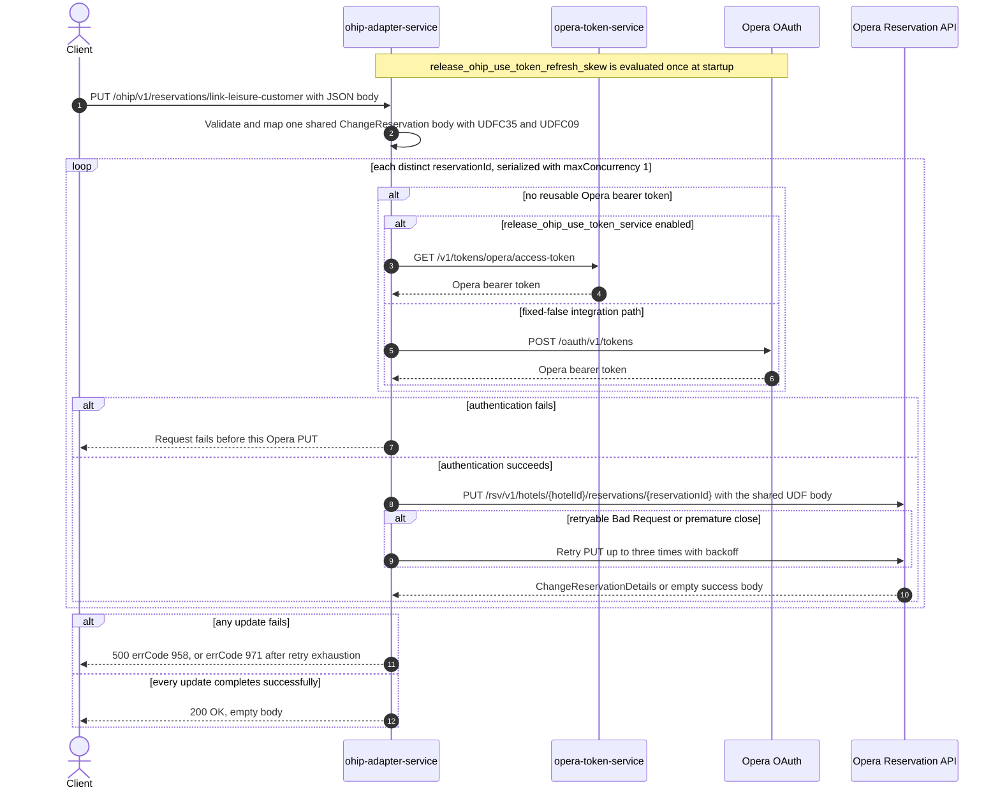

# OHIP Adapter Service: linkReservationToLeisureCustomer Flow

Stamps a CDH leisure customer account id onto every distinct Opera reservation id supplied for
one hotel, together with a fixed `PI` booking-channel marker.

```http
PUT /ohip/v1/reservations/link-leisure-customer
Host: ohip-adapter-service:9100
Content-Type: application/json
```

The servlet context path is `/ohip/` and `HotelReservationController` is mapped under `/v1`, so
the effective public route is `/ohip/v1/reservations/link-leisure-customer`. The controller has
no endpoint-level authentication guard. Outbound Opera requests carry a bearer token,
`x-app-key`, `x-hotelid`, and JSON content type. Success is `200 OK` with an empty body, set
explicitly by `ResponseEntity.status(HttpStatus.OK).build()`, which matches the checked-in
OpenAPI declaration for this operation.

## Flow

`HotelReservationController.linkReservationToLeisureCustomer` Bean-validates
`LinkReservationToLeisureCustomerRequestDto`, maps it one-for-one through
`LinkReservationToLeisureCustomerRequestMapper`, and calls
`HotelReservationInPortImpl.linkReservationToLeisureCustomer`. Constructing the domain
`LinkReservationToLeisureCustomerRequest` also runs its own `SelfValidation` check. The in-port
only logs and delegates to `HotelReservationOutPortImpl.linkReservationToLeisureCustomer`; it
applies no business guard, no reservation read, no cache, and no endpoint-specific
feature-flag decision.

The out-port maps the request once, before any fan-out, into a single shared `ChangeReservation`
body. `LinkReservationToLeisureCustomerRequestOhipMapper.injectReservationDetails` builds exactly
one reservation instruction carrying the request `hotelId` and a `userDefinedFields`
`characterUDFs` list of exactly two entries, in this order: `UDFC35` set to the request
`customerAccountId`, and `UDFC09` set to the constant `PI`. No other target field is populated;
the generated mapper sets only `reservations`. The reservation identity is never written into
the body — it appears only in the request URL — so every reservation in one request receives a
byte-identical payload.

The out-port then iterates the request's `Set<String> reservationIds` and sends the shared body
to the Opera Reservation API once per distinct id as
`PUT /rsv/v1/hotels/{hotelId}/reservations/{reservationId}`. `Flux.flatMap` is given
`config.service.ohip.maxConcurrency`; the checked-in value is `1`, so the PUTs are serialized
under repository configuration, although their order follows non-contractual set iteration.
`collectList().block()` waits for the whole fan-out before the controller returns. The Opera
response bodies are never inspected, so an Opera success with an empty body is accepted. There
is no read-before-write call, compensating action, or rollback anywhere on this path.

The shared Opera WebClient reuses a valid OAuth client token when available. Otherwise
`release_ohip_use_token_service` selects `opera-token-service` or direct Opera OAuth as the
token source. The integration workflow fixes that flag false, so its supported path is direct
Opera OAuth, using client credentials when `ENABLE_CLIENT_CREDENTIALS=true` and the password
grant otherwise. A non-retryable Opera error maps to HTTP 500 with errCode `958`. An error
envelope whose `type` is `Bad Request`, or a premature connection close, is retried up to three
times with backoff; exhaustion maps to HTTP 500 with errCode `971`. With the checked-in
concurrency of one, reservations already updated before a terminal failure stay updated and
later ids are not processed.

## Mermaid Flow



## Features

- Bulk link over a `Set`, so duplicate reservation ids collapse before execution
- One Opera change-reservation PUT per distinct reservation id
- One shared body mapped once for the whole request, with reservation identity supplied only by
  the URL
- Serialized PUT fan-out under the checked-in `maxConcurrency: 1` configuration
- CDH customer account id written to character UDF `UDFC35`
- Booking-channel marker `PI` always written to character UDF `UDFC09`, with no request field
  able to change it
- No reservation GET, cache lookup, downstream business collaborator other than Opera, or
  rollback
- Shared Opera OAuth selection and selective three-retry handling

## Feature Flags

No endpoint-specific business flag changes validation, mapping, fan-out, or response shaping.
The shared Opera authentication path evaluates these flags in `ohip-adapter-service`:

| Flag | Effect when enabled | Evaluation and override reachability |
| --- | --- | --- |
| `release_ohip_use_token_service` | Selects `opera-token-service` (`GET /v1/tokens/opera/access-token`) instead of direct Opera OAuth when an Opera bearer token is required. | Evaluated by the `ohipWebClient` filter for each outbound Opera request, so the baggage-aware wrapper can reach it at that call site. The integration environment fixes it false; it is never an ON/OFF scenario axis. |
| `release_ohip_use_token_refresh_skew` | Applies `config.service.ohip.tokenRefreshClockSkew` to refresh directly acquired Opera OAuth tokens early. It does not change the reservation PUT or the public response. | Evaluated once while `WebClientAuthConfig.customAuthClientProvider` is constructed, so request baggage cannot pin it. The integration workflow treats it as fixed false. |

## Request

Body: `LinkReservationToLeisureCustomerRequestDto`.

| Field | Required | Effect |
| --- | --- | --- |
| `reservationIds` | yes, non-empty `Set` (`@NotEmpty`) | Each distinct value becomes the reservation-id path segment for one Opera PUT; duplicate JSON values collapse during set deserialization |
| `hotelId` | yes, non-empty (`@NotEmpty`) | Supplies the Opera hotel path value, the body `reservations[0].hotelId`, and the `x-hotelid` header |
| `customerAccountId` | yes, non-empty (`@NotEmpty`) | Value of character UDF `UDFC35` in the shared body |

There are no path or query parameters. `UDFC09` is always `PI` and is not derived from any
request field.

## Branches

| Trigger | Behavior |
| --- | --- |
| Duplicate ids in the JSON array | Deserialization into a `Set` collapses them, so each distinct id is linked once |
| More than one distinct reservation id | The same shared body is PUT once per id, serialized under `maxConcurrency: 1` in non-contractual set-iteration order |
| A valid OAuth client token is reusable | Skips both token-acquisition HTTP endpoints for that Opera call |
| No valid token and `release_ohip_use_token_service` is fixed false | Gets a token directly from configured Opera OAuth, using client credentials when `ENABLE_CLIENT_CREDENTIALS=true`, otherwise the password grant |
| Token acquisition fails | The affected reservation PUT is not sent and the public request fails |
| Opera returns a successful response with an empty body | The inner publisher completes empty; the out-port does not inspect it and the public request still returns `200 OK` |
| Opera returns a non-retryable error | Returns HTTP 500 with errCode `958`; earlier serialized updates remain applied and later ids are not processed |
| Opera error body has `type=Bad Request`, or the connection closes prematurely | Retries that PUT up to three times with backoff; exhaustion returns HTTP 500 with errCode `971` |
| `config.service.ohip.maxConcurrency` is externally raised above one | Multiple distinct-id PUTs may overlap and a failure may leave other already-started updates in flight |

The controller annotation and checked-in OpenAPI advertise only 200, 400, and 500 for this
operation. There is no lookup on this path, so there is no endpoint-specific not-found branch;
Opera PUT errors are translated to the HTTP 500 paths above.
