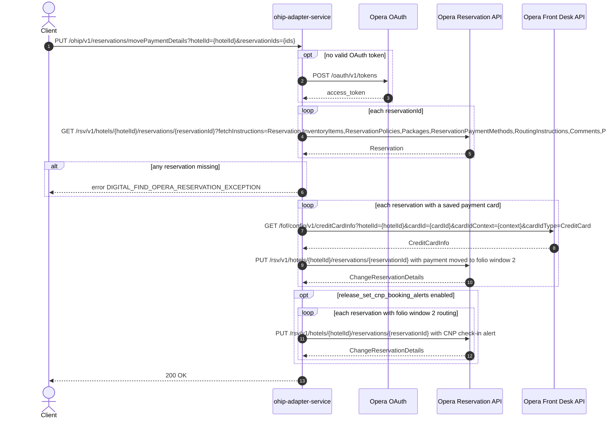

# OHIP Adapter Service: movePaymentDetails Flow

Moves each reservation's saved card payment details from folio window 1 to folio window 2
via an Opera change-reservation PUT, optionally raising CNP check-in alerts.

```http
PUT /ohip/v1/reservations/movePaymentDetails?hotelId={hotelId}&reservationIds={id[,id...]}
Host: ohip-adapter-service:9100
```

The servlet context path is `/ohip/` and `HotelReservationController` is mapped under
`/v1`, so the public path is `/ohip/v1/reservations/movePaymentDetails`. There is no
inbound authentication on the endpoint; Opera calls use the service OAuth client when no
valid token is present.

## Flow

ohip-adapter-service loads every requested reservation from Opera with the broad
fetch-instruction set; if any is missing it fails with
`DIGITAL_FIND_OPERA_RESERVATION_EXCEPTION`. For each reservation whose first payment
method carries a payment card, it fetches the full card details from the Opera front-desk
credit-card-info API and PUTs a change-reservation that moves the payment details to
folio window 2. Reservations without a saved card are skipped silently.

When `release_set_cnp_booking_alerts` is enabled, reservations whose routing instructions
reference folio window 2 additionally receive a CNP check-in alert via a further
change-reservation PUT.

## Mermaid Flow



## Features

- Batch move of saved-card payment details to folio window 2
- Card detail enrichment from front-desk credit-card-info before the PUT
- Reservations without a saved card are skipped, not failed
- Flag-gated CNP check-in alert for reservations routed to folio window 2
- No inbound authentication; outbound Opera OAuth bearer token per client config

## Feature Flags

| Flag | Effect when enabled |
| --- | --- |
| `release_set_cnp_booking_alerts` | After moving payment details, sets a CNP check-in alert (extra change-reservation PUT) on each reservation whose routing instructions reference folio window 2 |
| `release_ohip_use_token_service` | Obtains Opera bearer tokens from `opera-token-service` instead of authenticating directly with Opera OAuth. |
| `release_ohip_use_token_refresh_skew` | Applies the configured early-refresh clock skew to directly acquired Opera OAuth tokens. |

## Request

| Query parameter | Required | Purpose |
| --- | --- | --- |
| `hotelId` | Yes | Opera hotel id for all lookups and updates |
| `reservationIds` | Yes | Comma-separated reservation ids bound as a `Set<String>` |

No request body.

## Branches

| Trigger | Behavior |
| --- | --- |
| Any requested reservation not found in Opera | `DIGITAL_FIND_OPERA_RESERVATION_EXCEPTION` |
| Reservation has no payment card | Skipped, no card lookup or PUT |
| `release_set_cnp_booking_alerts` on and folio window 2 routing present | Extra alert PUT per matching reservation |
