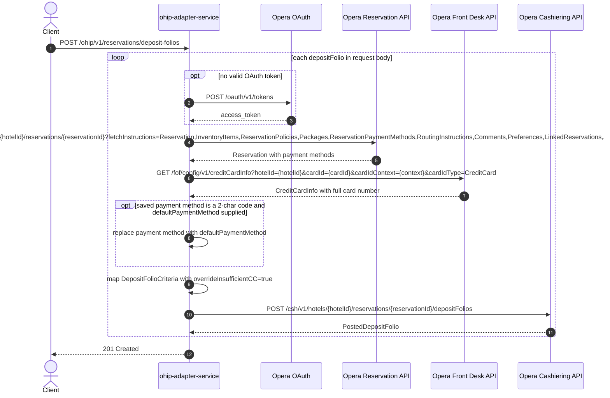

# OHIP Adapter Service: saveDepositFolios Flow

Posts a deposit folio to Opera cashiering for each reservation in the request, enriching
the reservation's saved payment card with its full card number first.

```http
POST /ohip/v1/reservations/deposit-folios
Host: ohip-adapter-service:9100
Content-Type: application/json
```

The servlet context path is `/ohip/` and `DepositFoliosController` is mapped under `/v1`,
so the public path is `/ohip/v1/reservations/deposit-folios`. There is no inbound
authentication on the endpoint; Opera calls use the service OAuth client when no valid
token is present. The GET sibling on the same path is documented in
[GetDepositsForReservationId.md](GetDepositsForReservationId.md).

## Flow

For each deposit folio in the request body, ohip-adapter-service loads the reservation
from Opera with the broad fetch-instruction set, finds the first payment method carrying a
payment card, and fetches the full card number from the Opera front-desk credit-card-info
API. For migrated bookings whose saved payment method is a bare two-character code, the
folio's `defaultPaymentMethod` replaces it. The service then maps the folio criteria
(forcing `overrideInsufficientCC=true`) and posts it to the Opera cashiering
deposit-folios API. On success the endpoint returns `201 Created` with no body.

## Mermaid Flow



## Features

- Batch deposit folio creation, one Opera cashiering POST per folio in the request
- Card-number enrichment from front-desk credit-card-info before posting
- Migrated-booking fallback: replaces a bare payment-method code with the folio's
  `defaultPaymentMethod`
- Always posts with `overrideInsufficientCC=true`
- No inbound authentication; outbound Opera OAuth bearer token per client config

## Feature Flags

No endpoint-specific flag gates this flow. The shared Opera authentication flags apply:

| Flag | Effect when enabled |
| --- | --- |
| `release_ohip_use_token_service` | Obtains Opera bearer tokens from `opera-token-service` instead of authenticating directly with Opera OAuth. |
| `release_ohip_use_token_refresh_skew` | Applies the configured early-refresh clock skew to directly acquired Opera OAuth tokens. |

## Request

Body: `DepositFoliosRequestDto` — a list of deposit folios. Each folio carries
`hotelId`, `reservationId`, amount/posting fields, and optionally
`defaultPaymentMethod` used for the migrated-booking substitution. Each folio's
`hotelId`/`reservationId` pair drives its own Opera calls.

## Branches

| Trigger | Behavior |
| --- | --- |
| Reservation has no payment method with a card | NullPointerException surfaces as a 500 internal error (no null guard) |
| Payment method is a 2-char code and `defaultPaymentMethod` set | Payment method replaced before mapping |
| Opera reservation fetch fails | `OHIP_GET_RESERVATION_EXCEPTION` error mapping |
| Cashiering POST fails | `OHIP_SEND_DEPOSIT_FOLIOS_EXCEPTION` error mapping |
