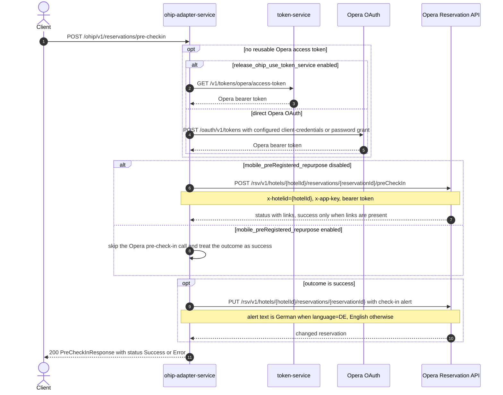

# OHIP Adapter Service: saveReservationPreCheckIn Flow

Marks an Opera reservation as pre-checked-in and adds a "do not print registration card" alert to the reservation.

```http
POST /ohip/v1/reservations/pre-checkin
Host: ohip-adapter-service:9100
Content-Type: application/json
Accept: application/json
```

The servlet context path is `/ohip/` and `HotelReservationController` is mapped under `/v1`, so the public path is `/ohip/v1/reservations/pre-checkin`. The public endpoint itself requires no caller authentication. All Opera API calls carry a bearer token plus `x-app-key` and `x-hotelid` headers. A cached access token is reused until its refresh criteria require another direct Opera OAuth or token-service request.

## Flow

The controller maps the request and delegates through `HotelReservationInPortImpl` to `HotelReservationOutPortImpl.saveReservationPreCheckIn`, which builds an Opera pre-check-in payload from the hotel id and arrival time.

When `mobile_preRegistered_repurpose` is disabled, the service posts the pre-check-in status to the Opera Reservation API and treats the call as successful only when Opera's response contains at least one link. When the flag is enabled, the Opera pre-check-in call is skipped entirely and the outcome is treated as successful without contacting Opera.

On success, the service then sends a change-reservation request to Opera adding a check-in alert to the reservation; the alert text is German when the request's `language` is `DE`, English otherwise. The response is always HTTP 200 with a `status` of `Success` or `Error` and a matching message; a failed downstream Opera call instead propagates a mapped exception.

## Mermaid Flow



## Features

- Records pre-check-in status against an Opera reservation using the request's arrival time.
- Adds a "Do not print registration card, Pre-Check-In completed" reservation alert (German variant for `language=DE`).
- Treats the Opera pre-check-in call as successful only when Opera returns at least one link; a link-less response yields `status=Error` without adding the alert.
- Can bypass the Opera pre-check-in call entirely via `mobile_preRegistered_repurpose` while still adding the alert.
- Requires no caller authentication on the public endpoint; acquires and caches an Opera bearer token, using either token-service or the configured direct Opera OAuth grant.

## Feature Flags

| Flag | Effect when enabled |
| --- | --- |
| `mobile_preRegistered_repurpose` | Skips the Opera `POST .../preCheckIn` call, treats the pre-check-in as successful, and proceeds straight to adding the reservation alert. |
| `release_ohip_use_token_service` | Obtains Opera bearer tokens from token-service instead of authenticating directly with Opera OAuth. |
| `release_ohip_use_token_refresh_skew` | Applies the configured early-refresh clock skew to directly acquired Opera OAuth tokens. |

## Request

| Body field | Required | Purpose |
| --- | --- | --- |
| `hotelId` | Yes | Opera hotel id used in downstream paths and `x-hotelid`. |
| `reservationId` | Yes | Opera reservation id to pre-check-in. |
| `arrivalTime` | Yes | Arrival date placed in the Opera pre-check-in payload. |
| `language` | No | `EN` or `DE`; selects the language of the reservation check-in alert text. |

## Branches

| Trigger | Behavior |
| --- | --- |
| Missing `hotelId`, `reservationId`, or `arrivalTime`, or `language` outside `EN`/`DE` | Request validation returns `400`. |
| Opera pre-check-in response has no links | Outcome is failure: the alert update is skipped and the endpoint returns `200` with `status=Error`. |
| Opera pre-check-in call returns an error status | `OHIP_POST_PROFILE_EXCEPTION` is raised and mapped by the common error handling. |
| Alert change-reservation call returns an error status | `OHIP_PUT_RESERVATIONS_GUEST_EXCEPTION` is raised; the call retries per the shared retry spec and exhaustion raises `OHIP_RETRIES_EXHAUSTED_EXCEPTION`. |
