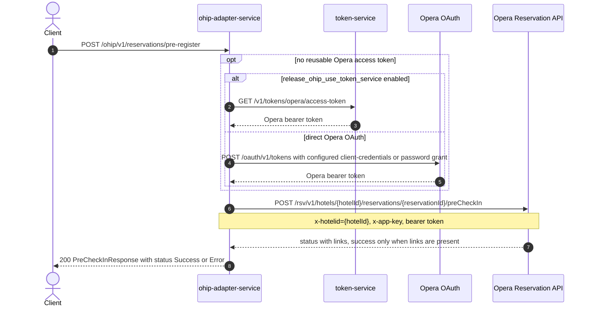

# OHIP Adapter Service: saveReservationPreRegister Flow

Sets the pre-registered flag on an Opera reservation by posting its pre-check-in status, without adding any reservation alert.

```http
POST /ohip/v1/reservations/pre-register
Host: ohip-adapter-service:9100
Content-Type: application/json
Accept: application/json
```

The servlet context path is `/ohip/` and `HotelReservationController` is mapped under `/v1`, so the public path is `/ohip/v1/reservations/pre-register`. The public endpoint itself requires no caller authentication. All Opera API calls carry a bearer token plus `x-app-key` and `x-hotelid` headers. A cached access token is reused until its refresh criteria require another direct Opera OAuth or token-service request.

## Flow

The controller maps the request and delegates through `HotelReservationInPortImpl` to `HotelReservationOutPortImpl.saveReservationPreRegister`, which builds an Opera pre-check-in payload from the hotel id and arrival time and posts it to the Opera Reservation API's `preCheckIn` operation — the same Opera call the pre-checkin endpoint uses, but unconditionally: no feature flag alters this path and no reservation alert is added afterwards.

The call is treated as successful only when Opera's response contains at least one link. The response is always HTTP 200 with a `status` of `Success` or `Error` and a matching message; a failed downstream Opera call instead propagates a mapped exception.

## Mermaid Flow



## Features

- Sets the Opera pre-registered flag by posting pre-check-in status with the request's arrival time.
- Treats the Opera call as successful only when Opera returns at least one link; a link-less response yields `status=Error`.
- Unlike the pre-checkin endpoint, never adds a reservation alert and ignores the `language` field beyond validation.
- Requires no caller authentication on the public endpoint; acquires and caches an Opera bearer token, using either token-service or the configured direct Opera OAuth grant.

## Feature Flags

| Flag | Effect when enabled |
| --- | --- |
| `release_ohip_use_token_service` | Obtains Opera bearer tokens from token-service instead of authenticating directly with Opera OAuth. |
| `release_ohip_use_token_refresh_skew` | Applies the configured early-refresh clock skew to directly acquired Opera OAuth tokens. |

No endpoint-specific feature flags: `mobile_preRegistered_repurpose` gates only the pre-checkin endpoint, not this one.

## Request

| Body field | Required | Purpose |
| --- | --- | --- |
| `hotelId` | Yes | Opera hotel id used in downstream paths and `x-hotelid`. |
| `reservationId` | Yes | Opera reservation id to pre-register. |
| `arrivalTime` | Yes | Arrival date placed in the Opera pre-check-in payload. |
| `language` | No | `EN` or `DE`; validated but unused by this endpoint. |

## Branches

| Trigger | Behavior |
| --- | --- |
| Missing `hotelId`, `reservationId`, or `arrivalTime`, or `language` outside `EN`/`DE` | Request validation returns `400`. |
| Opera pre-check-in response has no links | Endpoint returns `200` with `status=Error`. |
| Opera pre-check-in call returns an error status | `OHIP_POST_PROFILE_EXCEPTION` is raised and mapped by the common error handling. |
