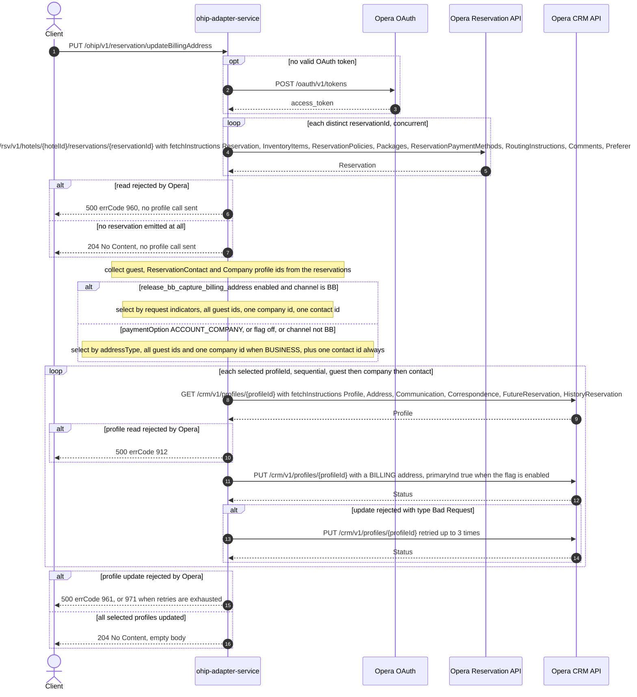

# OHIP Adapter Service: updateBillingAddress Flow

Writes the booker's billing address onto the Opera profiles attached to one or more
reservations of a single hotel: the reservations are read to discover which profile ids to
touch, then each selected profile is read and updated with a `BILLING` address.

```http
PUT /ohip/v1/reservation/updateBillingAddress
Host: ohip-adapter-service:9100
Content-Type: application/json
```

The servlet context path is `/ohip/` and `HotelReservationController` is mapped under `/v1`,
so the public path is `/ohip/v1/reservation/updateBillingAddress` (singular `reservation`).
There is no inbound authentication; Opera calls use the service OAuth client. The handler
returns `204 No Content` with an empty body (`ResponseEntity.noContent()`), which matches its
`@ApiResponse(responseCode = "204")` annotation. No reservation is written by this endpoint.

## Flow

`HotelReservationController.updateBillingAddress` maps the validated
`BillingAddressCaptRequestDto` to the `BillingAddressRequest` model — the three
`updateGuestProfile` / `updateCompanyProfile` / `updateContactProfile` booleans become the
`ProfileUpdateIndicators` record — and calls
`HotelReservationInPortImpl.updateBillingAddress`. The in-port applies exactly one rule: when
`paymentOption` equals `ACCOUNT_COMPANY` it delegates to
`HotelReservationOutPortImpl.updateBillingAddressCcui`, otherwise to
`HotelReservationOutPortImpl.updateBillingAddress`. There is no other domain logic.

Both out-port methods begin the same way. They read every requested reservation with
`OhipReservationClient.getReservations(hotelId, new HashSet<>(reservationIds))`, which issues
one `GET /rsv/v1/hotels/{hotelId}/reservations/{reservationId}` per **distinct** reservation id
over an unbounded, unordered `flatMap`, and the whole read is collected with `block()`. If the
collected list is empty — every read produced no element — the method returns immediately and
no profile is read or written; the caller still gets `204`.

From the reservation payloads three profile-id sets are derived:

- **guest**: for each reservation, the first `reservations.reservation[0].reservationGuests`
  entry whose `profileInfo.profile.profileType` is `Guest`, taking
  `profileInfo.profileIdList[0].id`;
- **contact**: for each reservation, the first
  `reservations.reservation[0].reservationProfiles.reservationProfile` entry whose
  `reservationProfileType` is `ReservationContact`, taking `profileIdList[0].id`;
- **company**: the same read with `reservationProfileType` `Company`.

All three are `Set`s collected across the reservations, so ids repeated across reservations
collapse. Which of them are updated depends on the path:

- **Business-booker selection** — reached only when `release_bb_capture_billing_address` is
  enabled **and** `channel` equals `BB`: the request's own indicators decide.
  `updateGuestProfile` updates *every* guest profile id, `updateCompanyProfile` updates *one*
  company profile id, `updateContactProfile` updates *one* contact profile id; each company and
  contact update is guarded by a real non-empty check.
- **Address-type selection** — the default path (flag off, or channel other than `BB`), and the
  identical logic in the `ACCOUNT_COMPANY`/CCUI variant: when `booker.address.addressType`
  equals `BUSINESS` (case-insensitive) every guest profile id and one company profile id are
  updated; one contact profile id is then updated **unconditionally**, whatever the address
  type. The company and contact steps take `iterator().next()` after only a `!= null` check,
  and the id sets are never null, so an empty set fails the request rather than skipping the
  step (see Branches).

Each selected profile is updated by `updateBillingAddressOpera`, which is sequential and
blocking, one profile at a time, in the order guest ids first, then company, then contact:

1. `GET /crm/v1/profiles/{profileId}` with
   `fetchInstructions=Profile,Address,Communication,Correspondence,FutureReservation,HistoryReservation`
   and the `x-hubid` header, taking the first returned profile;
2. `BookerProfileOhipMapper.toBillingDto` rebuilds a `Profile` carrying only
   `profileIdList` (from the read profile) and `profileDetails.addresses.addressInfo[0]`, whose
   address lines come from the request booker address (address line 4 is dropped from the lines
   when it is the city name) and whose `type`, `cityName`, and `id` are seeded from the read
   profile's existing address when it has one;
3. `updateOhipProfile` then forces the billing shape: `addressInfo[0].type` and
   `addressInfo[0].id` are nulled, `address.type` is set to `BILLING`, `address.country.value`
   is set from `booker.address.countryCode` when supplied, `address.cityName` becomes
   `addressLine4` when present and `cityName` otherwise, and — whenever
   `release_bb_capture_billing_address` is enabled, **independently of the channel and of which
   selection strategy ran** — `address.primaryInd` is set to `true`;
4. `PUT /crm/v1/profiles/{profileId}` with the `x-hotelid` header and that body.

Failures surface synchronously because every leg blocks. A rejected reservation read maps to
errCode `960` (`OHIP_GET_RESERVATION_EXCEPTION`) and no profile call is made; a rejected profile
read maps to errCode `912` (`OHIP_GET_PROFILES_EXCEPTION`); a rejected profile update maps to
errCode `961` (`OHIP_SEND_UPDATE_PROFILE_EXCEPTION`) — all as HTTP 500. A profile-update
rejection whose Opera body carries `type: "Bad Request"` is retried instead (3 retries, 3s
minimum backoff) and exhaustion maps to errCode `971` (`OHIP_RETRIES_EXHAUSTED_EXCEPTION`).
Because the updates are sequential, a failure on one profile leaves the profiles already
updated in place and skips the rest.

## Mermaid Flow



## Features

- Bulk input: one request carries many reservation ids for a single hotel; reads are
  deduplicated with a `HashSet`
- Profile discovery is entirely reservation-driven — the request never names a profile id
- Three profile roles are addressable: guest (all matching ids), reservation contact (one id),
  and company (one id)
- Two selection strategies, chosen by feature flag plus channel, plus an
  `ACCOUNT_COMPANY` payment-option variant that always uses the address-type strategy
- The written address is always typed `BILLING`, with the existing address id and info type
  removed so Opera adds a billing address rather than editing the profile's current one
- `addressLine4` doubles as the city name: when supplied it becomes `cityName` and is dropped
  from the address lines
- Profile reads and updates are sequential and blocking; reservation reads are concurrent
- Only the profile update is retried, and only for an Opera `Bad Request`-typed error body
- Empty `204` response on success; failures use the standard OHIP error envelope
- No inbound authentication; outbound Opera OAuth bearer token per client config

## Feature Flags

| Flag | Effect when enabled |
| --- | --- |
| `release_bb_capture_billing_address` | Two independent effects. In `HotelReservationOutPortImpl.updateBillingAddress` it switches profile selection from the address-type strategy to the request's `updateGuestProfile`/`updateCompanyProfile`/`updateContactProfile` indicators, but **only** when `channel` equals `BB`. In `updateOhipProfile` it additionally sets `address.primaryInd = true` on every profile-update body, with no channel condition and on the `ACCOUNT_COMPANY`/CCUI path as well. |

The flag is read through `OverrideAwareUnleashWrapper`, which consults the
`wb-feature-overrides` baggage entry before Unleash, and both reads happen on the request
thread, so request baggage reaches both states. Its configured key is
`feature-flags.capture-billing-address-bb.key = release_bb_capture_billing_address` with
fallback `false`.

The shared Opera transport-authentication flags also apply, outside the request context:

| Flag | Effect when enabled |
| --- | --- |
| `release_ohip_use_token_service` | Obtains Opera bearer tokens from `opera-token-service` instead of authenticating directly with Opera OAuth. Evaluated in the shared OHIP `WebClient` exchange filter, so it is on the path of every Opera call this endpoint makes. |
| `release_ohip_use_token_refresh_skew` | Applies the configured early-refresh clock skew to directly acquired Opera OAuth tokens. Evaluated once when the direct OAuth provider bean is created. |

## Request

Body: `BillingAddressCaptRequestDto`.

| Field | Required | Effect |
| --- | --- | --- |
| `hotelId` | yes (`@NotEmpty`) | Opera hotel for the reservation reads and the `x-hotelid` header on every reservation read and profile update |
| `reservationIds` | yes (`@NotNull` on the DTO, `@NotEmpty` on the domain model) | Distinct values drive the reservation reads; nothing else uses the list |
| `paymentOption` | no | `ACCOUNT_COMPANY` routes to the CCUI variant, which always uses the address-type strategy; any other value or `null` uses the flag-aware path |
| `channel` | no | Only `BB` can enable the indicator-driven selection, and only together with the flag |
| `booker` | yes (`@NotNull`) | `booker.address` supplies every written field; `booker.address.addressType` drives the default selection strategy |
| `booker.address.addressType` | no | `BUSINESS` (case-insensitive) is the only value that selects guest and company profiles on the address-type path |
| `booker.address.countryCode` | no | Written as `address.country.value` when present; omitted leaves the country unset |
| `booker.address.addressLine4` | no | When present it becomes `cityName` and is dropped from the address lines |
| `updateGuestProfile`, `updateCompanyProfile`, `updateContactProfile` | no (default `false`) | Used only on the indicator-driven path |

Nothing else in the booker (name, email, telephones) is written by this endpoint: the billing
mapper injects addresses only.

## Branches

| Trigger | Behavior |
| --- | --- |
| `paymentOption` = `ACCOUNT_COMPANY` | CCUI variant: address-type selection regardless of the flag, though the flag still adds `primaryInd` to the update body |
| Flag enabled and `channel` = `BB` | Indicator-driven selection; an indicator left `false` skips that profile role entirely |
| Flag enabled and `channel` other than `BB` | Address-type selection, but every update body still carries `primaryInd = true` |
| Duplicate reservation ids | One read per distinct id; profile ids are `Set`s, so duplicated profiles are updated once |
| Every reservation read emits nothing (empty HTTP body) | `204` with no profile read and no profile update |
| Reservation read rejected by Opera | HTTP 500 errCode `960`, no profile call is made |
| Indicator-driven path with no company or contact profile on the reservations | That step is skipped cleanly (`CollectionUtils.isNotEmpty` guard) |
| Address-type path with no `ReservationContact` profile on the reservations | The unconditional `profileIds.iterator().next()` runs against an empty `Set`, so the request fails with an unmapped HTTP 500 (`NoSuchElementException`) after any guest and company updates already applied. The `!= null` guards can never be false: the collectors always return a `Set` |
| Address-type path with `addressType` = `BUSINESS` and no `Company` profile | Same unmapped HTTP 500 from `companyProfileIds.iterator().next()` |
| Reservation success envelope whose `reservations.reservation` is null or empty | Both id collectors dereference `getReservations().getReservation().get(0)` unguarded, so the request fails with an unmapped HTTP 500 instead of skipping the reservation |
| Reservation carries `reservationProfiles` but no `reservationGuests` | The guest collector calls `.getReservationGuests().stream()` behind a `reservationProfiles != null` filter, so the request fails with an unmapped HTTP 500 |
| Profile read returns an empty HTTP body | `getProfileById` yields `null`, the billing mapper then dereferences it, and the request fails with an unmapped HTTP 500 |
| Profile read rejected by Opera | HTTP 500 errCode `912`; earlier profile updates stay applied |
| Profile update rejected by Opera with an error body typed `Bad Request` | Retried up to 3 times with 3s minimum backoff; exhaustion maps to HTTP 500 errCode `971` |
| Profile update rejected by Opera with any other error body | HTTP 500 errCode `961`, no retry, later profiles not updated |
| `booker.address` absent | `getAddress().getAddressType()` is dereferenced unguarded on both paths, so the request fails with an unmapped HTTP 500 (input-shaped) |
