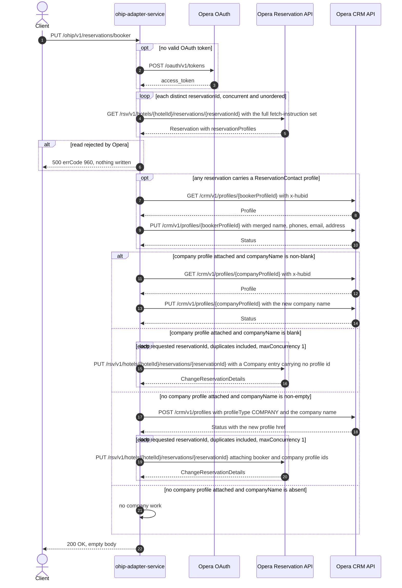

# OHIP Adapter Service: updateBookerDetails Flow

Updates the booker (reservation-contact) profile of one or more Opera reservations and, in the
same request, attaches, renames, or detaches the reservation's company profile.

```http
PUT /ohip/v1/reservations/booker
Host: ohip-adapter-service:9100
Content-Type: application/json
```

The servlet context path is `/ohip/` and `HotelReservationController` is mapped under `/v1`, so
the public path is `/ohip/v1/reservations/booker`. There is no inbound authentication on the
endpoint; Opera calls use the service OAuth client when no valid token is present. The handler
returns `200 OK` with an empty body (`ResponseEntity<Void>`), which matches the declared
contract.

## Flow

`HotelReservationController.updateBookerDetails` maps the validated `BookerDetailsCnpRequestDto`
to `BookerDetailsCnpRequest` and calls `HotelReservationInPortImpl.updateBookersDetails`, which
delegates straight to `HotelReservationOutPortImpl.updateBookerDetails` — no domain rules, no
extra validation, no flag checks in between.

The out-port first reads every requested reservation:
`OhipReservationClient.getReservations(hotelId, new HashSet<>(reservationIds))` issues one
`GET /rsv/v1/hotels/{hotelId}/reservations/{reservationId}` per **distinct** id, concurrently and
unordered (an unbounded `flatMap`), each with the full fetch-instruction set
(`Reservation,InventoryItems,ReservationPolicies,Packages,ReservationPaymentMethods,RoutingInstructions,Comments,Preferences,LinkedReservations,Alerts`)
and the `x-hotelid` header. The list is collected with `block()`, so a read failure ends the
request before any write. When the collected list is `null` the method returns silently; in
practice Opera either answers or errors, so this is not a reachable success shape.

Two independent blocks then run in order over the collected reservations.

**Booker profile.** `getProfileIdsByType(reservations, RESERVATIONCONTACT)` collects the profile
ids of every reservation profile typed `ReservationContact` into a `Set`. If the set is
non-empty, only its **first** element is used, whatever the number of reservations: one
`GET /crm/v1/profiles/{profileId}` (fetch instructions
`Profile,Address,Communication,Correspondence,FutureReservation,HistoryReservation`, `x-hubid`
header, no `x-hotelid`), then one `PUT /crm/v1/profiles/{profileId}` carrying the merged booker
profile — title/first/last name, landline and mobile telephones, email, and the postal address.
The merge keeps the existing Opera profile's address type, city name, and address/email/telephone
element ids and overlays the request's values, so the PUT is an amendment rather than a
replacement. When no reservation carries a `ReservationContact` profile, no profile read or
write happens at all and the booker part of the request is silently dropped.

**Company profile.** `getProfileIdsByType(reservations, COMPANY)` collects the reservation's
attached company profile ids. Which of three things happens depends on that set and on
`booker.companyName`:

- A company profile is already attached and `companyName` is non-blank — rename in place:
  `updateCompanyId` reads the first attached company profile with
  `GET /crm/v1/profiles/{companyProfileId}` and sends
  `PUT /crm/v1/profiles/{companyProfileId}` with a body carrying only the new company name. No
  reservation is updated on this branch. If the read answers no profile at all, the request fails
  with errCode `51` (`DIGITAL_GET_PROFILE_EXCEPTION`) before the PUT.
- A company profile is already attached and `companyName` is blank — detach: one
  `PUT /rsv/v1/hotels/{hotelId}/reservations/{reservationId}` per entry of the request's
  `reservationIds` list, whose `reservationProfiles` block re-states the booker profile id under
  `ReservationContact` and carries a `Company` entry with **no** profile id, which is how Opera
  clears the link. The company profile itself is neither read nor written.
- No company profile is attached and `companyName` is non-empty — attach: one
  `POST /crm/v1/profiles` creating a `COMPANY` profile whose body carries only the company name,
  the new profile id taken from the `Location`-style `links[0].href` tail of the Opera response,
  then one `PUT /rsv/v1/hotels/{hotelId}/reservations/{reservationId}` per entry of
  `reservationIds` attaching booker and company profile ids together.

Both reservation-PUT fan-outs iterate the request list as supplied (duplicates retained) and are
serialized by the deployed `reservationOhipProperties.maxConcurrency` of `1`, so the PUTs go out
one at a time in list order. Everything is collected with `block()`, so Opera errors surface
synchronously as HTTP 500 with the OHIP envelope: read failure `960`
(`OHIP_GET_RESERVATION_EXCEPTION`), profile read failure `912`
(`OHIP_GET_PROFILES_EXCEPTION`), profile update failure `961`
(`OHIP_SEND_UPDATE_PROFILE_EXCEPTION`), company create failure `953`
(`OHIP_POST_PROFILE_EXCEPTION`), reservation update failure `958`
(`OHIP_CHANGE_RESERVATION_EXCEPTION`). The profile PUT and the reservation PUT are the two calls
with a retry policy: an Opera error body whose `type` is `Bad Request` is retried up to three
times with a three-second backoff, and exhaustion maps to `971`
(`OHIP_RETRIES_EXHAUSTED_EXCEPTION`).

## Mermaid Flow



## Features

- Bulk update: one request carries many reservation ids for a single hotel
- Reads are deduplicated (`HashSet`); reservation PUTs are not — a duplicated id is read once and
  updated twice
- One booker profile is updated per request, not per reservation: the `ReservationContact`
  profile ids are collected into a `Set` and only the first is read and written
- Booker fields are merged onto the profile Opera already holds; blank title, first name, last
  name, landline, and mobile leave the stored value untouched, and a null `emailAddress` leaves
  the email collection unset
- The stored address type, city name, and address/email/telephone element ids are preserved from
  the existing profile; the request supplies postal code and address lines only
- Company handling is a three-way decision from the reservation's attached company profile and
  `booker.companyName`: rename the attached profile, detach it, or create and attach a new one
- Only the detach and attach branches touch reservations; a rename is purely a CRM operation
- Empty response body on success; failures are the standard OHIP error envelope
- No inbound authentication; outbound Opera OAuth bearer token plus `x-app-key` per client
  config, `x-hotelid` on reservation and profile-write calls, `x-hubid` on profile reads

## Feature Flags

No endpoint-specific flag gates this flow. Neither the controller, the in-port
(`HotelReservationInPortImpl.updateBookersDetails`), nor the out-port path
(`HotelReservationOutPortImpl.updateBookerDetails`) evaluates `unleashWrapper`. The shared Opera
transport-authentication flags apply to every outbound Opera call:

| Flag | Effect when enabled |
| --- | --- |
| `release_ohip_use_token_service` | Obtains Opera bearer tokens from `opera-token-service` instead of authenticating directly with Opera OAuth. Evaluated in the `ohipWebClient` exchange filter, on the reactive path rather than the servlet request thread. |
| `release_ohip_use_token_refresh_skew` | Applies the configured early-refresh clock skew to directly acquired Opera OAuth tokens. Evaluated once when the authorized-client provider bean is built, so it is fixed for the lifetime of the service. |

## Request

Body: `BookerDetailsCnpRequestDto`.

| Field | Required | Effect |
| --- | --- | --- |
| `hotelId` | yes (`@NotEmpty`) | Opera hotel for the reads, the reservation PUTs, and the `x-hotelid` header on reservation and profile-write calls |
| `reservationIds` | yes (`@NotEmpty`) | Distinct values drive the reads; the raw list drives the reservation PUTs one-for-one on the detach and attach branches |
| `booker` | no | Absent, the flow fails once it reaches the first branch that dereferences it (see Branches) |
| `booker.title` / `firstName` / `lastName` | no | Non-blank values overwrite the corresponding name part on the booker profile; blank leaves Opera's value |
| `booker.landline` / `booker.mobile` | no | Non-blank values are sent as `HOME` and `MOBILE` telephones, reusing the existing element ids |
| `booker.emailAddress` | no | Non-null replaces the profile's first email; null leaves the email collection unset |
| `booker.companyName` | no | Drives the three-way company decision. Non-blank with a company attached renames; blank or null with a company attached detaches; non-empty with no company attached creates and attaches |
| `booker.address` | no on the wire | Required in practice on the `ReservationContact` path (see Branches). Supplies postal code and address lines 1-4 |

## Branches

| Trigger | Behavior |
| --- | --- |
| No reservation carries a `ReservationContact` profile | No profile read or write; the booker part of the request is dropped and only the company decision runs |
| Several reservations carry different `ReservationContact` profile ids | One profile is read and written — the first element of a `HashSet`, so which one is not deterministic |
| Company profile attached, `companyName` non-blank | Company profile GET + PUT only; no reservation PUT is sent |
| Company profile attached, `companyName` blank or null | One reservation PUT per requested id detaching the company; no company profile call |
| No company profile attached, `companyName` non-empty | Company profile POST, then one reservation PUT per requested id attaching booker and company |
| No company profile attached, `companyName` null or empty | No company work at all; a booker-only request ends after the profile PUT |
| Duplicate reservation ids | One read for the distinct id, one PUT per list entry on the branches that send PUTs |
| Empty `reservationIds` list | Rejected by `@NotEmpty` before any Opera call |
| `booker.address` omitted on the `ReservationContact` path | The address merge converts the request address with ModelMapper, which rejects a null source, so the request fails with an unmapped HTTP 500 instead of skipping the address. Request-shaped, so it belongs to the owning service's tests |
| `booker` omitted entirely | Same shape: the first dereference of `getBooker()` fails with an unmapped HTTP 500. `booker` carries no `@NotNull`, so Bean Validation does not catch it |
| `companyName` is whitespace only, with no company attached | The attach branch is entered on `isNotEmpty` but the company-profile body builder returns null on `isNotBlank`, so the POST is attempted with a null body and fails with an unmapped HTTP 500. The two blocks disagree on which emptiness test to use |
| Attached company profile read answers no profile | errCode `51` (`DIGITAL_GET_PROFILE_EXCEPTION`), HTTP 500, before the company PUT |
| Reservation read rejected by Opera | HTTP 500 errCode `960`, nothing written |
| Booker profile read rejected by Opera | HTTP 500 errCode `912`, no profile or reservation write |
| Booker or company profile PUT rejected by Opera | HTTP 500 errCode `961`; on the booker PUT the company decision is never reached |
| Company profile POST rejected by Opera | HTTP 500 errCode `953`, no reservation PUT; the booker profile PUT has already applied |
| Reservation PUT rejected by Opera | HTTP 500 errCode `958`; PUTs are serialized, so earlier ids in the list have already applied |
| Opera answers a profile PUT or reservation PUT with an error body whose `type` is `Bad Request` | Retried up to three times with a three-second backoff; exhaustion maps to errCode `971` |
| Opera answers a reservation read with an empty HTTP body | The reactive stream emits nothing for that id, so it takes no part in the profile-type scan and still receives a reservation PUT on the detach and attach branches |
| Opera answers a reservation read with a success envelope whose `reservations` block is absent | The profile-type scan dereferences `getReservations().getReservation().get(0)` unguarded, so the request fails with HTTP 500 |
