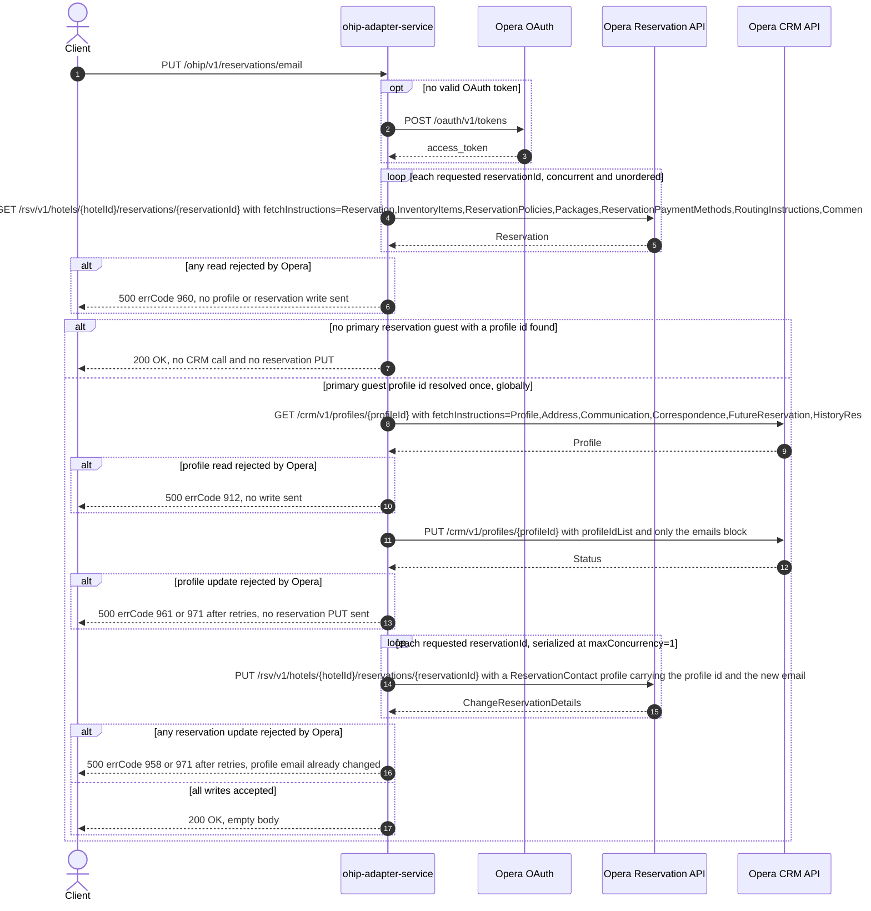

# OHIP Adapter Service: updateBookerEmail Flow

Replaces the email address on the primary reservation guest's Opera CRM profile and restamps
that email onto every requested reservation's `ReservationContact` profile block.

```http
PUT /ohip/v1/reservations/email
Host: ohip-adapter-service:9100
Content-Type: application/json
```

The servlet context path is `/ohip/` and `HotelReservationController` is mapped under `/v1`,
so the public path is `/ohip/v1/reservations/email`. There is no inbound authentication on
the endpoint; Opera calls use the shared OHIP WebClient's OAuth bearer token. The handler
returns `200 OK` with an empty body (`ResponseEntity<Void>`), which matches its
`@ApiResponse(responseCode = "200")` and the checked-in OpenAPI contract.

## Flow

`HotelReservationController.updateBookerEmail` maps the validated
`UpdateBookerEmailRequestDto` to the `UpdateBookerEmailRequest` model and calls
`HotelReservationInPortImpl.updateBookerEmail`, which is pure delegation to
`HotelReservationOutPortImpl.updateBookerEmail` — no logging, no domain rules, no flag
checks between the two.

The out-port runs three ordered, blocking phases against Opera.

Phase 1 (read every reservation). It calls
`OhipReservationClient.getReservations(hotelId, new HashSet<>(reservationIds))`, issuing one
`GET /rsv/v1/hotels/{hotelId}/reservations/{reservationId}` per requested id with the full
fetch-instruction set
(`Reservation,InventoryItems,ReservationPolicies,Packages,ReservationPaymentMethods,RoutingInstructions,Comments,Preferences,LinkedReservations,Alerts`).
The request field is already a `Set`, so the ids are distinct by construction. The reads are
issued through `Flux.flatMap` with the default concurrency, so they are concurrent and
complete in no guaranteed order; the whole phase is `collectList().block()`, so every read
finishes before anything else happens.

Phase 2 (resolve the guest profile, once). `getBookerProfileId(reservationList)` streams the
collected reservations, keeps those whose `reservations.reservation[0].reservationGuests` is
non-null, flattens their reservation guests, keeps the ones with `primary == true`, and takes
the **first** `profileInfo.profileIdList` entry it encounters across all reservations. This
is a single global profile id, resolved from the primary *reservation guest* block — not from
the `reservationProfiles` / `ReservationContact` block other flows use. If no primary guest
with a profile id is found the whole remainder of the flow is skipped and the endpoint still
answers `200 OK`.

With an id in hand the out-port reads that one profile via
`OhipReservationClient.sendGetProfilesByProfileIds(Set.of(profileId))`, a single
`GET /crm/v1/profiles/{profileId}` carrying
`fetchInstructions=Profile,Address,Communication,Correspondence,FutureReservation,HistoryReservation`
and the `x-hubid` header, then maps it to the internal `ProfileType` with
`BookerProfileOhipMapper.toModel`.

Phase 3 (write). It sends one `PUT /crm/v1/profiles/{profileId}` whose body is a minimal
`Profile`: the profile's `profileIdList` plus a `profileDetails.emails.emailInfo` entry
carrying the requested `emailAddress`, reusing the `id`/`type` of the profile's existing first
email when it has one. Nothing else from the read profile is echoed back — name, addresses
and telephones are deliberately absent from the update body. This call is blocking, so it
completes before any reservation is touched.

It then fans out over the request's `reservationIds` and sends one
`PUT /rsv/v1/hotels/{hotelId}/reservations/{reservationId}` per id. Each body is a
`ChangeReservation` carrying a single reservation instruction with `hotelId`,
`reservationIdList` (`type=Reservation`), and a `reservationProfiles.reservationProfile`
entry of `reservationProfileType=ReservationContact` whose `profileIdList` is the resolved
profile id (`type=Profile`) and whose inline `profile.emails.emailInfo[0].email.emailAddress`
is the new address. The fan-out runs at `reservation.ohip.maxConcurrency`, deployed as `1`,
so the PUTs are effectively serialized; their order is not guaranteed because the source is a
`Set`. The phase is `collectList().block()`.

Every Opera error surfaces synchronously as HTTP 500 with the OHIP error envelope: a failed
reservation read maps to errCode `960` (`OHIP_GET_RESERVATION_EXCEPTION`) before any write, a
failed profile read to errCode `912` (`OHIP_GET_PROFILES_EXCEPTION`), a failed profile update
to errCode `961` (`OHIP_SEND_UPDATE_PROFILE_EXCEPTION`), and a failed reservation update to
errCode `958` (`OHIP_CHANGE_RESERVATION_EXCEPTION`). The profile PUT and the reservation PUTs
both go through the shared retry spec (3 retries, 3s minimum exponential backoff) which
retries only when the Opera error body's `type` is `Bad Request`; exhausting those retries
maps to errCode `971` (`OHIP_RETRIES_EXHAUSTED_EXCEPTION`). The reservation read and the
profile read are not retried.

## Mermaid Flow



## Features

- Bulk update: one request carries many reservation ids for a single hotel
- `reservationIds` is a `Set`, so reads and reservation PUTs are both one-per-distinct-id and
  duplicate ids are impossible at the boundary
- Exactly one CRM profile is read and exactly one CRM profile is updated per request,
  regardless of how many reservations are listed: the profile is the first primary
  reservation guest found across all the reads
- The CRM update body carries only `profileIdList` and the `emails` block; the profile's
  name, address and telephone data are not echoed back to Opera
- The reservation PUT restamps the email inline on a `ReservationContact` reservation-profile
  entry as well, so the reservation's own contact block matches the CRM profile
- Ordering is strict and blocking: all reads, then the profile read, then the profile update,
  then the reservation updates
- Empty response body on success; failures use the standard OHIP error envelope
- No inbound authentication; outbound Opera OAuth bearer token per client config

## Feature Flags

No endpoint-specific flag gates this flow. Neither the controller, the in-port
(`HotelReservationInPortImpl.updateBookerEmail`), nor the out-port path evaluates
`unleashWrapper`. The shared Opera transport-authentication flags apply outside the request
context (`WebClientConfig`, `WebClientAuthConfig`):

| Flag | Effect when enabled |
| --- | --- |
| `release_ohip_use_token_service` | Obtains Opera bearer tokens from `opera-token-service` instead of authenticating directly with Opera OAuth. |
| `release_ohip_use_token_refresh_skew` | Applies the configured early-refresh clock skew to directly acquired Opera OAuth tokens. |

## Request

Body: `UpdateBookerEmailRequestDto`.

| Field | Required | Effect |
| --- | --- | --- |
| `hotelId` | yes (`@NotNull`, `@NotEmpty` on the model) | Opera hotel for every reservation read and PUT, the `x-hotelid` header value, and the hotel scope of the CRM profile update |
| `reservationIds` | yes (`@NotNull`, `@NotEmpty` on the model) | Set of Opera reservation ids; drives one read and one PUT each |
| `emailAddress` | yes (`@NotNull`, `@NotEmpty` on the model) | The new address written to the CRM profile and to each reservation's `ReservationContact` profile |

## Branches

| Trigger | Behavior |
| --- | --- |
| No reservation carries a `reservationGuests` block, or none of their guests has `primary == true` | No CRM call and no reservation PUT; `200 OK` |
| Several reservations each carry a primary guest | Only the first profile id encountered is read and updated; every reservation PUT carries that same id |
| Profile read returns a profile with no existing email | The update body's `emailInfo` entry carries only the new `email`, without an `id` or `type` |
| Reservation read rejected by Opera | HTTP 500 errCode `960`, no write of any kind |
| Profile read rejected by Opera | HTTP 500 errCode `912`, no write of any kind |
| Profile update rejected by Opera with a non-`Bad Request` envelope | HTTP 500 errCode `961`, no reservation PUT |
| Profile update rejected by Opera with a `Bad Request` envelope | 3 retries at 3s minimum backoff, then HTTP 500 errCode `971`, no reservation PUT |
| Reservation update rejected by Opera with a non-`Bad Request` envelope | HTTP 500 errCode `958`; the CRM profile email is already changed and is not rolled back |
| Reservation update rejected by Opera with a `Bad Request` envelope | 3 retries at 3s minimum backoff, then HTTP 500 errCode `971` |
| Opera answers a reservation read with the "reservation not held here" envelope (`reservations` with no `reservation` member) | `getBookerProfileId` dereferences `getReservations().getReservation().get(0)` unguarded, so the request fails with HTTP 500 instead of skipping that reservation |
| Opera answers a reservation read with an empty HTTP body | The reactive stream emits nothing for it, so it simply does not contribute a candidate profile id |
| A reservation guest reports `primary` as absent/null | `resGuest.getPrimary().equals(Boolean.TRUE)` dereferences the boxed value, so the request fails with HTTP 500 |
| Profile read returns `200` with an empty body | `getProfileById` yields `null`, `BookerProfileOhipMapper.toModel(null)` returns `null`, and the update mapper dereferences it, so the request fails with HTTP 500 |

## Implementation notes

- `if (reservationList != null)` in `updateBookerEmail` is not a reachable guard:
  `Flux.collectList().block()` emits a list even when the flux is empty, so the reference is
  never null in practice. The reachable "do nothing" path is the empty `bookerProfileId`
  Optional, not this null check.
- The identifier is named `bookerProfileId` but is read from `reservationGuests` /
  `primary == true`, whereas the sibling `getBookerProfileById(...)` overloads on this class
  read the `ReservationContact` entry of `reservationProfiles`. The two select different
  Opera blocks; only the `reservationGuests` one is on this route.
- There is no rollback: a reservation PUT failure leaves the CRM profile already carrying the
  new email.
