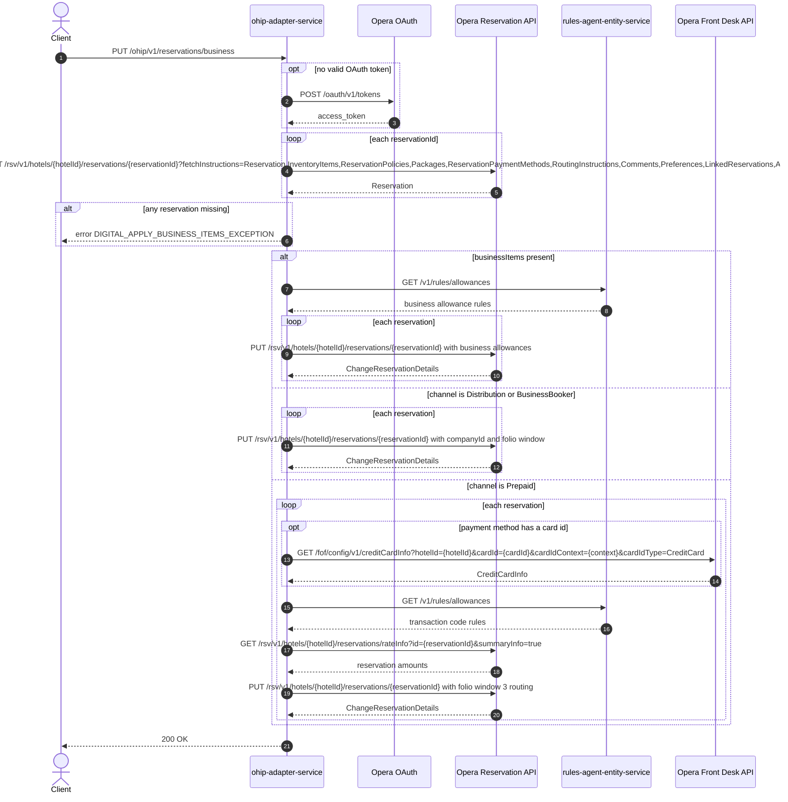

# OHIP Adapter Service: updateBusinessItems Flow

Applies business-specific items (allowances, company routing, prepaid card routing) to one
or more Opera reservations via change-reservation PUTs.

```http
PUT /ohip/v1/reservations/business
Host: ohip-adapter-service:9100
Content-Type: application/json
```

The servlet context path is `/ohip/` and `HotelReservationController` is mapped under
`/v1`, so the public path is `/ohip/v1/reservations/business`. There is no inbound
authentication on the endpoint; Opera calls use the service OAuth client when no valid
token is present.

## Flow

ohip-adapter-service loads every requested reservation from Opera with the broad
fetch-instruction set and clears their in-memory alerts (so the later PUT does not
duplicate them). If any reservation is missing it fails with
`DIGITAL_APPLY_BUSINESS_ITEMS_EXCEPTION`.

The update then takes exactly one of three branches. When `businessItems` is present, it
fills missing item fields from the loaded reservations, fetches business allowance rules
from rules-agent, and PUTs a change-reservation with the business allowances per
reservation. Otherwise, when the channel is Distribution or BusinessBooker, it PUTs a
change-reservation mapping the company id and a folio window resolved from
`pibaCardPresent`. Otherwise, when the channel is Prepaid, it enriches each reservation
with front-desk credit-card info (when a card is saved), package transaction codes from
rules-agent allowances, and reservation amounts from Opera rate-info, then PUTs a
change-reservation routing payment to folio window 3. Any other channel makes no update
call after the reservation fetch.

## Mermaid Flow



## Features

- Applies business allowances driven by rules-agent allowance rules
- Distribution/BusinessBooker company attachment with folio window resolved from
  `pibaCardPresent`
- Prepaid-channel payment routing to folio window 3 with card and amount enrichment
- Clears reservation alerts in memory before the PUT to avoid duplicating them in Opera
- No inbound authentication; outbound Opera OAuth bearer token per client config

## Feature Flags

No endpoint-specific flag gates this flow. The shared Opera authentication flags apply:

| Flag | Effect when enabled |
| --- | --- |
| `release_ohip_use_token_service` | Obtains Opera bearer tokens from `opera-token-service` instead of authenticating directly with Opera OAuth. |
| `release_ohip_use_token_refresh_skew` | Applies the configured early-refresh clock skew to directly acquired Opera OAuth tokens. |

## Request

Body: `BusinessItemsRequestDto` — `hotelId`, `reservationIds`, optional `businessItems`
(business allowances), `channel`, `companyId`, `pibaCardPresent`. The presence of
`businessItems` selects the allowances branch; otherwise `channel` selects the
Distribution/BusinessBooker or Prepaid branch.

## Branches

| Trigger | Behavior |
| --- | --- |
| Any requested reservation not found in Opera | `DIGITAL_APPLY_BUSINESS_ITEMS_EXCEPTION` |
| `businessItems` present | Rules-agent allowances + per-reservation PUT |
| Channel Distribution or BusinessBooker (no businessItems) | Company/folio-window PUT per reservation |
| Channel Prepaid (no businessItems) | Card + transaction-code + amounts enrichment, folio window 3 PUT |
| Other channel (no businessItems) | Reservation fetch only, no update |
