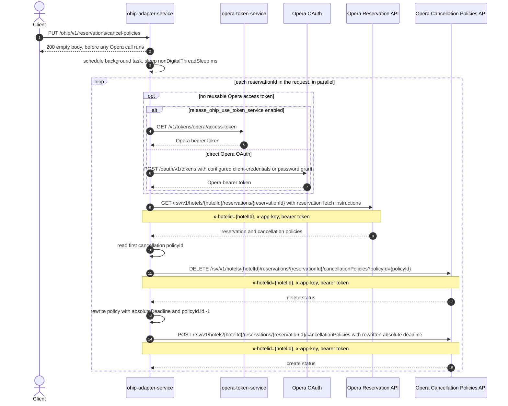

# OHIP Adapter Service: updateCancellationPolicies Flow

Schedules an absolute-deadline rewrite of the cancellation policy for one or more
reservations, running the Opera writes on a delayed background task after the endpoint
has already responded.

```http
PUT /ohip/v1/reservations/cancel-policies
Host: ohip-adapter-service:9100
Content-Type: application/json
Accept: application/json
```

The servlet context path is `/ohip/` and `HotelReservationController` is mapped under
`/v1`, so the public path is `/ohip/v1/reservations/cancel-policies`. All Opera API calls
carry a bearer token plus `x-app-key` and `x-hotelid` headers. A cached access token is
reused until its refresh criteria require another direct Opera OAuth or opera-token-service
request.

## Flow

ohip-adapter-service maps the JSON body, which carries a `hotelId`, a list of
`reservationIds`, and one `absoluteDeadline`, to a domain request and returns HTTP 200
with an empty body immediately, without waiting on any Opera call.

The actual work is scheduled on a background task: it first sleeps for a configured delay
(`config.service.ohip.nonDigitalThreadSleep`, 10000 ms by default), then, once the delay
elapses, processes every `reservationId` in the list in parallel. For each reservation id
it repeats the same per-reservation sequence used by `updateCancellationPolicy` (the
`PUT /ohip/v1/reservations/cancel` endpoint): load the reservation from the Opera
Reservation API including its cancellation policies, read the first policy's `policyId`,
delete that policy from the Opera Cancellation Policies API using `policyId` as a query
parameter, then post a rewritten policy with `policyId.id` set to `-1` and the requested
`absoluteDeadline` written onto the deadline field, to the same cancellationPolicies URL.

Because this work runs on an unobserved `CompletableFuture`, any failure from the Opera
calls (missing reservation, failed DELETE, failed POST) is never reported back to the
original caller: the client already received 200 before the background task even starts
its delay.

## Mermaid Flow



## Features

- Accepts multiple `reservationIds` under one `hotelId` and one shared `absoluteDeadline`
  in a single request, unlike the single-reservation `PUT /ohip/v1/reservations/cancel`.
- Responds with HTTP 200 and an empty body synchronously, before any Opera call is made.
- Runs the Opera writes for every reservation id on a background task after a configured
  delay, processing reservation ids in parallel.
- Per reservation id, reuses the same delete-then-recreate cancellation policy sequence as
  `updateCancellationPolicy`: read the current `policyId` from the reservation, delete it,
  then post a rewritten policy with `policyId.id` set to `-1` and the new
  `absoluteDeadline`.
- Acquires and caches an Opera bearer token, using either opera-token-service or the
  configured direct Opera OAuth grant, shared with all other Opera calls.

## Feature Flags

| Flag | Effect when enabled |
| --- | --- |
| `release_ohip_use_token_service` | Obtains Opera bearer tokens from opera-token-service instead of authenticating directly with Opera OAuth. |
| `release_ohip_use_token_refresh_skew` | Applies the configured early-refresh clock skew to directly acquired Opera OAuth tokens. |

This method does not read any other Unleash flags.

## Request

| Body field | Required | Purpose |
| --- | --- | --- |
| `hotelId` | Yes | Opera hotel id used in downstream paths and `x-hotelid`, shared by every reservation in the request. |
| `reservationIds` | Yes | List of Opera reservation ids whose cancellation policies are replaced, one background update per id. |
| `absoluteDeadline` | Yes | Deadline written onto the recreated cancellation policy for every reservation id in the list. |

## Branches

| Trigger | Behavior |
| --- | --- |
| Missing `hotelId`, missing/empty `reservationIds`, or missing `absoluteDeadline` | Request validation returns `400` before the background task is scheduled. |
| Background task's initial sleep is interrupted | The interrupt is logged and the thread's interrupted flag is set; the per-reservation update loop still runs afterward. |
| Opera GET reservation fails for a given reservationId | That reservation id's update fails on the background task; the failure is not surfaced to the original caller, who has already received `200`. |
| Reservation has no cancellation policy or `policyId` is null | Still calls DELETE with that `policyId` query param, then POST if DELETE succeeds, same as `updateCancellationPolicy`. |
| Opera DELETE or POST cancellation policy fails for a given reservationId | That reservation id's update fails on the background task; other reservation ids in the same request still run since they are processed in parallel and independently. |
| Token-service mode is disabled and no direct Opera token is reusable | Uses the configured client-credentials grant when enabled, otherwise the password grant. |
