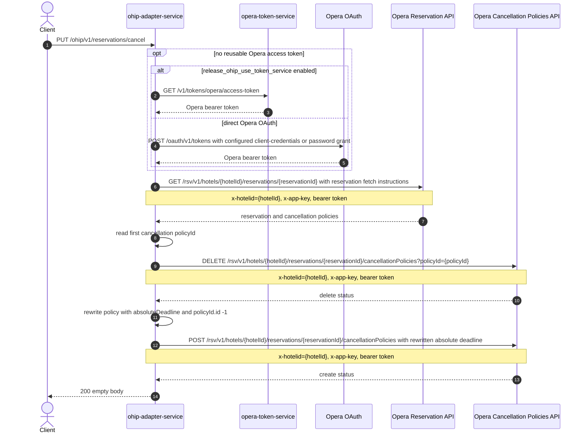

# OHIP Adapter Service: updateCancellationPolicy Flow

Replaces a reservation's Opera cancellation-policy absolute deadline by deleting the current policy and posting a rewritten one.

```http
PUT /ohip/v1/reservations/cancel
Host: ohip-adapter-service:9100
Content-Type: application/json
Accept: application/json
```

The servlet context path is `/ohip/` and `HotelReservationController` is mapped under `/v1`, so the public path is `/ohip/v1/reservations/cancel`. All Opera API calls carry a bearer token plus `x-app-key` and `x-hotelid` headers. A cached access token is reused until its refresh criteria require another direct Opera OAuth or opera-token-service request.

## Flow

ohip-adapter-service maps the JSON body to a domain request and loads the reservation from the Opera Reservation API, including reservation policies. It takes the first cancellation policy on that reservation and reads its `policyId`.

It then deletes that policy from the Opera Cancellation Policies API using `policyId` as a query parameter. It maps the loaded policy into a create payload, overwrites `hotelId` and `reservationId`, sets `policyId.id` to `-1`, and writes the requested `absoluteDeadline` onto the policy deadline. It posts that payload to the same cancellationPolicies URL.

The controller returns HTTP 200 with an empty body after both Opera writes complete. The DELETE then POST sequence is not skipped when the reservation has no cancellation policy or the `policyId` is null.

## Mermaid Flow



## Features

- Reads the current cancellation policy from the Opera reservation so the existing `policyId` can be deleted.
- Deletes the current cancellation policy, then posts a rewritten policy with the requested `absoluteDeadline` and `policyId.id` set to `-1`.
- Returns HTTP 200 with no response body after both Opera writes succeed.
- Acquires and caches an Opera bearer token, using either opera-token-service or the configured direct Opera OAuth grant.

## Feature Flags

| Flag | Effect when enabled |
| --- | --- |
| `release_ohip_use_token_service` | Obtains Opera bearer tokens from opera-token-service instead of authenticating directly with Opera OAuth. |
| `release_ohip_use_token_refresh_skew` | Applies the configured early-refresh clock skew to directly acquired Opera OAuth tokens. |

This method does not read any other Unleash flags.

## Request

| Body field | Required | Purpose |
| --- | --- | --- |
| `hotelId` | Yes | Opera hotel id used in downstream paths and `x-hotelid`. |
| `reservationId` | Yes | Opera reservation id whose cancellation policy is replaced. |
| `absoluteDeadline` | Yes | Deadline written onto the recreated cancellation policy. |

## Branches

| Trigger | Behavior |
| --- | --- |
| Missing or empty `hotelId` or `reservationId`, or missing `absoluteDeadline` | Request validation returns `400`. |
| Opera GET reservation fails | Fails with `OHIP_GET_RESERVATION_EXCEPTION` (error code `960`) and does not call DELETE or POST. |
| Reservation has no cancellation policy or `policyId` is null | Still calls DELETE with that `policyId` query param, then POST if DELETE succeeds. |
| Opera DELETE cancellation policy fails | Fails with `OHIP_DELETE_CANCELLATION_POLICY_EXCEPTION` (error code `9541`) and does not call POST. |
| Opera POST cancellation policy fails | Fails with `OHIP_CREATE_CANCELLATION_POLICY_EXCEPTION` (error code `940`). |
| Token-service mode is disabled and no direct Opera token is reusable | Uses the configured client-credentials grant when enabled, otherwise the password grant. |
| Opera, Opera OAuth, or opera-token-service calls fail | Propagates the mapped internal/downstream exception. The endpoint has no explicit reservation-not-found branch of its own. |
