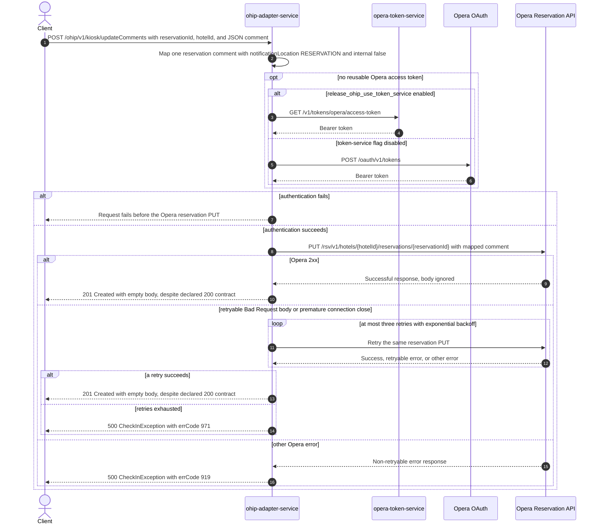

# OHIP Adapter Service: updateCarRegistrationComment Flow

Adds one caller-supplied comment, normally a car-registration comment, to one Opera
reservation.

```http
POST /ohip/v1/kiosk/updateComments?reservationId={reservationId}&hotelId={hotelId}
Host: ohip-adapter-service:9100
Content-Type: application/json
```

The servlet context path is `/ohip/` and `CheckInController` is mapped under `/v1/kiosk`.
The controller has no inbound authentication guard. Its runtime success response is `201
Created` with an empty body, although both its `@ApiResponse` annotation and the checked-in
OHIP OpenAPI contract declare `200 Success`. This contract mismatch blocks an integration
journey from asserting one coherent expected success status.

## Flow

`CheckInController.updateCarRegistrationComment` maps the unconstrained JSON fields
`commentTitle`, `type`, and `textValue` to `CommentDetails`, then calls
`CheckInInPortImpl.updateReservationComment`. The in-port delegates directly to
`CheckInOutPortImpl`; there is no endpoint-specific validation, business guard, feature-flag
check, read, cache, fan-out, rollback, or asynchronous work.

`UpdateReservationCommentOhipMapper` builds one `KioskChangeReservation`. Its sole
reservation entry carries the query `hotelId`; one id entry with the query `reservationId`
and fixed type `Reservation`; and one comment with the caller's title, type, and text. The
comment also has `notificationLocation=RESERVATION` and `internal=false` fixed by the service.

`OhipCheckInClient.sendKioskChangeReservationRequest` sends that body once to
`PUT /rsv/v1/hotels/{hotelId}/reservations/{reservationId}`. The shared Opera WebClient adds
`Authorization: Bearer`, `x-app-key`, and `x-hotelid: {hotelId}`; this PUT also declares JSON
content type. If no reusable authorized-client token exists, the default flag-disabled path
obtains one directly from `POST /oauth/v1/tokens`. The alternate token-service path calls
`GET /v1/tokens/opera/access-token`.

The client ignores a successful Opera response body. A non-retryable Opera error maps to a
500 `CheckInException` with errCode `919`. An error body whose `type` equals `Bad Request`,
or a premature connection close, triggers exponential-backoff retries: at most three retries
after the initial PUT. Exhaustion maps to HTTP 500 with errCode `971`. A successful Opera call
returns through the delegate chain, after which the controller constructs `201 Created` with
no body.

## Mermaid Flow



## Features

- Updates exactly one Opera reservation with exactly one mapped comment.
- Fixes the Opera comment's notification location to `RESERVATION`, marks it non-internal,
  and preserves the caller's title, type, and text.
- Performs no reservation read, existence guard, cache lookup, fan-out, or rollback.
- Uses shared outbound Opera authorization and retries only retryable `Bad Request` responses
  and premature connection closes.
- Returns runtime `201 Created` with no response body. The annotation and checked-in OpenAPI
  instead declare `200`, so the public success contract is inconsistent.

## Feature Flags

No endpoint-specific flag changes comment validation, mapping, or the reservation update. The
shared Opera transport evaluates these flags in `ohip-adapter-service`:

| Flag | Effect when enabled | Evaluation and override reachability |
| --- | --- | --- |
| `release_ohip_use_token_service` | Selects `opera-token-service` for a missing or expired Opera bearer token instead of authenticating directly with Opera OAuth. | Evaluated by the OHIP WebClient filter for each Opera request. It is fixed false in the integration environment, outside the usable request-override scope, and is not an ON/OFF scenario axis. |
| `release_ohip_use_token_refresh_skew` | Applies `config.service.ohip.tokenRefreshClockSkew` to refresh directly acquired Opera OAuth tokens early. It does not change token-service expiry handling. | Evaluated when the direct OAuth provider bean is constructed, so request baggage cannot pin it. The integration environment fixes it false. |

## Request

Query parameters:

| Parameter | Required | Effect |
| --- | --- | --- |
| `reservationId` | yes, by Spring request binding | Supplies the downstream reservation path and the mapped id whose fixed type is `Reservation`. |
| `hotelId` | yes, by Spring request binding | Supplies the downstream hotel path, `x-hotelid`, and mapped reservation hotel id. |

JSON body: `CommentDetailsDto`.

| Field | Required | Effect |
| --- | --- | --- |
| `commentTitle` | no field constraint | Copied to the Opera comment title. |
| `type` | no field constraint | Copied to the Opera comment type, normally `CARREG`. |
| `textValue` | no field constraint | Copied to `comment.text.value`. |

The controller applies `@Valid`, but `CommentDetailsDto` declares no Bean Validation
constraints, so null fields reach the mapper and are sent to Opera.

## Branches

| Trigger | Behavior |
| --- | --- |
| Missing required query parameter or request body | Spring rejects the request before the controller completes; no Opera PUT is sent. |
| Valid reusable authorized-client token | Skips both credential endpoints and sends the Opera PUT directly. |
| `release_ohip_use_token_service` fixed false with no reusable token | Uses direct Opera OAuth; `ENABLE_CLIENT_CREDENTIALS` selects client-credentials versus password grant. |
| Token acquisition fails | Fails before the reservation PUT; token-service errors use errCode `971`, while direct OAuth failures are surfaced by Spring OAuth handling. |
| Opera returns any 2xx | Ignores the body and returns runtime `201 Created` with an empty body. |
| Opera error body has `type=Bad Request`, or the connection closes prematurely | Retries the same PUT up to three times with three-second exponential backoff; exhaustion returns HTTP 500 errCode `971`. |
| Other Opera error | Returns HTTP 500 errCode `919` without an application-level retry. |
