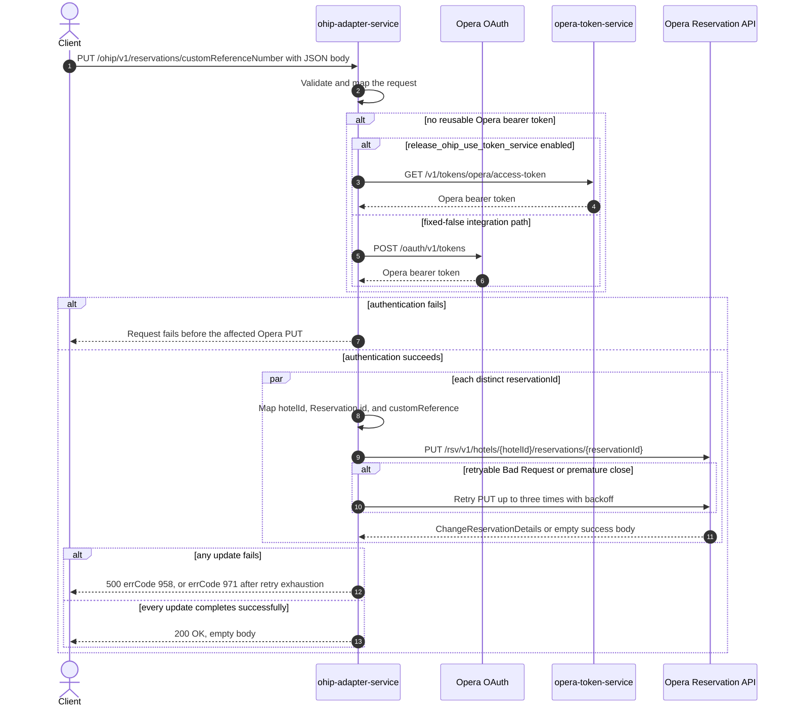

# OHIP Adapter Service: updateCustomReferenceNumber Flow

Sets the same custom reference on each distinct Opera reservation id supplied for one hotel.

```http
PUT /ohip/v1/reservations/customReferenceNumber
Host: ohip-adapter-service:9100
Content-Type: application/json
```

The servlet context path is `/ohip/` and `HotelReservationController` is mapped under `/v1`,
so the effective public route is `/ohip/v1/reservations/customReferenceNumber`. The controller
has no endpoint-level authentication guard. Outbound Opera requests carry a bearer token,
`x-app-key`, and `x-hotelid`. Success is `200 OK` with an empty body.

## Flow

`HotelReservationController.updateCustomReferenceNumber` Bean-validates
`UpdateCustomReferenceNumberRequestDto`, maps it one-for-one through
`UpdateCustomReferenceNumberRequestMapper`, and delegates to
`HotelReservationInPortImpl.updateCustomReferenceNumber`. The in-port performs no business
rule, read, or feature-flag check and delegates directly to
`HotelReservationOutPortImpl.updateCustomReferenceNumber`.

The out-port iterates the request's `Set<String> reservationIds` with `Flux.flatMap`. For every
distinct id, `UpdateCustomReferenceNumberOhipMapper` creates a separate `ChangeReservation`
body containing one reservation instruction: the request hotel id, a `reservationIdList`
entry whose type is `Reservation`, and the request `customReferenceNumber` mapped to Opera's
`customReference` field.

Each generated body is sent to the Opera Reservation API as
`PUT /rsv/v1/hotels/{hotelId}/reservations/{reservationId}`. The PUTs may be in flight
concurrently and have no ordering guarantee because this `flatMap` supplies no explicit
concurrency limit. `collectList().block()` waits for the reactive fan-out before the controller
returns. The response bodies are not inspected, so a successful empty Opera response is also
accepted. There is no read-before-write call, cache, compensating action, or rollback.

The shared Opera WebClient reuses a valid OAuth client token when available. Otherwise it gets
a token from `opera-token-service` or directly from the configured Opera OAuth endpoint,
depending on `release_ohip_use_token_service`. A non-retryable Opera error maps to errCode
`958`. An error envelope whose `type` is `Bad Request`, or a premature connection close, is
retried up to three times with backoff; exhaustion maps to errCode `971`. Because updates fan
out concurrently, failure of one id can occur after another update has already reached Opera.

## Mermaid Flow



## Features

- Bulk update over a `Set`, so duplicate reservation ids are collapsed before execution
- One independently mapped Opera change-reservation PUT per distinct reservation id
- Concurrent, unordered PUT fan-out with synchronous completion at the public boundary
- The same custom-reference value is applied to every requested reservation
- No reservation GET, cache lookup, downstream collaborator other than Opera auth/update, or
  rollback
- Shared Opera OAuth selection and selective three-retry handling

## Feature Flags

No endpoint-specific business flag is evaluated by the controller, mapper, in-port, or
out-port. The shared Opera transport evaluates these authentication flags:

| Flag | Effect when enabled | Evaluated by | Pinnability |
| --- | --- | --- | --- |
| `release_ohip_use_token_service` | Selects `opera-token-service` (`GET /v1/tokens/opera/access-token`) instead of direct Opera OAuth when an Opera bearer token is required. | `ohip-adapter-service`, in the `ohipWebClient` filter for each outbound Opera request | The integration stack enables the baggage-aware wrapper and OpenTelemetry propagation, but its token-service host is deliberately unreachable and the flag is fixed at `OhipFeatureFlag.USE_TOKEN_SERVICE=false`; it is never an ON/OFF scenario axis. |
| `release_ohip_use_token_refresh_skew` | Applies the configured early-refresh clock skew to tokens acquired directly from Opera OAuth. It does not change the reservation PUT or response. | `ohip-adapter-service`, once while `WebClientAuthConfig.customAuthClientProvider` is constructed | Not request-pinnable because evaluation occurs at service startup. The integration workflow treats the token refresh flag as fixed false and never as an ON/OFF scenario axis. |

## Request

Body: `UpdateCustomReferenceNumberRequestDto`.

| Field | Required | Effect |
| --- | --- | --- |
| `reservationIds` | yes, non-empty `Set` (`@NotEmpty`) | Distinct Opera reservation ids, each producing one PUT |
| `hotelId` | yes, non-empty string (`@NotEmpty`) | Opera hotel path value, outgoing reservation body value, and `x-hotelid` header |
| `customReferenceNumber` | yes, non-null (`@NotNull`) | Value written to each Opera reservation's `customReference` field; an empty string is permitted by validation |

## Branches

| Trigger | Behavior |
| --- | --- |
| Duplicate ids in the JSON array | Deserialization into a `Set` collapses them, so each distinct id is updated once |
| A valid OAuth client token is already cached | No token-acquisition HTTP call is made before the reservation PUT |
| No valid token and `release_ohip_use_token_service` is fixed false | Gets the token directly from configured Opera OAuth, using client credentials when `ENABLE_CLIENT_CREDENTIALS=true`, otherwise the password grant |
| Token acquisition fails | The affected reservation PUT is not sent and the public request fails |
| Opera returns a successful response with an empty body | The inner publisher completes empty; the out-port does not inspect it and the public request can still return `200 OK` |
| Opera returns a non-retryable error | HTTP 500 with errCode `958`; concurrently started updates may already have succeeded and are not rolled back |
| Opera error body has `type=Bad Request`, or the connection closes prematurely | Up to three retries with backoff; exhaustion returns HTTP 500 with errCode `971` |
