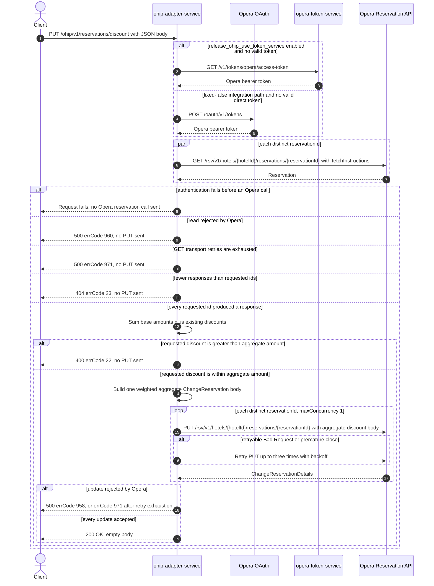

# OHIP Adapter Service: updateDiscount Flow

Distributes one discount amount across the discountable nightly rates of a set of Opera
reservations at one hotel.

```http
PUT /ohip/v1/reservations/discount
Host: ohip-adapter-service:9100
Content-Type: application/json
```

The servlet context path is `/ohip/` and `HotelReservationController` is mapped under
`/v1`, so the effective public route is `/ohip/v1/reservations/discount`. The controller
has no endpoint-level authentication guard. Outbound Opera requests carry a bearer token,
`x-app-key`, and `x-hotelid`; the token source is selected by the shared Opera WebClient.
Success is `200 OK` with an empty body.

## Flow

`HotelReservationController.updateDiscount` validates `UpdateDiscountRequestDto`, maps it
one-for-one through `UpdateDiscountRequestMapper`, and delegates through
`HotelReservationInPortImpl.updateDiscount`. The in-port only logs and delegates to
`HotelReservationOutPortImpl.updateDiscount`; the read, aggregate guards, discount
distribution, and write fan-out all live in that out-port.

The out-port calls `OhipReservationClient.getReservations` for the request's
`Set<String> reservationIds`. It issues one
`GET /rsv/v1/hotels/{hotelId}/reservations/{reservationId}` per distinct id, with the broad
`fetchInstructions` set that includes `Reservation`, `InventoryItems`,
`ReservationPolicies`, `Packages`, `ReservationPaymentMethods`, `RoutingInstructions`,
`Comments`, `Preferences`, `LinkedReservations`, and `Alerts`. The reads fan out through
`Flux.flatMap` and are collected before any update is attempted.
Premature connection closes on a GET are retried up to three times with backoff; exhausted
transport retries map to errCode `971`.

If the collected list is empty, or if its size differs from the requested set size, the
out-port throws `HotelReservationNotFound` with errCode `23` and no PUT is sent. It then
sums every returned nightly rate's `base.amountBeforeTax`, adding back any existing
`discount.amount`. If the requested discount is greater than that aggregate, it throws
`DiscountInvalidAmountException` with errCode `22` and no PUT is sent. A discount equal to
the aggregate is accepted.

`UpdateDiscountRequestOhipMapper` builds one `ChangeReservation` body for the whole
request. It computes weighted discount amounts from all returned nightly rates. For each
reservation instruction it preserves the Opera reservation ids and selected room-stay
fields, retains only room-rate rows whose `discountAllowed` is true, and replaces each
retained row's rate list with a discount carrying the requested currency, reason
`Promotion`, code `PR`, market code `OTH`, and source code `00`. A promotion name longer
than 20 characters is shortened to 17 characters plus `...`.

Finally, the out-port sends that same aggregate `ChangeReservation` body to
`PUT /rsv/v1/hotels/{hotelId}/reservations/{reservationId}` once per requested id. The
configured `maxConcurrency` is `1`, so those PUTs are subscribed sequentially. A normal
Opera error maps to errCode `958`. A retryable Opera error body whose `type` is
`Bad Request`, or a premature connection close, is retried up to three times with backoff;
exhaustion maps to errCode `971`. Earlier successful PUTs are not rolled back if a later
PUT fails.

## Mermaid Flow



## Features

- Bulk operation over a `Set`, so duplicate reservation ids are collapsed before runtime
  reads and writes
- Read-before-write completeness guard: every requested id must emit one reservation
  response before any update starts
- Aggregate upper bound based on all returned nightly base amounts plus existing discounts
- Weighted distribution across the request's returned nightly rates
- Only `discountAllowed=true` room-rate rows are included in each outgoing reservation
  instruction
- One aggregate change body is reused for every reservation-specific PUT
- Sequential PUT fan-out at the deployed `maxConcurrency=1`, with no transaction or rollback
- Shared outbound Opera OAuth and retry handling; no cache annotation on either reservation
  call

## Feature Flags

No endpoint-specific business flag is evaluated by the controller, in-port, out-port, or
discount mappers. The shared Opera transport evaluates these flags:

| Flag | Effect when enabled | Evaluated by | Request override |
| --- | --- | --- | --- |
| `release_ohip_use_token_service` | Selects `opera-token-service` (`GET /v1/tokens/opera/access-token`) as the source of the Opera bearer token instead of direct Opera OAuth. | `ohip-adapter-service`, in the `ohipWebClient` filter for each outbound Opera request | Fixed false in the integration environment and not an ON/OFF axis; request baggage cannot make the token-service path reachable there. |
| `release_ohip_use_token_refresh_skew` | Sets the configured early-refresh clock skew on the direct client-credentials and password OAuth providers. It does not change the reservation request or discount logic. | `ohip-adapter-service`, once while `WebClientAuthConfig.customAuthClientProvider` is constructed | Not baggage-pinnable because it is evaluated at service startup. |

## Request

Body: `UpdateDiscountRequestDto`.

| Field | Required | Effect |
| --- | --- | --- |
| `reservationIds` | yes (`@NotNull`; mapped model is `@NotEmpty`) | Distinct Opera reservation ids to read and update |
| `hotelId` | yes (`@NotNull`; mapped model is `@NotEmpty`) | Opera hotel path value and `x-hotelid` header |
| `currency` | yes (`@NotNull`; mapped model is `@NotEmpty`) | Currency written on every generated discount amount |
| `discountAmount` | yes (`@NotNull`; mapped model has `@DecimalMin("0.0")`) | Aggregate discount to validate and distribute |

## Branches

| Trigger | Behavior |
| --- | --- |
| Duplicate ids in the JSON array | Deserialization into a `Set` collapses them, so each distinct id is read and updated once |
| Bearer-token acquisition fails | The request stops before the affected Opera call; token-service acquisition failures use errCode `971`, while direct OAuth failures are surfaced by Spring OAuth handling |
| Any reservation GET returns an error | HTTP 500 errCode `960`; no update begins |
| A reservation GET closes prematurely | Retried up to three times with backoff; exhaustion returns HTTP 500 errCode `971` and no update begins |
| A GET completes with an empty HTTP body | That id contributes no collected item, so the size guard returns HTTP 404 errCode `23`; no update begins |
| Opera returns a response object but omits `reservations.reservation[0]` | The size guard passes, then the mapper dereferences the missing structure and the request fails as an internal error |
| Requested discount exceeds the aggregate base-plus-existing-discount total | HTTP 400 errCode `22`; no update begins |
| Requested discount equals the aggregate total | Accepted and distributed |
| A room-rate row has `discountAllowed=false` | It contributes to the aggregate/weight input but is omitted from the outgoing room-rate instructions |
| A normal reservation PUT error occurs | HTTP 500 errCode `958`; no retry, and any earlier successful PUT remains applied |
| PUT error body has `type=Bad Request`, or the connection closes prematurely | Up to three retries with backoff; exhaustion returns HTTP 500 errCode `971` |
| A later sequential PUT fails | Remaining ids are not updated, and earlier successful updates are not rolled back |
