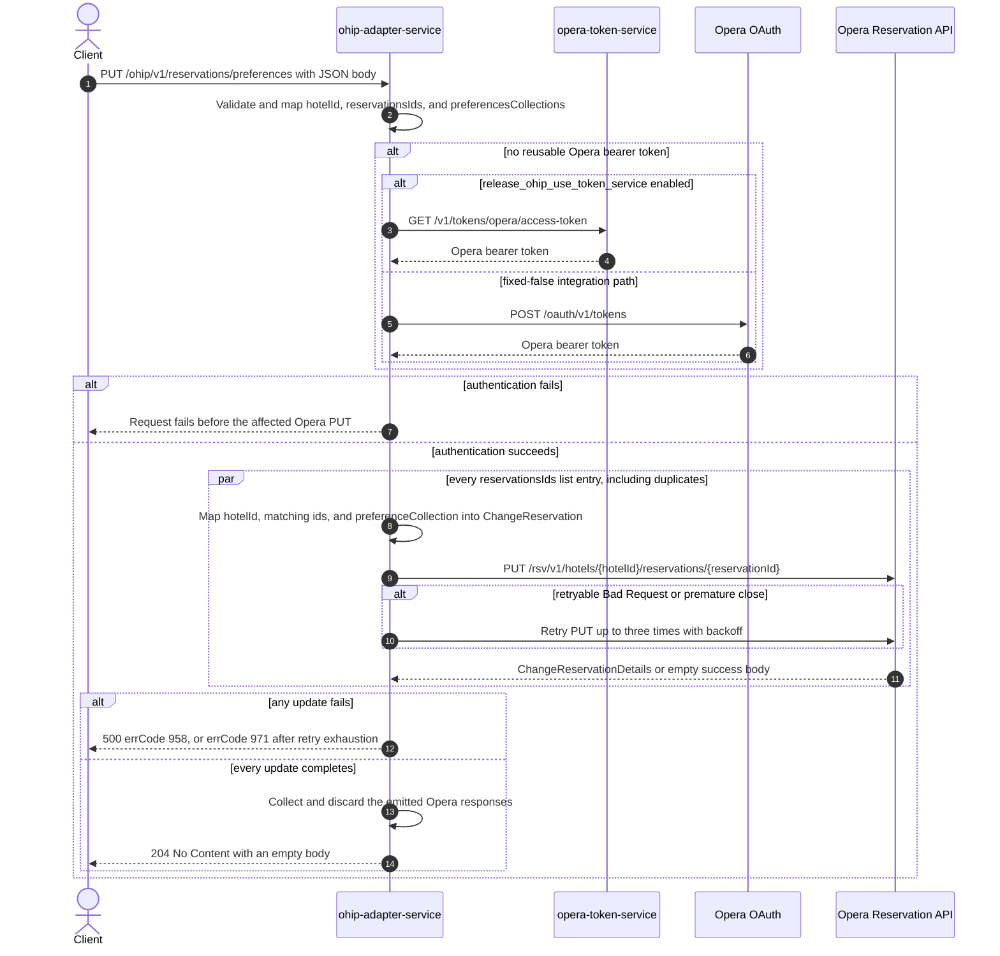

# OHIP Adapter Service: updatePreferences Flow

Writes one shared set of Opera reservation preference collections onto every reservation id
supplied for a hotel and returns no content.

```http
PUT /ohip/v1/reservations/preferences
Host: ohip-adapter-service:9100
Content-Type: application/json
```

The servlet context path is `/ohip/` and `HotelReservationController` is mapped under `/v1`, so
the effective public route is `/ohip/v1/reservations/preferences`. The controller has no
endpoint-level authentication guard. Outbound Opera requests carry a bearer token, `x-app-key`,
`x-hotelid`, and JSON content type. Success is `204 No Content` with an empty body, which is what
the checked-in `ohip-adapter-service-openApi.yaml` declares for this operation.

## Flow

`HotelReservationController.updatePreferences` Bean-validates `ReservationPreferencesRequestDto`,
maps it through `ReservationPreferencesRequestMapper`, and calls
`HotelReservationInPortImpl.updateReservationPreferences`. The in-port only logs `hotelId` and
`reservationsIds` and delegates to `HotelReservationOutPortImpl.updateReservationPreferences`; it
adds no business guard, no reservation read, no cache, and no endpoint-specific feature-flag
decision.

The out-port iterates the request's `List<String> reservationsIds` with `Flux.flatMap`. For every
list entry, including duplicates, `UpdatePreferencesRequestOhipMapper.toDto` builds a separate
`ChangeReservation` body containing exactly one reservation instruction. That instruction carries
the request `hotelId`, a `reservationIdList` built by filtering the request id list down to the
entries equal to the id currently being sent (each surviving entry mapped to
`{ id, type: "Reservation" }`), and a `preferenceCollection` translated from the request's
`preferencesCollections`: one entry per collection with `preferenceType` copied verbatim and each
`preferences` string emitted as a `preference[].preferenceValue`. The same preference content is
therefore repeated identically on every reservation; only the id differs.

Each body is sent to the Opera Reservation API as
`PUT /rsv/v1/hotels/{hotelId}/reservations/{reservationId}`
(`reservationIdEndpoint`), with the reservation id also present in the URL. No concurrency
argument is passed to `flatMap`, so the deployed `maxConcurrency: 1` property does **not** apply
here and the PUTs run concurrently at Reactor's default rail count; completion order is not input
order. `collectList().block()` waits for the whole fan-out before the controller returns. A
failure terminates the aggregate without rolling back updates that already reached Opera.

The shared Opera WebClient reuses a valid OAuth client token when available. Otherwise
`release_ohip_use_token_service` selects either `opera-token-service` or direct Opera OAuth as the
token source. The integration environment fixes that flag false, so its reachable path is direct
Opera OAuth, using client credentials when `ENABLE_CLIENT_CREDENTIALS=true` and the password grant
otherwise.

Nothing reads the collected `ChangeReservationDetails` responses. The endpoint returns
`ResponseEntity.noContent()` regardless of what Opera echoed back, so an empty Opera success body
is harmless on this path. A non-retryable Opera error maps to errCode `958`
(`OHIP_CHANGE_RESERVATION_EXCEPTION`, HTTP 500). An error envelope whose `type` is `Bad Request`,
or a premature connection close, is retried up to three times with backoff; exhaustion maps to
errCode `971` (`OHIP_RETRIES_EXHAUSTED_EXCEPTION`, HTTP 500).

## Mermaid Flow



## Features

- One independently mapped Opera change-reservation PUT per request list entry
- Duplicate reservation ids are retained and produce repeated PUTs
- Concurrent, unordered PUT fan-out with synchronous completion at the public boundary; the
  deployed `maxConcurrency` property is not applied on this path
- The same `preferenceCollection` content is written to every reservation in the request
- Each `preferencesCollections` entry becomes one Opera `preferenceType` with its strings as
  `preference[].preferenceValue`
- The outgoing instruction repeats the reservation id in `reservationIdList` with type
  `Reservation`, alongside the id in the URL
- Opera response bodies are collected and discarded; the public response is always empty
- No reservation GET, cache lookup, secondary business collaborator, compensating action, or
  rollback
- Shared Opera OAuth selection and selective three-retry handling

## Feature Flags

No endpoint-specific business flag is evaluated by the controller, mappers, in-port, or out-port.
The shared Opera transport evaluates these authentication flags:

| Flag | Effect when enabled | Evaluated by | Request override |
| --- | --- | --- | --- |
| `release_ohip_use_token_service` | Selects `opera-token-service` (`GET /v1/tokens/opera/access-token`) instead of direct Opera OAuth when a bearer token is required. | `ohip-adapter-service`, in the `ohipWebClient` filter for each outbound Opera request | Fixed false in the integration environment and not an ON/OFF scenario axis; request baggage cannot make the token-service path reachable there. |
| `release_ohip_use_token_refresh_skew` | Applies the configured early-refresh clock skew to tokens acquired directly from Opera OAuth. It does not change the reservation PUT or the public response. | `ohip-adapter-service`, once while `WebClientAuthConfig.customAuthClientProvider` is constructed | Not baggage-pinnable because it is evaluated at service startup. |

## Request

Body: `ReservationPreferencesRequestDto`. There are no path or query parameters.

| Field | Required | Effect |
| --- | --- | --- |
| `hotelId` | yes, non-null and non-empty (`@NotNull`, `@NotEmpty`) | Opera hotel path value, outgoing instruction `hotelId`, and `x-hotelid` header |
| `reservationsIds` | yes, non-null and non-empty (`@NotNull`, `@NotEmpty`, `@NoEmptyStrings`) | Each list entry drives one Opera PUT and supplies the URL reservation id; duplicates are permitted and are not deduplicated |
| `preferencesCollections` | not annotated `@NotNull`; each element is `@Valid` | Each entry becomes one Opera `preferenceCollection` item; omitting the field is not rejected by validation but is dereferenced unguarded by the mapper |
| `preferencesCollections[].preferenceType` | yes, non-null and non-empty (`@NotNull`, `@NotEmpty`) | Copied verbatim to Opera `preferenceCollection[].preferenceType` |
| `preferencesCollections[].preferences` | yes, non-null (`@NotNull`, `@NoEmptyStrings`) | Each string becomes one Opera `preference[].preferenceValue`; an empty list yields an empty `preference` array |

## Branches

| Trigger | Behavior |
| --- | --- |
| A valid OAuth client token is reusable | Skips both token-acquisition HTTP endpoints for that Opera call |
| No valid token and `release_ohip_use_token_service` is fixed false | Gets a token directly from configured Opera OAuth; `ENABLE_CLIENT_CREDENTIALS` selects client-credentials versus password grant |
| Token acquisition fails | The affected reservation PUT is not sent and the public request fails |
| Duplicate reservation ids | Every duplicate list entry is retained and produces its own PUT, and each of those bodies repeats the id once per occurrence in `reservationIdList` |
| Empty `reservationsIds` list | Rejected by `@NotEmpty` before any Opera call, so the zero-PUT path is validation-only |
| `preferencesCollections` omitted or null | Passes Bean Validation, then `UpdatePreferencesRequestOhipMapper.injectReservationDetails` dereferences it and the request fails as an internal error before any Opera call |
| `preferencesCollections` present but empty | Sends the PUT with an empty `preferenceCollection` array; Opera decides the outcome |
| Opera returns a successful empty body for a PUT | Ignored: nothing reads the collected responses and the endpoint still returns `204 No Content` |
| Opera returns a non-retryable error | HTTP 500 with errCode `958`; concurrently started updates may already have succeeded and are not rolled back |
| Opera error body has `type=Bad Request`, or the connection closes prematurely | Retries that PUT up to three times with backoff; exhaustion returns HTTP 500 with errCode `971` |
