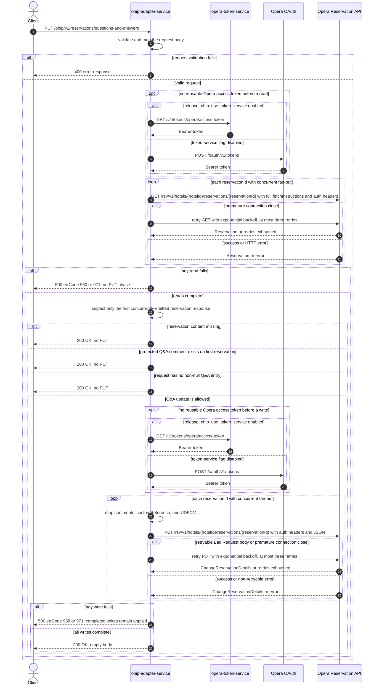

# OHIP Adapter Service: updateQuestionsAndAnswers Flow

Adds company purchase-order, customer-reference, and user-defined questions and answers to
one or more Opera reservations when the first completed reservation read has no protected
company Q&A comment.

```http
PUT /ohip/v1/reservations/questions-and-answers
Host: ohip-adapter-service:9100
Content-Type: application/json
```

The servlet context path is `/ohip/`, and `HotelReservationController` is mapped under
`/v1`. The handler returns `200 OK` with an empty body.

## Flow

`HotelReservationController.updateQuestionsAndAnswers` validates the request DTO, maps it
to `CompanyQuestionAndAnswerDetailsRequest`, and calls
`HotelReservationInPortImpl.updateCompanyQuestionAndAnswerDetails`. The in-port logs and
delegates directly to `HotelReservationOutPortImpl`; it adds no business rule or endpoint
feature-flag check.

The out-port concurrently reads every distinct request `reservationId` through
`OhipReservationClient.getReservations`. Each read is
`GET /rsv/v1/hotels/{hotelId}/reservations/{reservationId}` with the full reservation
fetch-instruction set, including `Comments`. The flow waits for the complete read fan-out,
then inspects only `reservations.get(0)`: this is the first response emitted by the concurrent
fan-out, not a response selected by reservation id. If the collected list is empty, that
response has no reservation collection or entry, the first reservation has a comment typed
`PUR_ORD_QNA`, `CUST_REF_QNA`, or `USR_DEF_QNA`, or the request contains no non-null Q&A
entry, the endpoint silently skips every write and returns `200 OK`.

When the guard passes, the out-port concurrently sends one
`PUT /rsv/v1/hotels/{hotelId}/reservations/{reservationId}` per request id. Each body carries
the current reservation id plus mapped Q&A data. A purchase-order entry becomes a
`PUR_ORD_QNA` comment and, when its answer is non-null, character UDF `UDFC11`; a
customer-reference entry becomes a `CUST_REF_QNA` comment and its answer also becomes
`customReference`; each non-null user-defined entry becomes a `USR_DEF_QNA` comment. Comment
titles are `question|questionHeader`, and comment text is the answer. The PUT fan-out is fully
collected before success is returned. If one PUT fails after another has completed, there is
no rollback.

Every Opera request uses the shared OHIP WebClient. With no reusable authorized-client token,
the default, token-service-disabled path obtains an Opera token directly from
`POST /oauth/v1/tokens`, using client credentials when `ENABLE_CLIENT_CREDENTIALS=true` and
the password grant otherwise. The request then carries `Authorization: Bearer`, `x-app-key`,
and `x-hotelid`; PUTs also carry JSON content type.

## Mermaid Flow



## Features

- One request targets a non-empty set of reservation ids for one hotel; JSON duplicates
  collapse in the set before fan-out.
- Concurrent, blocking-at-the-boundary reservation GET fan-out followed by a guarded,
  concurrent PUT fan-out.
- The guard is global to the request but examines only the first concurrently emitted Opera
  response. Protected comments on later responses are not considered.
- Protected comment types are `PUR_ORD_QNA`, `CUST_REF_QNA`, and `USR_DEF_QNA`.
- Q&A comments carry `question|questionHeader` as the title and `answer` as the text.
- Customer-reference answers also set `customReference`; non-null purchase-order answers also
  set character UDF `UDFC11`.
- No cache, secondary service, or asynchronous background work participates in this endpoint.
- OAuth authorized-client caching can avoid a credential call while a token remains reusable.
- Opera read failures map to HTTP 500 errCode `960`; exhausted transport retries map to errCode
  `971`; non-retryable change-reservation failures map to errCode `958`.

The reservation GET sends `fetchInstructions` values `Reservation`, `InventoryItems`,
`ReservationPolicies`, `Packages`, `ReservationPaymentMethods`, `RoutingInstructions`,
`Comments`, `Preferences`, `LinkedReservations`, and `Alerts`.

## Feature Flags

No endpoint-specific flag changes Q&A validation, mapping, fan-out, or the write guard. The
shared Opera authentication path evaluates these flags in `ohip-adapter-service`:

| Flag | Effect when enabled | Evaluation and override reachability |
| --- | --- | --- |
| `release_ohip_use_token_service` | Selects `opera-token-service` for a missing or expired Opera bearer token instead of authenticating directly with Opera OAuth. | Evaluated by the OHIP WebClient filter for each Opera request. In the integration environment it is a fixed-false invariant, evaluated outside the usable request override scope, and is not an ON/OFF scenario axis. |
| `release_ohip_use_token_refresh_skew` | Applies `config.service.ohip.tokenRefreshClockSkew` to refresh directly acquired Opera OAuth tokens early. It does not change token-service expiry handling. | Evaluated by `ohip-adapter-service` when the direct OAuth authorized-client provider bean is created, so request baggage cannot pin it. The integration environment fixes it false. |

## Request

Body: `CompanyQuestionAndAnswerDetailsRequestDto`.

| Field | Required | Effect |
| --- | --- | --- |
| `reservationIds` | yes, non-empty set | Drives one Opera GET per id and, if the global guard passes, one PUT per id |
| `hotelId` | yes, non-null | Supplies the Opera path hotel, `x-hotelid`, and each mapped comment's hotel id; blank is not rejected |
| `companyQuestionAndAnswerDetails` | yes, non-null | Holds the three optional Q&A categories |
| `purchaseOrderQuestionAndAnswer` | no | Adds a `PUR_ORD_QNA` comment and maps a non-null answer to `UDFC11` |
| `customerReferenceQuestionAndAnswer` | no | Adds a `CUST_REF_QNA` comment and maps the answer to `customReference` |
| `userDefinedQuestionAndAnswers` | no | Adds one `USR_DEF_QNA` comment per non-null entry |
| Q&A `question` | no field constraint | Supplies the first title component |
| Q&A `questionHeader` | no field constraint | Supplies the second title component |
| Q&A `answer` | no field constraint | Supplies comment text and the duplicated purchase-order or customer-reference value |

There are no path or query parameters.

## Branches

| Trigger | Behavior |
| --- | --- |
| Valid reusable OAuth token | Skips both credential endpoints for that Opera call |
| `release_ohip_use_token_service` fixed false with no reusable token | Uses direct Opera OAuth; `ENABLE_CLIENT_CREDENTIALS` selects client-credentials versus password grant |
| A reservation GET closes prematurely | Retries that GET up to three times with three-second exponential backoff; exhaustion returns HTTP 500 errCode `971` |
| Any reservation GET returns an HTTP error | Fails the read phase with HTTP 500 errCode `960`; no PUT phase starts |
| A GET completes with an empty body | That publisher emits no list entry; if no other GET emits a reservation, the endpoint returns `200 OK` with no PUT |
| First collected response has null or empty reservation content | Returns `200 OK` with no PUT |
| First collected reservation has any protected Q&A comment | Returns `200 OK` with no PUT for every requested reservation |
| A later reservation has protected Q&A but the first collected reservation does not | The guard passes and every requested reservation is PUT, including the protected one |
| Purchase-order and customer-reference entries are null and the user-defined list is null or empty | Returns `200 OK` with no PUT |
| User-defined list is non-empty but contains only null entries | The guard passes, the mapper emits no Q&A comments for those entries, and every reservation is still PUT |
| A protected-comment list entry has a null nested `comment` object | The guard dereferences it and the request fails with HTTP 500 |
| PUT error body has type `Bad Request`, or the connection closes prematurely | Retries the PUT up to three times with three-second exponential backoff; exhaustion returns HTTP 500 errCode `971` |
| Other Opera PUT error | Returns HTTP 500 errCode `958` without the application-level retry |
| One concurrent PUT fails after another succeeds | The request fails, but the completed Opera update is not rolled back |
