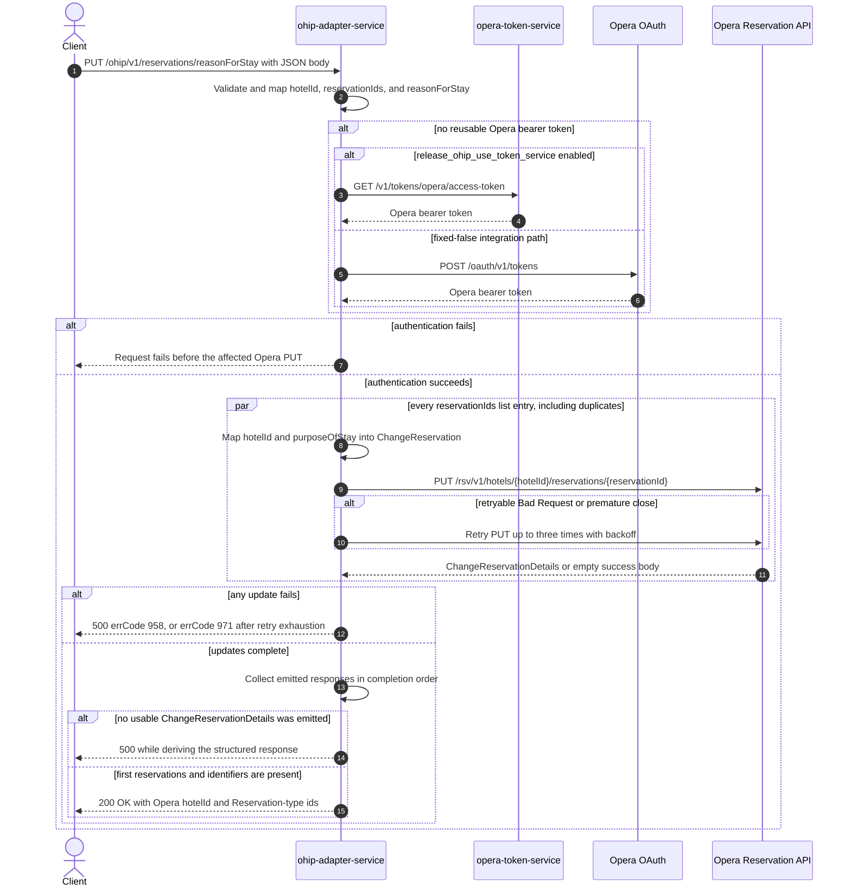

# OHIP Adapter Service: updateReasonForStay Flow

Sets one purpose-of-stay code on every Opera reservation id supplied for a hotel and returns
the reservation ids and hotel id reported by Opera.

```http
PUT /ohip/v1/reservations/reasonForStay
Host: ohip-adapter-service:9100
Content-Type: application/json
```

The servlet context path is `/ohip/` and `HotelReservationController` is mapped under `/v1`,
so the effective public route is `/ohip/v1/reservations/reasonForStay`. The controller has no
endpoint-level authentication guard. Outbound Opera requests carry a bearer token,
`x-app-key`, `x-hotelid`, and JSON content type. Success is `200 OK` with an
`UpdateReasonForStayResponseDto` body.

## Flow

`HotelReservationController.updateReasonForStay` Bean-validates
`UpdateReasonForStayRequestDto`, maps it through `UpdateReasonForStayRequestMapper`, and calls
`HotelReservationInPortImpl.updateReasonForStay`. The in-port only logs and delegates to
`HotelReservationOutPortImpl.updateReasonForStay`; it adds no business guard, read, cache, or
endpoint-specific feature-flag decision.

The out-port iterates the request's `List<String> reservationIds` with `Flux.flatMap`. For every
list entry, including duplicates, `UpdateReasonForStayRequestOhipMapper` creates a separate
`ChangeReservation` body with one reservation instruction. That instruction contains the
request `hotelId` and maps `reasonForStay` to
`reservations[0].additionalGuestInfo.purposeOfStay`; the reservation id is carried only in the
request URL.

Each body is sent to the Opera Reservation API as
`PUT /rsv/v1/hotels/{hotelId}/reservations/{reservationId}`. No explicit concurrency limit is
passed to `flatMap`, so PUTs may overlap and response order follows completion rather than input
order. `collectList().block()` waits for the fan-out before the public response is built. A
failure terminates the aggregate without rolling back updates that have already reached Opera.

The shared Opera WebClient reuses a valid OAuth client token when available. Otherwise
`release_ohip_use_token_service` selects either `opera-token-service` or direct Opera OAuth as
the token source. The integration environment fixes that flag false, so its reachable path is
direct Opera OAuth, using client credentials when `ENABLE_CLIENT_CREDENTIALS=true` and the
password grant otherwise.

For each emitted `ChangeReservationDetails`, `UpdateReasonForStayResponseOhipMapper` reads only
the first returned reservation, collects all of its ids whose type equals `Reservation`
case-insensitively, and uses the first-emitted response's first reservation as the public
`hotelId`. It does not compare returned ids or hotel ids with the request. A non-retryable Opera
error maps to errCode `958`. An error envelope whose `type` is `Bad Request`, or a premature
connection close, is retried up to three times with backoff; exhaustion maps to errCode `971`.

## Mermaid Flow



## Features

- One independently mapped Opera change-reservation PUT per request list entry
- Duplicate reservation ids are retained and produce repeated PUTs
- Concurrent, unordered PUT fan-out with synchronous completion at the public boundary
- Purpose of stay is written as Opera `additionalGuestInfo.purposeOfStay`
- Structured success response is derived from Opera response bodies, not echoed from the request
- Returned ids are filtered to Opera identifier type `Reservation`, case-insensitively
- No reservation GET, cache lookup, secondary business collaborator, compensating action, or
  rollback
- Shared Opera OAuth selection and selective three-retry handling

## Feature Flags

No endpoint-specific business flag is evaluated by the controller, mappers, in-port, or
out-port. The shared Opera transport evaluates these authentication flags:

| Flag | Effect when enabled | Evaluated by | Request override |
| --- | --- | --- | --- |
| `release_ohip_use_token_service` | Selects `opera-token-service` (`GET /v1/tokens/opera/access-token`) instead of direct Opera OAuth when a bearer token is required. | `ohip-adapter-service`, in the `ohipWebClient` filter for each outbound Opera request | Fixed false in the integration environment and not an ON/OFF scenario axis; request baggage cannot make the token-service path reachable there. |
| `release_ohip_use_token_refresh_skew` | Applies the configured early-refresh clock skew to tokens acquired directly from Opera OAuth. It does not change the reservation PUT or response mapping. | `ohip-adapter-service`, once while `WebClientAuthConfig.customAuthClientProvider` is constructed | Not baggage-pinnable because it is evaluated at service startup. |

## Request

Body: `UpdateReasonForStayRequestDto`.

| Field | Required | Effect |
| --- | --- | --- |
| `hotelId` | yes, non-null (`@NotNull`) | Opera hotel path value, outgoing body value, and `x-hotelid` header; blank is permitted by validation |
| `reasonForStay` | yes, non-empty (`@NotEmpty`) | Value written to Opera `additionalGuestInfo.purposeOfStay` |
| `reservationIds` | yes, non-null list (`@NotNull`) | Each list entry drives one Opera PUT; the list may be empty and may contain duplicates or null entries under the declared validation |

There are no path or query parameters.

## Branches

| Trigger | Behavior |
| --- | --- |
| A valid OAuth client token is reusable | Skips both token-acquisition HTTP endpoints for that Opera call |
| No valid token and `release_ohip_use_token_service` is fixed false | Gets a token directly from configured Opera OAuth; `ENABLE_CLIENT_CREDENTIALS` selects client-credentials versus password grant |
| Token acquisition fails | The affected reservation PUT is not sent and the public request fails |
| Duplicate reservation ids | Every duplicate list entry is retained, mapped, and PUT; there is no deduplication |
| Empty `reservationIds` list | No Opera request is sent, then response mapping dereferences the empty collected list and fails as an internal error |
| Opera returns a successful empty body for every PUT | Each `Mono` completes without emitting, the collected list is empty, and structured response mapping fails as an internal error |
| One successful PUT returns an empty body while others emit bodies | The empty response contributes no public reservation ids; no completeness guard detects the omission |
| A returned body has no first reservation or reservation-id list | Response mapping dereferences the missing structure and fails as an internal error |
| Opera returns only non-`Reservation` identifier types | The public `reservationIds` list is empty, but the endpoint can still return `200 OK` |
| Opera returns a non-retryable error | HTTP 500 with errCode `958`; concurrently started updates may already have succeeded and are not rolled back |
| Opera error body has `type=Bad Request`, or the connection closes prematurely | Retries that PUT up to three times with backoff; exhaustion returns HTTP 500 with errCode `971` |
