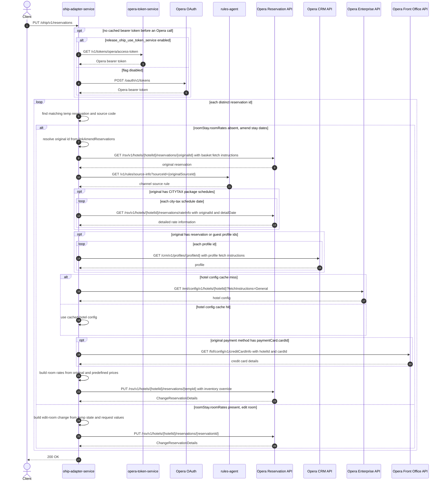

# OHIP Adapter Service: updateReservation Flow

This endpoint applies amend-stay-dates or edit-room changes to one or more Opera
reservations.

```http
PUT /ohip/v1/reservations
Host: ohip-adapter-service:9100
Content-Type: application/json
```

The servlet context path is `/ohip/`. `HotelReservationController` is mapped under
`/v1`. The endpoint does not require caller authentication. Opera calls use an OAuth
bearer token and the `x-app-key` and `x-hotelid` headers.

## Flow

The service maps the request body to `UpdateReservationsRequest`. It processes each
distinct reservation id in `updateReservationsRequest`. The matching entry in
`tempReservations` supplies the current source code, room type, rate plan, occupancy,
and dates.

An update without `roomStay.roomRates` uses the amend-stay-dates path. The service uses
`linkAmendReservations` to find the original reservation id for the temp reservation.
It then performs the full basket read for the original reservation. This read gets the
Opera reservation, channel rules, optional profiles, hotel config, and optional card
details. It can also get rate information for a city-tax package. The service uses the
original nightly prices and any `newRatesReservation` prices to build the new room rates.
It then sends one Opera change-reservation PUT to the temp reservation id. The PUT
overrides the inventory check and sets the room type charged.

An update with `roomStay.roomRates` uses the edit-room path. This path does not read the
linked original reservation. It builds the change from the caller-supplied temp state
and request values. It then sends one Opera change-reservation PUT.

The endpoint returns `200 OK` with no body after all updates succeed.

## Mermaid Flow



## Features

- Processes several reservation updates in one request.
- Selects amend-stay-dates or edit-room behavior from `roomStay.roomRates`.
- Uses caller-supplied temp reservation state for the reservation being changed.
- Reads the linked original reservation for amend-stay-dates pricing.
- Enriches the original basket read with profiles, hotel config, and saved card details.
- Reuses the one-day Opera hotel-config cache when enabled.
- Adds distribution IATA values to `UDFC_16` and `UDFN_01` when supplied.
- Forces the configured default market code in the Opera room-rate change.
- Retries the Opera change-reservation PUT under the shared retry policy.

## Feature Flags

| Flag | Effect when enabled |
| --- | --- |
| `release_ohip_use_token_service` | Gets Opera bearer tokens from `opera-token-service` instead of direct Opera OAuth. It does not change reservation update logic. |
| `release_ohip_use_token_refresh_skew` | Applies the configured early-refresh clock skew to directly acquired Opera OAuth tokens. |

## Request

Body: `UpdateReservationsRequestDto`.

| Field | Effect |
| --- | --- |
| `updateReservationsRequest` | Supplies the hotel id, reservation id, and requested room-stay changes. |
| `tempReservations` | Supplies the current temp reservation state for every target reservation id. |
| `linkAmendReservations` | Maps each original reservation id to its temp reservation id for amend-stay-dates updates. |
| `newRatesReservation` | Supplies predefined prices for nights that need replacement prices. |
| `bookingChannel` | Supplies channel data for edit-room mapping. |
| `companyId` | Supplies the company id for edit-room mapping. |
| `distributionIATANumber` | Adds distribution IATA user-defined fields to the Opera update. |

## Branches

| Trigger | Behavior |
| --- | --- |
| Update entry without `roomStay.roomRates` | Reads the linked original basket, builds room rates, and updates the temp reservation with inventory override. |
| Update entry with `roomStay.roomRates` | Builds an edit-room change without the original basket read. |
| Original reservation has profile ids | Gets each profile from Opera CRM. |
| Original reservation has a payment card with a card id | Gets saved card details from `GET /fof/config/v1/creditCardInfo`. |
| Original reservation has a `CITYTAX` package | Gets detailed rate information for each city-tax schedule date. |
| Hotel config cache hit | Skips `GET /ent/config/v1/hotels/{hotelId}`. |
| Target id is missing from `tempReservations` | `findAny().get()` throws before the coded fallback Opera read can run. |
| No matching amend link exists | Uses the first original id in `linkAmendReservations`; an empty map throws. |
| Opera reservation read returns no reservations | Returns the mapped digital reservation-not-found error. |
| Opera change PUT fails after retries | Returns `OHIP_CHANGE_RESERVATION_EXCEPTION` or `OHIP_RETRIES_EXHAUSTED_EXCEPTION`. |
