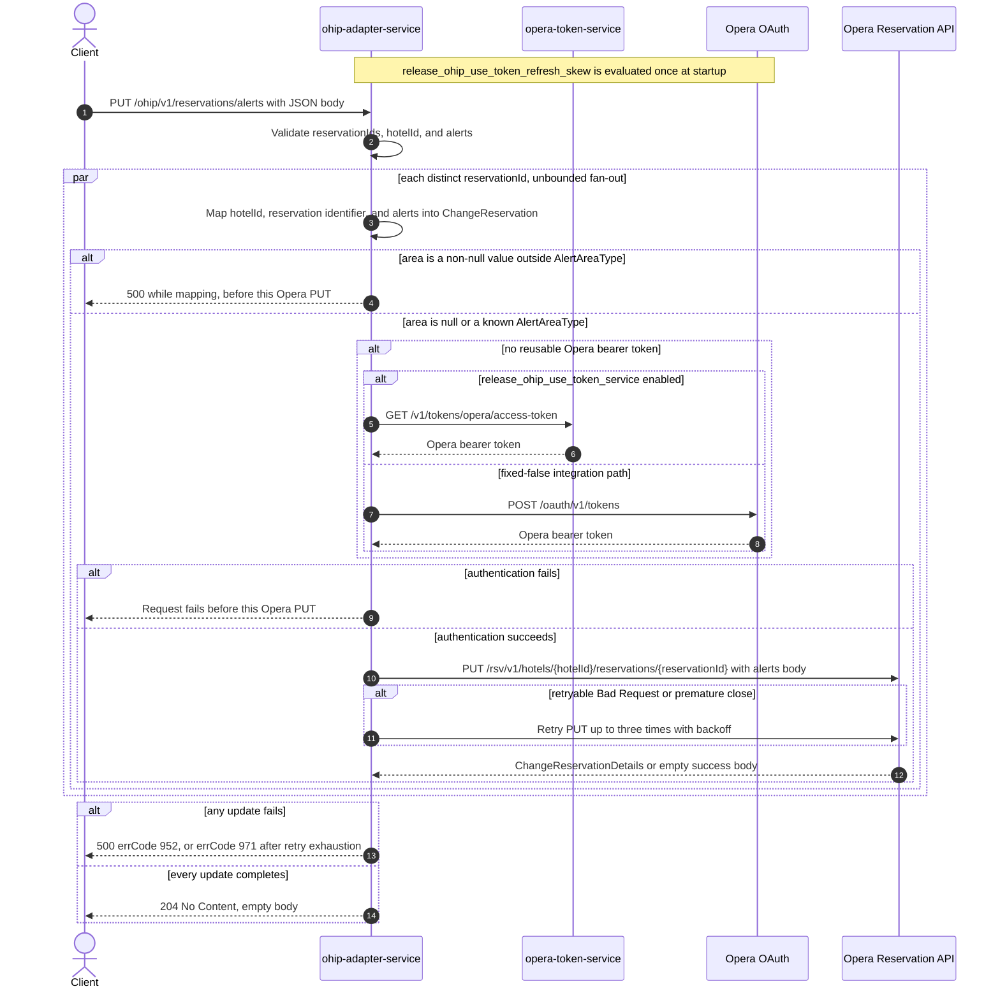

# OHIP Adapter Service: updateReservationAlerts Flow

Writes the same list of Opera reservation alerts to every distinct reservation id supplied for
one hotel.

```http
PUT /ohip/v1/reservations/alerts
Host: ohip-adapter-service:9100
Content-Type: application/json
```

The servlet context path is `/ohip/` and `HotelReservationController` is mapped under `/v1`,
so the effective public route is `/ohip/v1/reservations/alerts`. The controller has no
endpoint-level authentication guard. Outbound Opera requests carry a bearer token, `x-app-key`,
`x-hotelid`, and JSON content type. Success is `204 No Content` with an empty body: the handler
returns `void` and is annotated `@ResponseStatus(HttpStatus.NO_CONTENT)`, which matches the
`204` declared by the checked-in OpenAPI operation `updateReservationAlerts`.

## Flow

`HotelReservationController.updateReservationAlerts` Bean-validates
`UpdateReservationAlertsRequestDto`, maps it one-for-one through
`UpdateReservationRequestMapper.toAlertsModel`, and calls
`HotelReservationInPortImpl.updateReservationAlerts`. The in-port only delegates to
`HotelReservationOutPortImpl.updateReservationAlerts`; it adds no business guard, read, cache,
logging decision, or endpoint-specific feature-flag evaluation.

The out-port iterates the request's `Set<String> reservationIds`. For each distinct id,
`ReservationAlertMapper.toChangeReservationAlertDto` builds a separate `ChangeReservation` body
containing exactly one reservation instruction. That instruction carries the request `hotelId`,
a `reservationIdList` of one `UniqueIDType` with type `Reservation` and the reservation id, and
the mapped `alerts` collection. Each `AlertDto` becomes an Opera `AlertType` with `id`, `code`,
`description`, `screenNotification`, and `printerNotification` copied straight across; a
non-null `area` string is resolved with `Enum.valueOf(AlertAreaType.class, area)`, so only the
generated enum constant names `CHECKIN`, `CHECKOUT`, `RESERVATION`, `BILLING`, and `INHOUSE` are
accepted and any other non-null value throws before that reservation's Opera call is made.
Unlike the sibling override-reasons path, the reservation identity appears both in the URL and
in the body.

Each body is sent to the Opera Reservation API as
`PUT /rsv/v1/hotels/{hotelId}/reservations/{reservationId}` through
`OhipReservationClient.sendPutReservationsGuestRequest`. `Flux.flatMap` is called with no
concurrency argument, so Reactor's default applies and every distinct-id PUT may be in flight at
once; the order follows non-contractual set iteration and completion, not request order.
`blockLast()` waits for the whole fan-out before the controller returns. The
`ChangeReservationDetails` response bodies are never inspected, so an Opera success with an empty
body is accepted and the public response is `204` either way. There is no read-before-write call,
compensating action, or rollback.

The shared Opera WebClient reuses a valid OAuth client token when available. Otherwise
`release_ohip_use_token_service` selects `opera-token-service` or direct Opera OAuth as the token
source. The integration workflow fixes that flag false, so its supported path is direct Opera
OAuth, using client credentials when `ENABLE_CLIENT_CREDENTIALS=true` and the password grant
otherwise.

A non-retryable Opera error maps to HTTP 500 with errCode `952`
(`OHIP_PUT_RESERVATIONS_GUEST_EXCEPTION`) — not the `958` used by the change-reservation client
method that other reservation mutations call. An error envelope whose `type` is `Bad Request` is
retried up to three times with backoff; exhaustion maps to HTTP 500 with errCode `971`. The
shared WebClient's premature-close retry filter is applied only to `GET` requests, so it does not
cover this PUT; the client-level retry spec still retries a `PrematureCloseException` for it.
Because the fan-out is unbounded, a terminal failure on one id races the PUTs already dispatched
for the other ids, and any Opera writes that already landed are not undone.

The same out-port method is also reused internally by `setCnpReservationAlert` on the
confirm-reservation path; that caller is not reachable through this public route.

## Mermaid Flow



## Features

- Bulk alert write over a `Set`, so duplicate reservation ids collapse before execution
- One Opera change-reservation PUT per distinct reservation id
- A separately built body per id that carries the hotel id, the `Reservation`-typed reservation
  identifier, and the shared alert list
- Unbounded concurrent PUT fan-out, synchronously awaited at the public boundary
- Alert `area` restricted to the Opera `AlertAreaType` constant names by enum resolution
- Opera response bodies are never inspected, so an empty success body is accepted
- No reservation GET, cache lookup, downstream business collaborator other than Opera, or
  rollback
- Shared Opera OAuth selection and selective three-retry handling

## Feature Flags

No endpoint-specific business flag changes validation, mapping, fan-out, or response shaping.
The shared Opera authentication path evaluates these flags in `ohip-adapter-service`:

| Flag | Effect when enabled | Evaluation and override reachability |
| --- | --- | --- |
| `release_ohip_use_token_service` | Selects `opera-token-service` (`GET /v1/tokens/opera/access-token`) instead of direct Opera OAuth when a bearer token is required. | Evaluated by the `ohipWebClient` filter for each outbound Opera request. The integration override wrapper can consult propagated baggage at this call site, but the integration environment fixes the flag false, so it is not an ON/OFF scenario axis. |
| `release_ohip_use_token_refresh_skew` | Applies `config.service.ohip.tokenRefreshClockSkew` to refresh directly acquired Opera OAuth tokens early. It does not change the reservation PUT or public response. | Evaluated once while `WebClientAuthConfig.customAuthClientProvider` is constructed, so request baggage cannot pin it. The integration workflow treats it as fixed false. |

`release_set_cnp_booking_alerts` gates a different caller of the same out-port method on the
confirm-reservation path and has no effect on this route.

## Request

Body: `UpdateReservationAlertsRequestDto`.

| Field | Required | Effect |
| --- | --- | --- |
| `reservationIds` | yes, non-null set with at least one entry (`@NotNull @NotEmpty`) | Each distinct value becomes one Opera PUT: the reservation-id path segment and the body's `reservations[0].reservationIdList[0].id` with type `Reservation`; duplicate JSON values collapse during set deserialization |
| `hotelId` | yes, non-empty (`@NotEmpty`) | Supplies the Opera hotel path value, the body's `reservations[0].hotelId`, and the `x-hotelid` header |
| `alerts` | yes, non-null list (`@NotNull @Valid`); may be empty | Mapped element-for-element into `reservations[0].alerts`; an empty list still sends the PUT with an empty alerts collection |
| `alerts[].id` | no | Copied to Opera `AlertType.id` |
| `alerts[].area` | no | Resolved to `AlertAreaType` by constant name; `CHECKIN`, `CHECKOUT`, `RESERVATION`, `BILLING`, or `INHOUSE`. Null leaves the field unset; any other value fails during mapping |
| `alerts[].code` | no | Copied to Opera `AlertType.code` |
| `alerts[].description` | no | Copied to Opera `AlertType.description` |
| `alerts[].screenNotification` | no, primitive `boolean` defaulting to false | Copied to Opera `AlertType.screenNotification` |
| `alerts[].printerNotification` | no, primitive `boolean` defaulting to false | Copied to Opera `AlertType.printerNotification` |

There are no path or query parameters. `AlertDto` declares no Bean Validation constraints, so
`@Valid` adds no per-alert checks.

## Branches

| Trigger | Behavior |
| --- | --- |
| Duplicate ids in the JSON array | Deserialization into a `Set` collapses them, so each distinct id is updated once |
| Several distinct reservation ids | One PUT per id, dispatched with no concurrency limit, so the calls may overlap in any order |
| `alerts` is an empty list | The PUT is still sent per id with an empty `alerts` collection; Opera decides the effect |
| `alerts` contains a null entry | The mapper emits a null element in the Opera `alerts` collection rather than skipping it |
| `alerts[].area` is a value outside `AlertAreaType` | `Enum.valueOf` throws inside the mapping step, so that reservation's PUT is never sent and the request fails as an internal error |
| A valid OAuth client token is reusable | Skips both token-acquisition HTTP endpoints for that Opera call |
| No valid token and `release_ohip_use_token_service` is fixed false | Gets a token directly from configured Opera OAuth, using client credentials when `ENABLE_CLIENT_CREDENTIALS=true`, otherwise the password grant |
| Token acquisition fails | The affected reservation PUT is not sent and the public request fails |
| Opera returns a successful response with an empty body | The inner publisher completes empty; the out-port does not inspect it and the request still returns `204 No Content` |
| Opera returns a non-retryable error | Returns HTTP 500 with errCode `952`; concurrently dispatched updates for other ids may already have succeeded and are not rolled back |
| Opera error body has `type=Bad Request`, or the connection closes prematurely | Retries that PUT up to three times with backoff; exhaustion returns HTTP 500 with errCode `971` |

The controller annotation and checked-in OpenAPI also advertise HTTP 400 and 404. The 400 comes
from Bean Validation of the request body; this runtime path performs no lookup and contains no
endpoint-specific not-found branch, so Opera PUT errors are translated to the HTTP 500 paths
above.
