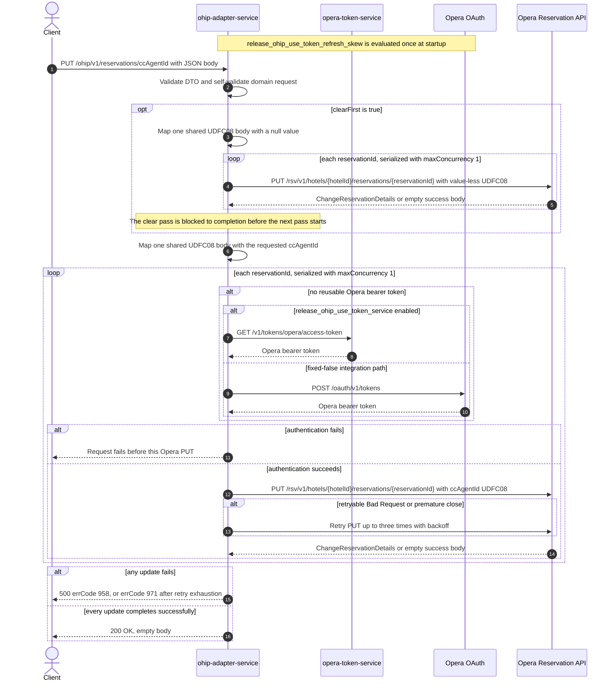

# OHIP Adapter Service: updateReservationCcAgentId Flow

Writes the contact-centre agent identifier to character UDF `UDFC08` on every reservation id
supplied for one hotel, optionally clearing that UDF in a completed first pass before writing
the new value.

```http
PUT /ohip/v1/reservations/ccAgentId
Host: ohip-adapter-service:9100
Content-Type: application/json
```

The servlet context path is `/ohip/` and `HotelReservationController` is mapped under `/v1`,
so the effective public route is `/ohip/v1/reservations/ccAgentId`. The controller has no
endpoint-level authentication guard. Outbound Opera requests carry a bearer token, `x-app-key`,
`x-hotelid`, and JSON content type. Success is `200 OK` with an empty body, which matches the
checked-in OpenAPI contract for this operation.

## Flow

`HotelReservationController.updateReservationCcAgentId` Bean-validates
`UpdateReservationCcAgentIdRequestDto`, maps it field-for-field through
`UpdateReservationCcAgentIdRequestMapper`, and calls
`HotelReservationInPortImpl.updateReservationCcAgentId`. The mapper builds the domain
`UpdateReservationCcAgentIdRequest`, whose constructor self-validates `reservationIds` and
`hotelId` as non-empty; a violation returns HTTP 422 before any downstream call. The in-port
only logs and delegates to `HotelReservationOutPortImpl.updateReservationCcAgentId` with
`shouldRunInAsync = false`. It adds no business guard, read, cache, or endpoint-specific
feature-flag decision.

The out-port runs one or two write passes over the same reservation ids. Each pass maps the
request once to one shared `ChangeReservation` body containing a single reservation instruction
with the request `hotelId` and one character UDF named `UDFC08`; the reservation id is carried
only in the request URL. Each pass then iterates the request's `Set<String> reservationIds` and
sends the shared body to the Opera Reservation API once per id as
`PUT /rsv/v1/hotels/{hotelId}/reservations/{reservationId}`. `Flux.flatMap` uses
`config.service.ohip.maxConcurrency`; the checked-in value is `1`, so the calls are serialized.
The ids keep the order of the request JSON array, because Jackson deserializes the DTO field
into a `LinkedHashSet` and the request mapper copies it into another `LinkedHashSet`.
`collectList().block()` waits for the whole pass to finish before the next statement runs.

With `clearFirst = false`, the default, there is exactly one pass and its `UDFC08` value is the
request `ccAgentId`. With `clearFirst = true`, a clear pass runs first over the same ids with
`ccAgentId` rebuilt as `null`; because the Opera WebClient encodes with a `NON_NULL` JsonMapper
(`JacksonConfig.objectMapper` wired as the `jacksonJsonEncoder` in `WebClientConfig`), the clear
body carries a `UDFC08` entry with no `value` member at all rather than JSON `null`; that pass is
blocked to completion before the second pass writes the real `ccAgentId`. Both passes hit the
same Opera URL per reservation, so the endpoint sends two PUTs per reservation id in that
branch, ordered clear-then-set.

There is no read-before-write call, compensating action, or rollback, and the Opera response
bodies are not inspected, so an Opera success with an empty body is accepted. The out-port also
has an asynchronous variant that sleeps `config.service.ohip.updateCcAgentIdThreadSleep` before
its write pass, but that variant is selected only by the `shouldRunInAsync = true` callers
inside reservation confirmation; this public endpoint always passes `false`, so no part of the
request is deferred past the HTTP response.

The shared Opera WebClient reuses a valid OAuth client token when available. Otherwise
`release_ohip_use_token_service` selects `opera-token-service` or direct Opera OAuth as the
token source. The integration workflow fixes that flag false, so its supported path is direct
Opera OAuth, using client credentials when `ENABLE_CLIENT_CREDENTIALS=true` and the password
grant otherwise. A non-retryable Opera error maps to HTTP 500 with errCode `958`. An error
envelope whose `type` is `Bad Request`, or a premature connection close, is retried up to three
times with backoff; exhaustion maps to HTTP 500 with errCode `971`. With the checked-in
concurrency of one, earlier successful reservations remain updated and later ids are not
processed after a terminal failure; a failure during the clear pass also stops the second pass
from starting at all.

## Mermaid Flow



## Features

- Bulk update over a `Set`, so duplicate reservation ids collapse before execution
- One Opera change-reservation PUT per reservation id per write pass
- One shared body per pass, with the reservation identity supplied only by the URL
- Contact-centre agent identity written as character UDF `UDFC08`
- Optional clear-then-set mode that sends a completed null-value pass before the value pass
- Request-array id order preserved through `LinkedHashSet`, serialized under the checked-in
  `maxConcurrency: 1` configuration
- No reservation GET, cache lookup, downstream business collaborator other than Opera, or
  rollback
- Fully synchronous on this route: the out-port's sleeping asynchronous variant belongs to the
  reservation-confirmation callers, not to this endpoint
- Shared Opera OAuth selection and selective three-retry handling

## Feature Flags

No endpoint-specific business flag changes validation, mapping, fan-out, or response shaping.
The shared Opera authentication path evaluates these flags in `ohip-adapter-service`:

| Flag | Effect when enabled | Evaluation and override reachability |
| --- | --- | --- |
| `release_ohip_use_token_service` | Selects `opera-token-service` (`GET /v1/tokens/opera/access-token`) instead of direct Opera OAuth when a bearer token is required. | Evaluated by the OHIP WebClient filter for each outbound Opera request. The integration override wrapper can consult propagated baggage at this call site, but the integration environment fixes the flag false, so it is not an ON/OFF scenario axis. |
| `release_ohip_use_token_refresh_skew` | Applies `config.service.ohip.tokenRefreshClockSkew` to refresh directly acquired Opera OAuth tokens early. It does not change the reservation PUT or public response. | Evaluated once while `WebClientAuthConfig.customAuthClientProvider` is constructed, so request baggage cannot pin it. The integration workflow treats it as fixed false. |

## Request

Body: `UpdateReservationCcAgentIdRequestDto`.

| Field | Required | Effect |
| --- | --- | --- |
| `reservationIds` | yes, non-null set with at least one entry | Each distinct value becomes the reservation-id path segment for one Opera PUT per write pass; duplicate JSON values collapse during set deserialization and the remaining order is the JSON array order |
| `hotelId` | yes, non-null | Supplies the Opera hotel path value, body hotel id, and `x-hotelid` header; a blank value passes DTO validation but fails the domain model's `@NotEmpty` self-validation |
| `ccAgentId` | yes, non-empty | Becomes the `UDFC08` value of the final write pass |
| `clearFirst` | no, defaults to false | When true, adds a completed preceding write pass that sets `UDFC08` to null for every id |

There are no path or query parameters.

## Branches

| Trigger | Behavior |
| --- | --- |
| `clearFirst` absent or false | One write pass: one PUT per reservation id carrying the requested `ccAgentId` in `UDFC08` |
| `clearFirst` is true | Two write passes over the same ids: a null-`UDFC08` clear pass runs and completes first, then the value pass, so each reservation id receives two PUTs to the same URL in clear-then-set order |
| Duplicate ids in the JSON array | Deserialization into a `Set` collapses them, so each distinct id is updated once per pass |
| Blank `hotelId` or empty `reservationIds` | Domain self-validation throws `ConstraintViolationException`, answered with HTTP 422 and no Opera call |
| A valid OAuth client token is reusable | Skips both token-acquisition HTTP endpoints for that Opera call |
| No valid token and `release_ohip_use_token_service` is fixed false | Gets a token directly from configured Opera OAuth, using client credentials when `ENABLE_CLIENT_CREDENTIALS=true`, otherwise the password grant |
| Token acquisition fails | The affected reservation PUT is not sent and the public request fails |
| Opera returns a successful response with an empty body | The inner publisher completes empty; the out-port does not inspect it and the public request can still return `200 OK` |
| Opera returns a non-retryable error | Returns HTTP 500 with errCode `958`; earlier serialized updates remain applied and later ids are not processed. A failure inside the clear pass prevents the value pass from starting |
| Opera error body has `type=Bad Request`, or the connection closes prematurely | Retries that PUT up to three times with backoff; exhaustion returns HTTP 500 with errCode `971` |
| `config.service.ohip.maxConcurrency` is externally raised above one | PUTs within one pass may overlap and lose their request-array order; the clear pass still completes before the value pass because the flux is blocked between them |

The controller annotation and checked-in OpenAPI also advertise HTTP 404, but this runtime path
performs no lookup and contains no endpoint-specific not-found branch. Opera PUT errors are
translated to the HTTP 500 paths above.
